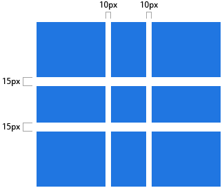
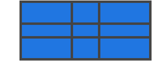
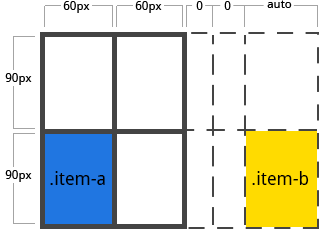
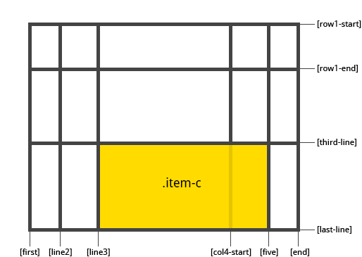
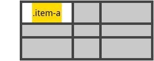
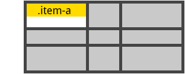

# CSS Grid Layout

Is the most powerful layout system available in CSS. It is a 2-dimensional system, meaning it can handle both columns and rows, unlike flexbox which is largely a 1-dimensional system. You work with Grid Layout by applying CSS rules both to a parent element (which becomes the Grid Container) and to that elements children (which become Grid Items).

o get started you have to define a container element as a grid with __display: grid__, set the column and row sizes with __grid-template-columns__ and __grid-template-rows__, and then place its child elements into the grid with __grid-column__ and __grid-row__. Similarly to flexbox, the source order of the grid items doesn't matter. Your CSS can place them in any order, which makes it super easy to rearrange your grid with media queries.

### Grid Track
The space between two adjacent grid lines. You can think of them like the columns or rows of the grid. Here's the grid track between the second and third row grid lines.


### Grid Area
The total space surrounded by four grid lines. A grid area may be comprised of any number of grid cells. Here's the grid area between row grid lines 1 and 3, and column grid lines 1 and 3.


## Properties for the Parent (Grid Container)
* ### display
    Defines the element as a grid container and establishes a new grid formatting context for its contents.

    Values:
    * __grid__ - generates a block-level grid
    * __inline-grid__ - generates an inline-level grid
    * __subgrid__ - if your grid container is itself a grid item (i.e. nested grids), you can use this property to indicate that you want the sizes of its rows/columns to be taken from its parent rather than specifying its own.

    ```css
    .container {
        display: grid | inline-grid | subgrid;
    }
    ```

* ### grid-template-columns, grid-template-rows
    Defines the columns and rows of the grid with a space-separated list of values. The values represent the track size, and the space between them represents the grid line.

    Values:
    * __\<track-size>__ - can be a length, a percentage, or a fraction of the free space in the grid (using the fr unit)
    * __\<line-name>__ - an arbitrary name of your choosing

    ```css
    .container {
        grid-template-columns: <track-size> ... | <line-name> <track-size> ...;
        grid-template-rows: <track-size> ... | <line-name> <track-size> ...;
    }
    ```

    Examples:

    * When you leave an empty space between the track values, the grid lines are automatically assigned numerical names:
        ```css
        .container {
            grid-template-columns: 40px 50px auto 50px 40px;
            grid-template-rows: 25% 100px auto;
        }
        ```
        

    * But you can choose to explicitly name the lines. Note the bracket syntax for the line names:
        ```css
        .container {
            grid-template-columns: [first] 40px [line2] 50px [line3] auto [col4-start] 50px [five] 40px [end];
            grid-template-rows: [row1-start] 25% [row1-end] 100px [third-line] auto [last-line];
        }
        ```
        
    
    * Note that a line can have more than one name. For example, here the second line will have two names: row1-end and row2-start:
        ```css
        .container {
            grid-template-rows: [row1-start] 25% [row1-end row2-start] 25% [row2-end];
        }
        ```

    * If your definition contains repeating parts, you can use the repeat() notation to streamline things:
        ```css
        .container {
            grid-template-columns: repeat(3, 20px [col-start]) 5%;
        }
        /* equivalent to */
        .container {
            grid-template-columns: 20px [col-start] 20px [col-start] 20px [col-start] 5%;
        }
        ```
    * The __fr__ unit allows you to set the size of a track as a fraction of the free space of the grid container. For example, this will set each item to one third the width of the grid container:
        ```css
        .container {
            grid-template-columns: 1fr 1fr 1fr;
        }
        ```
    * The free space is calculated after any non-flexible items. In this example the total amount of free space available to the __fr__ units doesn't include the 50px:
        ```css
        .container {
            grid-template-columns: 1fr 50px 1fr 1fr;
        }
        ```
* ### grid-template-areas
    Defines a grid template by referencing the names of the grid areas which are specified with the grid-area property. Repeating the name of a grid area causes the content to span those cells. A period signifies an empty cell. The syntax itself provides a visualization of the structure of the grid.

    Values:
    * __\<grid-area-name>__ - the name of a grid area specified with grid-area
    * __.__ - a period signifies an empty grid cell
    * __none__ - no grid areas are defined

    ```css
    .container {
        grid-template-areas: 
            "<grid-area-name> | . | none | ..."
            "...";
    }
    ```

    Example:
    ```css
    .item-a {
        grid-area: header;
    }
    .item-b {
        grid-area: main;
    }
    .item-c {
        grid-area: sidebar;
    }
    .item-d {
        grid-area: footer;
    }

    .container {
        grid-template-columns: 50px 50px 50px 50px;
        grid-template-rows: auto;
        grid-template-areas: 
            "header header header header"
            "main main . sidebar"
            "footer footer footer footer";
    }
    ```
    Result:

    

    Each row in your declaration needs to have the same number of cells.

    You can use any number of adjacent periods to declare a single empty cell. As long as the periods have no spaces between them they represent a single cell.

    Notice that you're not naming lines with this syntax, just areas. When you use this syntax the lines on either end of the areas are actually getting named automatically. If the name of your grid area is foo, the name of the area's starting row line and starting column line will be foo-start, and the name of its last row line and last column line will be foo-end. This means that some lines might have multiple names, such as the far left line in the above example, which will have three names: header-start, main-start, and footer-start.

* ### grid-template    
    A shorthand for setting __grid-template-rows__, __grid-template-columns__, and __grid-template-areas__ in a single declaration.

    Values:
    * __none__ - sets all three properties to their initial values
    * __subgrid__ - sets _grid-template-rows_ and _grid-template-columns_ to subgrid, and _grid-template-areas_ to its initial value
    * __\<grid-template-rows> / \<grid-template-columns>__ - sets _grid-template-columns_ and _grid-template-rows_ to the specified values, respectively, and sets _grid-template-areas_ to none

    ```css
    .container {
        grid-template: none | subgrid | <grid-template-rows> / <grid-template-columns>;
    }
    ```

    It also accepts a more complex but quite handy syntax for specifying all three.
    ```css
    .container {
        grid-template:
            [row1-start] "header header header" 25px [row1-end]
            [row2-start] "footer footer footer" 25px [row2-end]
            / auto 50px auto;
    }
    /* equivalent to */
    .container {
        grid-template-rows: [row1-start] 25px [row1-end row2-start] 25px [row2-end];
        grid-template-columns: auto 50px auto;
        grid-template-areas: 
            "header header header" 
            "footer footer footer";
    }
    ```
    Since __grid-template__ doesn't reset the implicit grid properties (__grid-auto-columns, grid-auto-rows, and grid-auto-flow__), which is probably what you want to do in most cases, it's recommended to use the __grid__ property instead of grid-template.

* ### grid-column-gap, grid-row-gap
    Specifies the size of the grid lines. You can think of it like setting the width of the gutters between the columns/rows.
    ```css
    .container {
        grid-column-gap: <line-size>;
        grid-row-gap: <line-size>;
    }
    ```

    Example:
    ```css
    .container {
        grid-template-columns: 100px 50px 100px;
        grid-template-rows: 80px auto 80px; 
        grid-column-gap: 10px;
        grid-row-gap: 15px;
    }
    ```
    

* ### grid-gap
    A shorthand for grid-row-gap and grid-column-gap.
    ```css
    .container {
        grid-gap: <grid-row-gap> <grid-column-gap>;
    }
    ```

    Example:
    ```css
    .container {
        grid-template-columns: 100px 50px 100px;
        grid-template-rows: 80px auto 80px; 
        grid-gap: 10px 15px;
    }
    ```

    > If no __grid-row-gap__ is specified, it's set to the same value as __grid-column-gap__

* ### justify-items
    Aligns the content inside a grid item along the row axis (as opposed to __align-items__ which aligns along the column axis). This value applies to all grid items inside the container.
    Values:
    * __start__ - aligns the content to the left end of the grid area
        
        

    * __end__ - aligns the content to the right end of the grid area
        
        

    * __center__ - aligns the content in the center of the grid area
        
        

    * __stretch__ - fills the whole width of the grid area (this is the 
    default)

         

    ```css
    .container {
        justify-items: start | end | center | stretch;
    }
    ```

    This behavior can also be set on individual grid items via the __justify-self__ property.

* ### align-items
    Aligns the content inside a grid item along the column axis (as opposed to justify-items which aligns along the row axis). This value applies to all grid items inside the container.

    Values:
    * start - aligns the content to the top of the grid area
        
        

    * end - aligns the content to the bottom of the grid area
        
        

    * center - aligns the content in the center of the grid area
        
        

    * stretch - fills the whole height of the grid area (this is the default)
        
         

    ```css
    .container {
        align-items: start | end | center | stretch;
    }
    ```

    This behavior can also be set on individual grid items via the __align-self__ property.

* ### justify-content
    Sometimes the total size of your grid might be less than the size of its grid container. This could happen if all of your grid items are sized with non-flexible units like px. In this case you can set the alignment of the grid within the grid container. This property aligns the grid along the row axis (as opposed to align-content which aligns the grid along the column axis).

    Values:
    * __start__ - aligns the grid to the left end of the grid container
        
        

    * __end__ - aligns the grid to the right end of the grid container
        
        

    * __center__ - aligns the grid in the center of the grid container
        
        

    * __stretch__ - resizes the grid items to allow the grid to fill the full width of the grid container

        

    * __space-around__ - places an even amount of space between each grid item, with half-sized spaces on the far ends
        
        

    * __space-between__ - places an even amount of space between each grid item, with no space at the far ends

        

    * __space-evenly__ - places an even amount of space between each grid item, including the far ends

        

    ```css
    .container {
        justify-content: start | end | center | stretch | space-around | space-between | space-evenly;	
    }
    ```

* ### align-content
    Sometimes the total size of your grid might be less than the size of its grid container. This could happen if all of your grid items are sized with non-flexible units like px. In this case you can set the alignment of the grid within the grid container. This property aligns the grid along the column axis (as opposed to justify-content which aligns the grid along the row axis).

    Values:
    * __start__ - aligns the grid to the top of the grid container
        
        

    * __end__ - aligns the grid to the bottom of the grid container
        
        

    * __center__ - aligns the grid in the center of the grid container
        
        

    * __stretch__ - resizes the grid items to allow the grid to fill the full height of the grid container

        

    * __space-around__ - places an even amount of space between each grid item, with half-sized spaces on the far ends

        

    * __space-between__ - places an even amount of space between each grid item, with no space at the far ends

        

    * __space-evenly__ - places an even amount of space between each grid item, including the far ends

        

    ```css
    .container {
        align-content: start | end | center | stretch | space-around | space-between | space-evenly;	
    }
    ```

* ### grid-auto-columns, grid-auto-rows
    Specifies the size of any auto-generated grid tracks (aka implicit grid tracks). Implicit grid tracks get created when you explicitly position rows or columns (via __grid-template-rows/grid-template-columns__) that are out of range of the defined grid.

    Values:
    * __\<track-size>__ - can be a length, a percentage, or a fraction of the free space in the grid (using the __fr__ unit)

    ```css
    .container {
        grid-auto-columns: <track-size> ...;
        grid-auto-rows: <track-size> ...;
    }
    ```

    Example:
    ```css
    .container {
        grid-template-columns: 60px 60px;
        grid-template-rows: 90px 90px
    }
    ```
    
    
    But now imagine you use grid-column and grid-row to position your grid items like this:
    ```css
    .item-a {
        grid-column: 1 / 2;
        grid-row: 2 / 3;
    }
    .item-b {
        grid-column: 5 / 6;
        grid-row: 2 / 3;
    }
    ```
    
    
    We told .item-b to start on column line 5 and end at column line 6, but we never defined a column line 5 or 6. Because we referenced lines that don't exist, implicit tracks with widths of 0 are created to fill in the gaps. We can use grid-auto-columns and grid-auto-rows to specify the widths of these implicit tracks:
    ```css
    .container {
        grid-auto-columns: 60px;
    }
    ```
    
    
* ### grid-auto-flow
    If you have grid items that you don't explicitly place on the grid, the auto-placement algorithm kicks in to automatically place the items. This property controls how the auto-placement algorithm works.

    Values:
    * __row__ - tells the auto-placement algorithm to fill in each row in turn, adding new rows as necessary
    * __column__ - tells the auto-placement algorithm to fill in each column in turn, adding new columns as necessary
    * __dense__ - tells the auto-placement algorithm to attempt to fill in holes earlier in the grid if smaller items come up later

    ```css
    .container {
        grid-auto-flow: row | column | row dense | column dense
    }
    ```
    > Note that dense might cause your items to appear out of order.

    Examples:
    ```html
    <section class="container">
        <div class="item-a">item-a</div>
        <div class="item-b">item-b</div>
        <div class="item-c">item-c</div>
        <div class="item-d">item-d</div>
        <div class="item-e">item-e</div>
    </section>
    ```
    You define a grid with five columns and two rows, and set __grid-auto-flow__ to __row__ (which is also the default):
    ```css
    .container {
        display: grid;
        grid-template-columns: 60px 60px 60px 60px 60px;
        grid-template-rows: 30px 30px;
        grid-auto-flow: row;
    }
    ```
    When placing the items on the grid, you only specify spots for two of them:
    ```css
    .item-a {
        grid-column: 1;
        grid-row: 1 / 3;
    }
    .item-e {
        grid-column: 5;
        grid-row: 1 / 3;
    }
    ```
    Because we set grid-auto-flow to row, our grid will look like this.
    
    
    If we instead set grid-auto-flow to column, item-b, item-c and item-d flow down the columns:
    ```css
    .container {
        display: grid;
        grid-template-columns: 60px 60px 60px 60px 60px;
        grid-template-rows: 30px 30px;
        grid-auto-flow: column;
    }
    ```
    
        
* ### grid
    A shorthand for setting all of the following properties in a single declaration: __grid-template-rows, grid-template-columns, grid-template-areas, grid-auto-rows, grid-auto-columns,__ and __grid-auto-flow__. It also sets __grid-column-gap__ and __grid-row-gap__ to their initial values, even though they can't be explicitly set by this property.
    
    Values:
    * __none__ - sets all sub-properties to their initial values
    * __\<grid-template-rows> / \<grid-template-columns>__ - sets _grid-template-rows_ and _grid-template-columns_ to the specified values, respectively, and all other sub-properties to their initial values
    * __\<grid-auto-flow> [\<grid-auto-rows> [ / \<grid-auto-columns>] ]__ - accepts all the same values as _grid-auto-flow, grid-auto-rows and grid-auto-columns_, respectively. If _grid-auto-columns_ is omitted, it is set to the value specified for _grid-auto-rows_. If both are omitted, they are set to their initial values

    ```css
    .container {
        grid: none | <grid-template-rows> / <grid-template-columns> | <grid-auto-flow> [<grid-auto-rows> [/ <grid-auto-columns>]];
    }
    ```

    Examples:
    ```css
    .container {
        grid: 200px auto / 1fr auto 1fr;
    }
    /* equivalent to */
    .container {
        grid-template-rows: 200px auto;
        grid-template-columns: 1fr auto 1fr;
        grid-template-areas: none;
    }
    ```

    ```css
    .container {
        grid: column 1fr / auto;
    }
    /* equivalent to */
    .container {
        grid-auto-flow: column;
        grid-auto-rows: 1fr;
        grid-auto-columns: auto;
    }
    ```

    It also accepts a more complex but quite handy syntax for setting everything at once. You specify grid-template-areas, grid-template-rows and grid-template-columns, and all the other sub-properties are set to their initial values. What you're doing is specifying the line names and track sizes inline with their respective grid areas. This is easiest to describe with an example:
    ```css
    .container {
        grid: [row1-start] "header header header" 1fr [row1-end]
              [row2-start] "footer footer footer" 25px [row2-end]
              / auto 50px auto;
    }
    /* equivalent to */
    .container {
        grid-template-areas: 
            "header header header"
            "footer footer footer";
        grid-template-rows: [row1-start] 1fr [row1-end row2-start] 25px [row2-end];
        grid-template-columns: auto 50px auto;    
    }
    ```

## Properties for the Children (Grid Items)
* ### grid-column-start, grid-column-end, grid-row-start, grid-row-end
    Determines a grid item's location within the grid by referring to specific grid lines. grid-column-start/grid-row-start is the line where the item begins, and grid-column-end/grid-row-end is the line where the item ends.

    Values:
    * __\<line>__ - can be a number to refer to a numbered grid line, or a name to refer to a named grid line
    * __span \<number>__ - the item will span across the provided number of grid tracks
    * __span <name>__ - the item will span across until it hits the next line with the provided name
    * __auto__ - indicates auto-placement, an automatic span, or a default span of one

    ```css
    .item {
        grid-column-start: <number> | <name> | span <number> | span <name> | auto
        grid-column-end: <number> | <name> | span <number> | span <name> | auto
        grid-row-start: <number> | <name> | span <number> | span <name> | auto
        grid-row-end: <number> | <name> | span <number> | span <name> | auto
    }
    ```

    Example:
    ```css
    .item-a {
        grid-column-start: 2;
        grid-column-end: five;
        grid-row-start: row1-start;
        grid-row-end: 3;
    }
    ```
    

    ```css
    .item-b {
        grid-column-start: 1;
        grid-column-end: span col4-start;
        grid-row-start: 2
        grid-row-end: span 2
    }
    ```
    
    
    If no grid-column-end/grid-row-end is declared, the item will span 1 track by default.

    Items can overlap each other. You can use z-index to control their stacking order.

* ### grid-column, grid-row
    Shorthand for __grid-column-start__ + __grid-column-end__, and __grid-row-start__ + __grid-row-end__, respectively.

    Values:
    * __\<start-line> / \<end-line>__ - each one accepts all the same values as the longhand version, including span

    ```css
    .item {
        grid-column: <start-line> / <end-line> | <start-line> / span <value>;
        grid-row: <start-line> / <end-line> | <start-line> / span <value>;
    }
    ```

    Example:
    ```css
    .item-c {
        grid-column: 3 / span 2;
        grid-row: third-line / 4;
    }
    ```
    
    If no end line value is declared, the item will span 1 track by default.

* ### grid-area
    Gives an item a name so that it can be referenced by a template created with the grid-template-areas property. Alternatively, this property can be used as an even shorter shorthand for grid-row-start + grid-column-start + grid-row-end + grid-column-end.

    Values:
    * __\<name>__ - a name of your choosing
    * __\<row-start> / \<column-start> / \<row-end> / \<column-end>__ - can be numbers or named lines

    ```css
    .item {
        grid-area: <name> | <row-start> / <column-start> / <row-end> / <column-end>;
    }
    ```

    Examples:
    ```css
    .item-d {
        grid-area: header
    }
    ```

    As the short-shorthand for __grid-row-start + grid-column-start + grid-row-end + grid-column-end__:
    ```css
    .item-d {
        grid-area: 1 / col4-start / last-line / 6
    }
    ```
    
    
* ### justify-self
    Aligns the content inside a grid item along the row axis (as opposed to __align-self__ which aligns along the column axis). This value applies to the content inside a single grid item.

    Values:
    * start - aligns the content to the left end of the grid area

        

    * end - aligns the content to the right end of the grid area

        

    * center - aligns the content in the center of the grid area

        

    * stretch - fills the whole width of the grid area (this is the default)

        

    ```css
    .item {
        justify-self: start | end | center | stretch;
    }
    ```

    To set alignment for all the items in a grid, this behavior can also be set on the grid container via the __justify-items__ property.

* ### align-self
    Aligns the content inside a grid item along the column axis (as opposed to justify-self which aligns along the row axis). This value applies to the content inside a single grid item.

    Values:
    * start - aligns the content to the top of the grid area

        

    * end - aligns the content to the bottom of the grid area
        
        

    * center - aligns the content in the center of the grid area
        
        

    * stretch - fills the whole height of the grid area (this is the default)

        

    ```css
    .item {
        align-self: start | end | center | stretch;
    }
    ```

    To align all the items in a grid, this behavior can also be set on the grid container via the __align-items__ property.