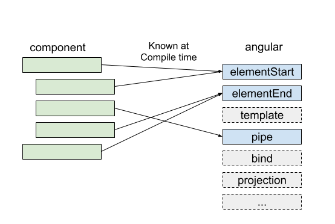

## Ivy Engine
Ivy is Angular's new rendering pipeline and view engine.

Ivy is going to be the third incarnation of this engine for Angular 2+. First, there was the __View Engine__. Then, for version 4, the team introduced the view engine, referred to as __Renderer2__.

### Features:
* #### Locality

    Locality means that Ivy compiles one file at a time. It only looks at a component and its template, not its dependencies, when generating the output. Compiling one file at a time will mean smaller sets of instructions, and it will also mean we'll be able to do incremental builds.

    Renderer2 was unable to do this, because it needed to do a static analysis of all code and generate a file called `metadata.json` that could be used to generate the compilation instructions. This template data was then sent to the Angular interpreter in order to be translated into something readable by the DOM.

    Ivy compresses these steps, and the template HTML is turned into JS instructions that are then readable by then DOM.

    Benefits:
    * Faster compilation and the lack of a `metadata.json` step, this simplified process means that library creators will be able to ship AoT (ahead of time compiled) code through _npm_.

        Essentially, we'll have an equivalence between AoT and JIT

    * There's more opportunity for meta-programming, like higher order components and the ability to dynamically generate modules, components, or pipes.

* #### Tree-Shaking

    Ivy has been designed from the start with tree-shaking in mind.

    > "Tree-shaking" means removing unused pieces of your code, which results in smaller bundles and faster load times.

    Tree-shaking is done using static analysis, which doesn't actually run your code. Because of this, it must take into account all possible scenarios and include anything that might be needed in the bundle.

    You no longer ship the entire framework code, you only bundle pieces of the framework functionality that you use!

    Ivy tree-shakes even the templates.

* #### Incremental DOM

    The new runtime engine is based on the concept of __Incremental DOM__. It’s a way to express and apply updates to DOM trees using instructions. _So every component gets compiled into a series of instructions. These instructions create DOM trees and update them in-place when the data changes._

    A compiler simply produces metadata about a component and elements defined in its template. It’s the interpreter that does the main job. It uses this data to instantiate components and run change detection.

    Renderer2 rendering pipeline:

    

    Instead of generating template data and passing it into an interpreter that then makes decisions on which operations to run ,we generate a set of template instructions directly. These instructions will do the work of creating the correct DOM on their own.

    

    For example:
    ```typescript
    @Component({
        selector: 'todos-cmp',
        template: `
            <div *ngFor="let t of todos|async">
                {{t.description}}
            </div>
        `
    })
    class TodosComponent {
        todos: Observable<Todo[]> = this.store.pipe(select('todos'));
        constructor(private store: Store<AppState>) {}
    }
    ```

    Will be compiled into:
    ```javascript
    var TodosComponent = /** @class */ (function () {
        function TodosComponent(store) {
            this.store = store;
            this.todos = this.store.pipe(select('todos'));
        }

        TodosComponent.ngComponentDef = defineComponent({
            type: TodosComponent,
            selectors: [["todos-cmp"]],
            factory: function TodosComponent_Factory(t) {
                return new (t || TodosComponent)(directiveInject(Store));
            },
            consts: 2,
            vars: 3,
            template: function TodosComponent_Template(rf, ctx) {
                if (rf & 1) { // create dom
                    pipe(1, "async");
                    template(0, TodosComponent_div_Template_0, 2, 1, null, _c0);
                } if (rf & 2) { // update dom
                    elementProperty(0, "ngForOf", bind(pipeBind1(1, 1, ctx.todos)));
                }
            },
            encapsulation: 2
        });

        return TodosComponent;
    }());
    ```

    The template function contains the instructions rendering and updating the DOM. Note that the instructions aren’t interpreted by the framework’s rendering engine. __They are the rendering engine.__

    #### Why Incremental DOM?
    They have one goal in mind: applications have to perform well on mobile devices. This mainly meant optimizing two things: the bundle size and the memory footprint.

    To achieve the two goals:
    * The rendering engine itself has to be tree shakable.
    * The rendering engine has to have low memory footprint.

    #### Why Incremental DOM is Tree Shakable?
    When using incremental DOM, the framework does not interpret the component. Instead, the component references instructions. If it doesn’t reference a particular instruction, it will never be used. And since we know this at compile time, we can omit the unused instruction from the bundle.

    

    Virtual DOM requires an interpreter. What part of that interpreter is needed and what part is not isn’t known at compile time, so we have to ship the whole thing to the browser.

    #### Why Incremental DOM Has Low Memory Footprint?
    Virtual DOM creates a whole tree from scratch every time you rerender.

    Incremental DOM, on the other hand, doesn’t need any memory to rerender the view if it doesn’t change the DOM. We only have to allocate the memory when the DOM nodes are added or removed. And the size of the allocation is proportional to the size of the DOM change.

    > _Incremental DOM_ also happens to be a [library](https://github.com/google/incremental-dom), but the new Ivy engine doesn’t use it and instead implements its own version.

* #### `NgOnChanges`

    So it is notable that `OnChanges` in Ivy is not a real lifecycle any more.

    Basically the `NgOnChangesFeature` that implements the hook adds a wrapper around `ngDoCheck` lifecycle hook that calls `NgOnChanges` first if there’s a change, and then the `ngDoCheck` lifecycle hook.

* #### Stricter type checking in templates

    Because of this the old code might not work with Ivy.

* #### No NgFactory file anymore

    Under the new Ivy mode, compiled template will be stored in the static fields in class, instead of generating new wrapper class.

    So, we have less code to ship.

* #### Greatly simplify bootstrap code

* #### Redesigned DevMode configuration and checking

* #### New Injectable API

* #### New template compilation

* #### Memory and Speed

[More detailed list of Ivy feature](https://herringtondarkholme.github.io/2018/02/19/angular-ivy/)

___

### Resources:

* #### [Recomended Video to Watch](https://www.youtube.com/watch?v=isb5Ef6yI48)

* #### [Official Ivy Engine Introduction](https://www.youtube.com/watch?v=dIxknqPOWms&feature=youtu.be&t=22m43s)

* [Metaprogramming, Higher-Order Components and Mixins with Angular Ivy](https://blog.nrwl.io/metaprogramming-higher-order-components-and-mixins-with-angular-ivy-75748fcbc310)

* [Understanding Angular Ivy: Incremental DOM and Virtual DOM](https://blog.nrwl.io/understanding-angular-ivy-incremental-dom-and-virtual-dom-243be844bf36)

* [First Look: Angular Ivy](https://dzone.com/articles/first-look-angular-ivy)

* [Ivy: A look at the New Render Engine for Angular](https://medium.com/js-imaginea/ivy-a-look-at-the-new-render-engine-for-angular-953bf3b4907a)

* [Inside Ivy: Exploring the New Angular Compile](https://blog.angularindepth.com/inside-ivy-exploring-the-new-angular-compiler-ebf85141cee1)

* [Ivy engine in Angular: first in-depth look at compilation, runtime and change detection](https://blog.angularindepth.com/ivy-engine-in-angular-first-in-depth-look-at-compilation-runtime-and-change-detection-876751edd9fd)

* [Incremental DOM Tutorial](https://medium.com/@azizhk/incremental-dom-tutorial-843530b0cb68)

* [Introducing to NG-VDOM: A new way to write Angular application](https://blog.angularindepth.com/introducing-to-ng-vdom-a-new-way-to-write-angular-application-60a3be805e59)
