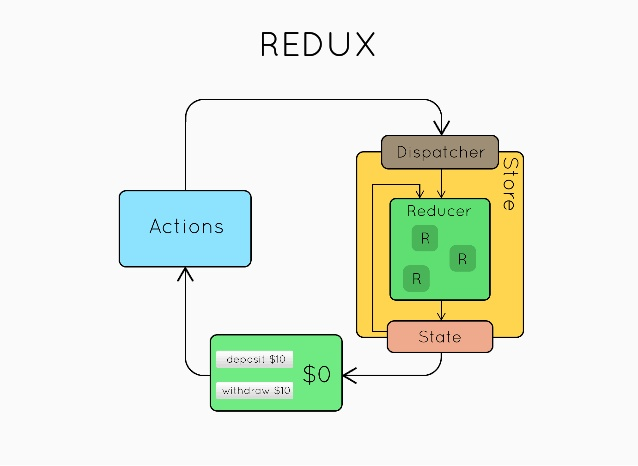

## Redux
Redux is a very popular state-management library, mostly used along side React. People like it because it delivers a predictable data model.

#### Pros:
* Predictability and simplicity
* Unidirectional data flow and immutability
* Separation of data and presentation
* Extensibility (via middlewares)
* Popularity and community
* Tooling support
* Easy to debug
* Time travel

#### Cons:
* Boilerplate (views, action types, action creators, reducers, selectors, …)
* No out-of-the-box solution for dealing with side-effects (available through middlewares such as redux-thunk or redux-saga)
* No encapsulation. Any component can access the data which can cause security issues.
* As state is immutable in redux, the reducer updates the state by returning a new state every time which can cause excessive use of memory.
