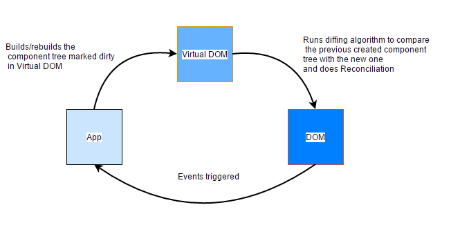

## Virtual DOM in React

`DOM` is a way of representing a structured document via objects.
* _Document_ - means page
* _Object_ - pieces, components of the document
* _Model_ - what do we call these individual pieces and how do we describe relationship between them

The main problem is that `DOM` was never optimized for creating dynamic UI. We can work with it using `JavaScript` and libraries like `jQuery`. But `jQuery` and others did little to solve performance issues.

Currently, `W3C` group is working on new `Shadow DOM`.

Another option is `Virtual DOM` — Not a standard. `Virtual DOM` is an abstraction of real DOM. They still utilize DOM eventually, but do it as little as possible and very efficiently.

`Virtual DOM` is a technique and set of libraries / algorithms that allow us to improve front end performance by avoiding direct work with DOM and work only with lightweight JavaScript object that mimics the DOM tree.

Pros:
* Updates process is optimized and accelerated.
* JSX makes components/blocks code readable.
* React’s data binding establishes conditions for creation dynamic applications.
* Prompt rendering. Using comprises methods to minimize number of DOM operations helps to optimize updating process and accelerate it.
* Testable. React’s native tools are offered for testing, debugging code.

__[How React Virtual DOM works (Video)](https://www.youtube.com/watch?v=mLMfx8BEt8g)__

__[More about React Virtual DOM](https://evilmartians.com/chronicles/optimizing-react-virtual-dom-explained)__
