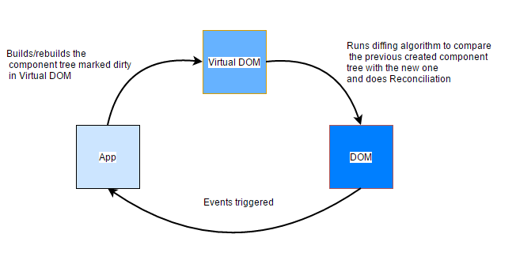

## Virtual DOM in React


`DOM` is a way of representing a structured document via objects.
* _Document_ - means page
* _Object_ - pieces, components of the document
* _Model_ - what do we call these individual pieces and how do we describe relationship between them

The main problem is that `DOM` was never optimized for creating dynamic UI. We can work with it using `JavaScript` and libraries like `jQuery`. But `jQuery` and others did little to solve performance issues. 

Currently, `W3C` group is working on new `Shadow DOM`.

Another option is `Virtual DOM` — Not a standard. `Virtual DOM` is an abstraction of real DOM. They still utilize DOM eventually, but do it as little as possible and very efficiently.

`Virtual DOM` is a technique and set of libraries / algorithms that allow us to improve front end performance by avoiding direct work with DOM and work only with lightweight JavaScript object that mimics the DOM tree.

__[How React Virtual DOM works (Video)](https://www.youtube.com/watch?v=mLMfx8BEt8g)__

__[More about React Virtual DOM](https://evilmartians.com/chronicles/optimizing-react-virtual-dom-explained)__

## Web Components
`Web Components` are developer defined HTML Elements which work in the browser with other HTML elements.

`Web Components` is a suite of different technologies allowing you to create reusable custom elements — with their functionality encapsulated away from the rest of your code — and utilize them in your web apps.

* __`Custom elements`__: A set of JavaScript APIs that allow you to define custom elements and their behaviour, which can then be used as desired in your user interface.

* __`Shadow DOM`__: A set of JavaScript APIs for attaching an encapsulated "shadow" DOM tree to an element — which is rendered separately from the main document DOM — and controlling associated functionality. In this way you can keep an element's features private, so they can be scripted and styled without the fear of collision with other parts of the document.

    `Shadow DOM` is a new part of the HTML spec which allows developers to encapsulate their HTML markup, CSS styles and JavaScript. 

    All the content of `Shadow DOM` goes inside `#shadow-root` element.

    __[More about how to deal with the `Shadow DOM`](https://gist.github.com/praveenpuglia/0832da687ed5a5d7a0907046c9ef1813)__

* __`HTML templates`__: The `<template>` and `<slot>` elements enable you to write markup templates that are not displayed in the rendered page. These can then be reused multiple times as the basis of a custom element's structure.

    When you have to reuse the same markup structures repeatedly on a web page, it makes sense to use some kind of a template rather than repeating the same structure over and over again. This is made a lot easier by the HTML `<template>` element (which is well-supported in modern browsers). This element and its contents are not rendered in the DOM, but it can still be referenced using JavaScript.

    This won't appear in your page until you grab a reference to it with JavaScript and then append it to the DOM.

    `<slot>` are identified by their `name` attribute, and allow you to define placeholders in your `<template>` that can be filled with any markup fragment you want when the element is used in the markup.

    The `<template>` has a `<style>` element with a set of CSS styles that are scoped just to the document fragment the  `<template>` creates.

* __`HTML Imports`__: Once you've defined a custom component, the easiest way to reuse it is to keep its definition details in a separate file and then use an import mechanism to import it into pages where you want to actually use it. HTML Imports is one such mechanism, although there is controversy over it — Mozilla fundamentally disagrees with this approach and is intending to implement something more suitable in the future.

    `HTML Imports` is intended to be the packaging mechanism for web components, but you can also use HTML Imports by itself.
    ```html
    <link rel="import" href="myfile.html">
    ```

The basic approach for implementing a web component generally looks something like this:

1. Create a class in which to specify your web component functionality using the _ECMAScript 2015 class syntax_.
2. Register your new custom element using the `CustomElementRegistry.define()` method, passing it the element name to be defined, class in which its functionality is specified, and optionally, what element it inherits from.
3. If required, attach a shadow DOM to the custom element using `Element.attachShadow()` method. Add child elements, event listeners, etc., to the shadow DOM using regular DOM methods.
4. If required, define an HTML template using `<template>` and `<slot>`. Again use regular DOM methods to clone the template and attach it to your shadow DOM.
5. Use your custom element wherever you like on your page, just like you would any regular HTML element.

Feature detection:
```js
if (!document.body.createShadowRoot) {...}
```

Otherwise use polifyll [webcomponents.js](https://github.com/webcomponents/webcomponentsjs).


__[Detailed explanation of Web Components](https://developer.mozilla.org/en-US/docs/Web/Web_Components)__

__[Examples](https://github.com/mdn/web-components-examples)__

### [DOM API](https://developer.mozilla.org/en-US/docs/Web/API/Document_Object_Model)