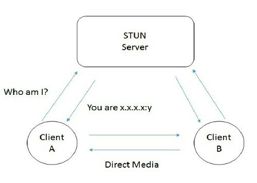
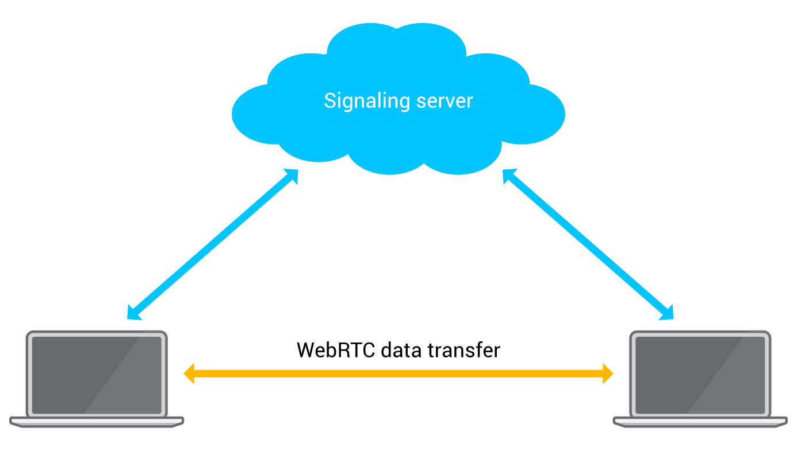

## WebRTC
Web Real-Time Communication (WebRTC) is an open source project currently being developed with an aim to provide real time, peer-to-peer communication between web applications.

WebRTC provides simple JavaScript APIs that help developers to easily build web applications with real time audio, video and data transfer capabilities.

In order to set-up a WebRTC connection, we need to perform the following two steps:

### 1. Locating a peer
Web applications cannot ‘dial and call’ each other. Each of the million browsers in the world do not have a unique id (like a phone number) assigned to them. However, the system in which these applications reside is assigned an unique IP address which can be used to ‘locate’ a peer.

However, this process is not as easy as it sounds. Because, most of these systems sit behind a __Network Address Translation (`NAT`)__ device. `NAT` devices are needed for security and IPv4 limitations on available public IP addresses. A `NAT` device assigns private IP addresses to systems within a local network. This private IP addresses are only valid and visible within the local network and cannot be used to accept communication from the outside world since the systems outside the network are not aware of the public IP of devices within the network.

Due to the involvement of `NAT` devices, a peer does not know it’s own public IP address since it is masked by a private IP address assigned by the `NAT`. And hence, it cannot share it’s public IP address with another peer for accepting connections. In more understandable terms, if you want someone to give you a phone call, you need to give your phone number to the other person. But, in the presence of `NAT`, it’s like staying in a hotel wherein the phone number of your room is hidden from the outside world, the calls coming to the hotel are handled at the reception and further redirected to your room on request. Such indirect form of connection is not intended in a peer-to-peer connection technology.

In order to overcome this, we use a protocol called as Interactive Connectivity Establishment (`ICE`). The job of `ICE` is to find the best possible path to connect two peers. `ICE` can perform direct connection , i.e in the absence of `NAT` and also indirect connections i.e in the presence of a `NAT`. `ICE` framework provides us with `ICE candidates`. `ICE candidates` are nothing but objects that contain our own public IP address, port number and other connection related information.

In the absence of `NAT`, `ICE` is pretty straightforward since the public IP address of the peer is readily available. However, in the presence of `NAT`, `ICE` relies on entities called as __Session Traversal Utilities for `NAT` (`STUN`)__ and/or __Traversal Using Relays around `NAT` (`TURN`)__.

A `STUN` server basically allows a peer to find out it’s own public IP address. A peers that needs to know it’s own public IP address sends a request to the `STUN` server. The `STUN` server replies with the public IP address of that peer. This public address can now be shared with other peers so that they can locate you. However, if the peer is behind a complex `NAT` and/or a firewall, even `STUN` is not able to find and provide the requesting peer with it’s IP address. In such cases, ICE relies on `TURN` to establish the connection. `TURN`, as the name suggests, is a relay server and acts as an intermediary for transferring data, audio, video when direct connection is not possible between two peers.

> The `STUN` server is only involved during the process of finding the public IP. Once WebRTC connection has been established, all further communication happen through WebRTC. However, in case of `TURN`, the `TURN` server is required throughout even after the WebRTC connection has been setup.

A `TURN` server is something that is not intended but due to limitations of `STUN`, we have to rely on it. A `STUN` server is only successful about `86%` of the times.

> “ICE is complex because we live in a complex world.”

### 2. Notify a peer to setup WebRTC connection.
Now that we have obtained the `ICE candidates`, the next step is to send this candidates to a peer that we wish to connect to. Along with the candidates, Session Descriptions like the session information, time description, media description are sent. The `ICE candidates` and the Session Description are bundled inside an object and conveyed using the __Session Description Protocol (`SDP`)__.

I’ve written that we need to ‘send’ the information to the other peer. But, how are the candidates and session description transferred when we only know the IP address of the sender and unaware about the receiving peer’s IP address ?

The answer to all these questions lie inside a concept called as __Signalling Mechanism__. Before a WebRTC connection is established, we need some medium to transfer the above information between the peers and let them know how to locate and connect with each other for a WebRTC connection. This is where signalling mechanism comes into picture. A signalling mechanism, as the name suggests, exchanges connection signals (`ICE` candidates, Session description, etc) between the two peers that intend to be connected.

WebRTC does not define any standard for implementing such a signalling mechanism and leaves it to the developer to create a mechanism of his/her choice. The signalling mechanism to exchange the information can be achieved by simply copy-pasting either information into respective peers or by using a communication channel like `WebSockets`, `Socket.io`, `Server Side Events`, etc. In short, a signalling mechanism is just a mode of exchanging connection related information between peers so that the peers can identify each other and start communicating further using WebRTC.

### Recap:
1. Peer A generates it’s `ICE` candidates using __Interactive Connectivity Establishment (`ICE`)__. In most cases it requires a __Session Traversal Utilities for `NAT` (`STUN`)__ or a __Traversal Using Relays around `NAT` (`TURN`)__ server.
2. Peer A bundles the `ICE` candidate and __Session Description__ into a single object. This object is stored as __Local Description__ (a peer’s own connection information) within peer A and transferred to peer B via a signalling mechanism. This part is called as the __Offer__.
3. Peer B receives the _offer_ and stores it as __Remote Description__ (connection information of the peer at other end) for further use. Peer B generates it’s own `ICE` candidate and _Session Description_, stores them as it’s _Local Description_ and sends it to peer A via the signalling mechanism. This part is called as the _Answer_. (Note: As said earlier, the `ICE` candidates in step 2 and 3 may also be sent separately)
4. Peer A receives the answer from peer B and stores it as it’s _Remote Description_.

