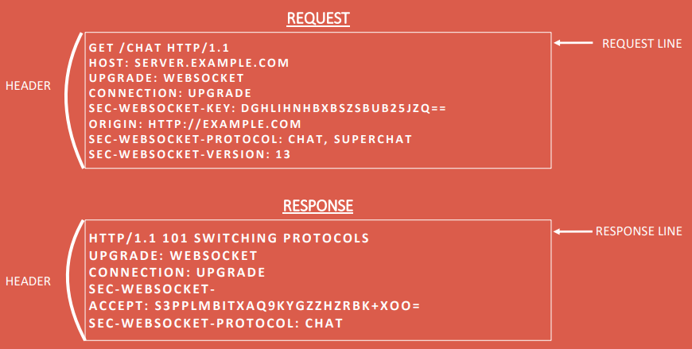

## WebSocket
WebSockets provide a persistent connection between a client and server that both parties can use to start sending data at any time.

The client establishes a WebSocket connection through a process known as the WebSocket handshake. This process starts with the client sending a regular HTTP request to the server. An `Upgrade` header is included in this request that informs the server that the client wishes to establish a WebSocket connection.

Here is a simplified example of the initial request headers.

> Note: WebSocket URLs use the `ws` scheme. There is also `wss` for secure WebSocket connections which is the equivalent of HTTPS.

If the server supports the WebSocket protocol, it agrees to the upgrade and communicates this through an `Upgrade` header in the response.

Now that the handshake is complete the initial HTTP connection is replaced by a WebSocket connection that uses the same underlying TCP/IP connection. At this point either party can starting sending data.

With WebSockets you can transfer as much data as you like without incurring the overhead associated with traditional HTTP requests.

#### Summary
* Full-featured duplex stream
* Bidirectional communication protocol
* Connection can be closed fom either side
* WebSocket is often used to handle real-time web apps
* Browser compatibility must be considered
