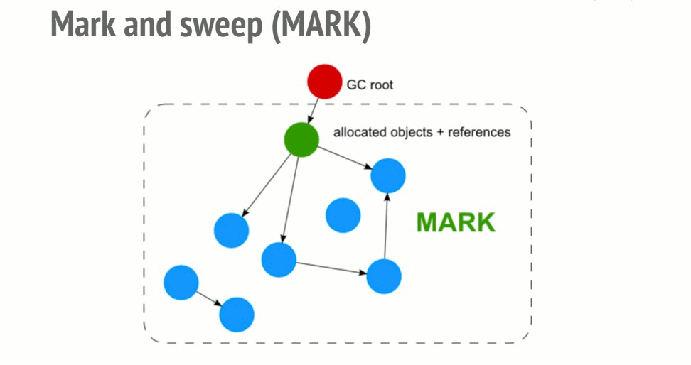

## Memory Management
This is the simplest garbage collection algorithm. An object is considered “garbage collectible” if there are zero references pointing to it.

### Cycles are creating problems
There is a limitation when it comes to cycles. In the following example, two objects are created and reference one another, thus creating a cycle.
```javascript
function f() {
    var o1 = {};
    var o2 = {};
    o1.p = o2; // o1 references o2
    o2.p = o1; // o2 references o1. This creates a cycle.
}

f();
```

### Mark-and-sweep algorithm
In order to decide whether an object is needed, this algorithm determines whether the object is reachable.

The Mark-and-sweep algorithm goes through these 3 steps:
* Roots: In general, roots are global variables which get referenced in the code. In JavaScript for example, a global variable that can act as a root is the “window” object. The identical object in Node.js is called “global”. A complete list of all roots gets built by the garbage collector.
* The algorithm then inspects all roots and their children and marks them as active (meaning, they are not garbage). Anything that a root cannot reach will be marked as garbage.
* Finally, the garbage collector frees all memory pieces that are not marked as active and returns that memory to the OS.



___

## Memory Leak
Memory leaks are pieces of memory that the application have used in the past but is not needed any longer but has not yet been return back to the OS or the pool of free memory.

The four types of common JavaScript leaks:
* __Global variables__.
    ```javascript
    function foo(arg) {
        bar = "some text";
    }

    // is equivivalent of

    function foo(arg) {
        window.bar = "some text";
    }
    ```

    You can also accidentally create a global variable using `this`:
    ```javascript
    function foo() {
        this.var1 = "potential accidental global";
    }
    // Foo called on its own, this points to the global object (window)
    // rather than being undefined.
    foo();
    ```

    > You can avoid all this by adding `‘use strict’;` at the beginning of your JavaScript file

    Use global variables to store data if you must but when you do, make sure to assign it as `null` or reassign it once you are done with it.

* __Timers or callbacks that are forgotten__

    Don't forget to remove `setInterval()` and `target.addEventListener()`.

* __Closures__

    ```javascript
    var theThing = null;
    var replaceThing = function () {
    var originalThing = theThing;
    var unused = function () {
        if (originalThing) // a reference to 'originalThing'
        console.log("hi");
    };
    theThing = {
        longStr: new Array(1000000).join('*'),
        someMethod: function () {
        console.log("message");
        }
    };
    };
    setInterval(replaceThing, 1000);
    ```

    Once a scope for closures is created for closures in the same parent scope, the scope is shared. In the above example, the scope created for the closure `someMethod` is shared with `unused`, while `unused` references `originalThing`. `someMethod` can be used through `theThing` outside of the `replaceThing` scope, despite the fact that `unused` is never used. The fact that `unused` references `originalThing` requires that it remains active since `someMethod` shares the closure scope with `unused`.

* __Out of DOM references__

    ```javascript
    var elements = {
        button: document.getElementById('button'),
        image: document.getElementById('image')
    };
    function doStuff() {
        elements.image.src = 'http://example.com/image_name.png';
    }
    function removeImage() {
        // The image is a direct child of the body element.
        document.body.removeChild(document.getElementById('image'));
        // At this point, we still have a reference to #button in the
        //global elements object. In other words, the button element is
        //still in memory and cannot be collected by the GC.
    }
    ```

## Unintuitive behavior of Garbage Collectors
Although Garbage Collectors are convenient they come with their own set of trade-offs. GC is nondeterminism. In other words, GCs are unpredictable. It is not usually possible to be certain when a collection will be performed. This means that in some cases more memory than is actually required by the program is being used. In other cases, short-pauses may be noticeable in particularly sensitive applications.

#### [Read More](https://blog.sessionstack.com/how-javascript-works-memory-management-how-to-handle-4-common-memory-leaks-3f28b94cfbec)
