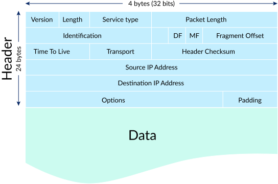

# Network
A network is a group of two or more connected computing devices. Usually all devices in the network are connected to a central hub — for instance, a router. A network can also include subnetworks, or smaller subdivisions of the network. Subnetworking is how very large networks, such as those provided by ISPs, are able to manage thousands of IP addresses and connected devices.

Think of the Internet as a network of networks: computers are connected to each other within networks, and these networks connect to other networks. This enables these computers to connect with other computers both near and far.

## Client Server Model
The paradigm by which modern systems are designed, which consists of clients requesting data or service from servers and servers providing data or service to clients.

### Client
A machine or process that requests data or service from a server.

Note that a single machine or piece of software can be both a client and a server at the same time. For instance, a single machine could act as a server for end users and as a client for a database. 

### Server
A machine or process that provides data or service for a client, usually by listening for incoming network calls.

Note that a single machine or piece of software can be both a client and a server at the same time. For instance, a single machine could act as a server for end users and as a client for a database.

## Internet Protocol (IP)
In networking, a __protocol__ is a standardized way of doing certain actions and formatting data so that two or more devices are able to communicate with and understand each other.

The Internet Protocol - is a protocol, or set of rules, for routing and addressing _packets_ of data so that they can travel across networks and arrive at the correct destination.

Every device or domain that connects to the Internet is assigned an _IP address_. `IPv4` addresses consist of four numbers separated by dots: `a.b.c.d` where all four numbers are between `0` and `255`. Special values include:
* `127.0.0.1`: Your own local machine. Also referred to as `localhost`.
* `192.168.x.y`: Your private network. For instance, your machine and all machines on your private wifi network will usually have the `192.168` prefix.

Sometimes more broadly referred to as just a (network) packet, an IP packet is effectively the smallest unit used to describe data being sent over IP, aside from bytes. An IP packet consists of:
* an __IP header__, which contains the source and destination IP addresses as well as other information related to the network
* a __payload__, which is just the data being sent over the network

When Bob sends Alice a message, for instance, his message is broken down into smaller pieces and then reassembled on Alice's computer. A packet has two parts: the header, which contains information about the packet itself, and the body, which is the actual data being sent.

At the network layer, networking software attaches a header to each packet when the packet is sent out over the Internet, and on the other end, networking software can use the header to understand how to handle the packet.

A header contains information about the content, source, and destination of each packet (somewhat like stamping an envelope with a destination and return address). For example, an IP header contains the destination IP address of each packet, the total size of the packet, an indication of whether or not the packet has been fragmented (broken up into still smaller pieces) in transit, and a count of how many networks the packet has traveled through.

### Port
In order for multiple programs to listen for new network connections on the same machine without colliding, they pick a __port__ to listen on. A port is an integer between 0 and 65,535 (2^16 ports total).

Typically, ports 0-1023 are reserved for system ports (also called well-known ports) and shouldn't be used by user-level processes. Certain ports have pre-defined uses, and although you usually won't be required to have them memorized, they can sometimes come in handy. Below are some examples:
* `22`: Secure Shell
* `53`: DNS lookup
* `80`: HTTP
* `443`: HTTPS

### DNS
Short for __Domain Name System__, it describes the entities and protocols involved in the translation from domain names to IP Addresses. Typically, machines make a DNS query to a well known entity which is responsible for returning the IP address (or multiple ones) of the requested domain name in the response.

## Border Gateway Protocol (BGP)
The Internet is made up of interconnected large networks that are each responsible for certain blocks of IP addresses; these large networks are known as __autonomous systems (AS)__. A variety of routing protocols, including BGP, help route packets across ASes based on their destination IP addresses. Routers have routing tables that indicate which ASes the packets should travel through in order to reach the desired destination as quickly as possible. Packets travel from AS to AS until they reach one that claims responsibility for the targeted IP address. That AS then internally routes the packets to the destination.

__Border Gateway Protocol (BGP)__ is the postal service of the Internet. When someone drops a letter into a mailbox, the Postal Service processes that piece of mail and chooses a fast, efficient route to deliver that letter to its recipient. Similarly, when someone submits data via the Internet, BGP is responsible for looking at all of the available paths that data could travel and picking the best route, which usually means hopping between autonomous systems.

BGP is the protocol that makes the Internet work by enabling data routing. When a user in Singapore loads a website with origin servers in Argentina, BGP is the protocol that enables that communication to happen quickly and efficiently.

## TCP
Network protocol built on top of the Internet Protocol (IP). Allows for ordered, reliable data delivery between machines over the public internet by creating a connection.

TCP is usually implemented in the kernel, which exposes sockets to applications that they can use to stream data through an open connection.

The Transmission Control Protocol (TCP) is a transport protocol, meaning it dictates the way data is sent and received. A TCP header is included in the data portion of each packet that uses TCP/IP. Before transmitting data, TCP opens a connection with the recipient. TCP ensures that all packets arrive in order once transmission begins. Via TCP, the recipient will acknowledge receiving each packet that arrives. Missing packets will be sent again if receipt is not acknowledged.

TCP is designed for reliability, not speed. Because TCP has to make sure all packets arrive in order, loading data via TCP/IP can take longer if some packets are missing.

TCP and IP were originally designed to be used together, and these are often referred to as the __TCP/IP__ suite. However, other transport protocols can be used with IP.

## UDP
The User Datagram Protocol, or UDP, is another widely used transport protocol. It's faster than TCP, but it is also less reliable. UDP does not make sure all packets are delivered and in order, and it doesn't establish a connection before beginning or receiving transmissions.

## What physical infrastructure makes the Internet work?
A lot of different kinds of hardware and infrastructure go into making the Internet work for everyone. Some of the most important types include the following:
* __Routers__ forward packets to different computer networks based on their destination. Routers are like the traffic cops of the Internet, making sure that Internet traffic goes to the right networks.
* __Switches__ connect devices that share a single network. They use packet switching to forward packets to the correct devices. They also receive outbound packets from those devices and pass them along to the right destination.
* __Web servers__ are specialized high-powered computers that store and serve content (webpages, images, videos) to users, in addition to hosting applications and databases. Servers also respond to DNS queries and perform other important tasks to keep the Internet up and running. Most servers are kept in large data centers, which are located throughout the world.
