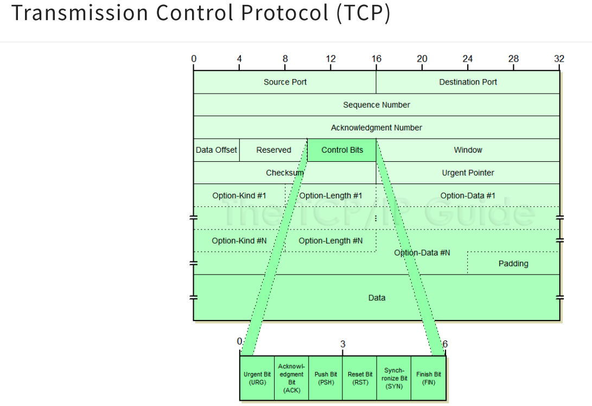
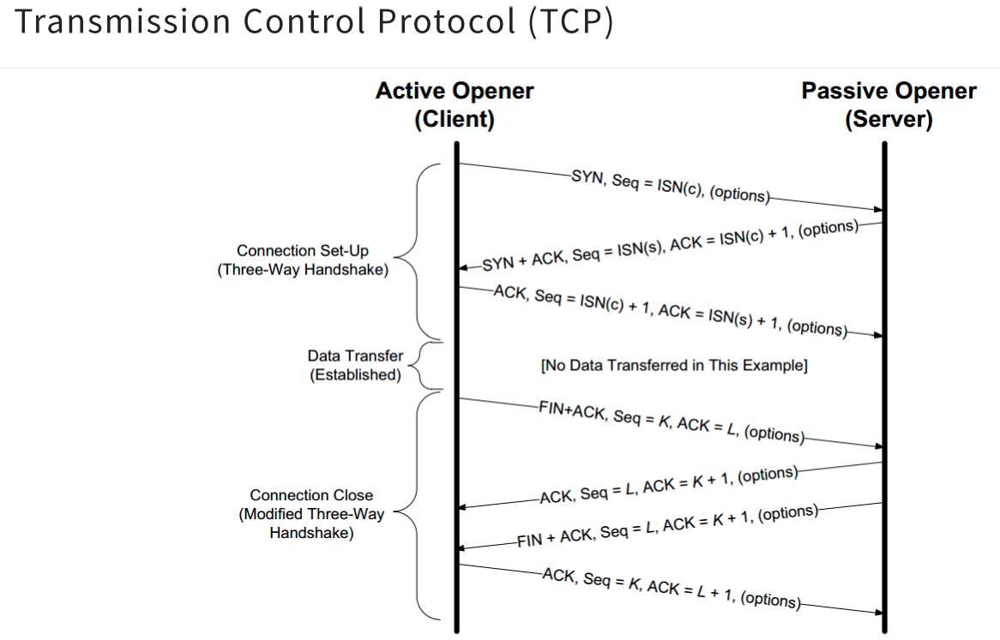

## Transmission Control Protocol (TCP) 
__TCP__ is a standard that defines how to establish and maintain a network conversation through which application programs can exchange data. TCP works with the Internet Protocol (IP), which defines how computers send packets of data to each other. Together, TCP and IP are the basic rules defining the Internet.

The detailed structure of a TCP Header:

### The three-way handshake
Describes how the TCP connection is established between machines.

---

#### [Read More](https://www.ionos.com/digitalguide/server/know-how/introduction-to-tcp/)
