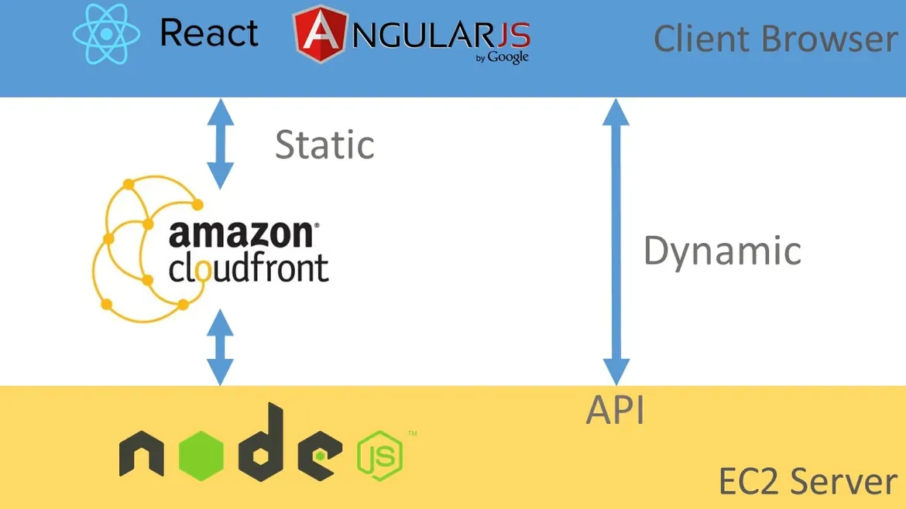

# NodeJS Architectures
## 3 Layer architecture
The idea is to use the principle of separation of concerns to move the business logic away from the node.js API Routes.

### Folder Structure
``` shell
src
│───app.js          # App entry point
└───api             # Express route controllers for all the endpoints of the app
└───config          # Environment variables and configuration related stuff
└───jobs            # Jobs definitions for agenda.js
└───loaders         # Split the startup process into modules
└───models          # Database models
└───services        # All the business logic is here
└───subscribers     # Event handlers for async task
└───types           # Type declaration files (d.ts) for Typescript
```

### Don’t put your business logic inside the controllers!!
You may be tempted to just use the express.js controllers to store the business logic of your application, but this quickly becomes spaghetti code, as soon as you need to write unit tests, you will end up dealing with complex mocks for req or res express.js objects.

### Use a service layer for your business logic
This layer is where your business logic should live.

It’s just a collection of classes with clear purposes, following the SOLID principles applied to node.js.

In this layer there should not exists any form of ‘SQL query’, use the data access layer for that.

* Move your code away from the express.js router
* Don’t pass the req or res object to the service layer
* Don’t return anything related to the HTTP transport layer like a status code or headers from the service layer.

### Use a Pub/Sub layer too
The simple node.js API endpoint that creates a user right now, may want to call third-party services, maybe to an analytics service, or maybe start an email sequence.

An imperative call to a dependent service is not the best way of doing it.

A better approach is by emitting an event i.e. ‘a user signed up with this email’.

And you are done, now it’s the responsibility of the listeners to do their job.

### Dependency Injection
D.I. or inversion of control (IoC) is a common pattern that will help the organization of your code, by ‘injecting’ or passing through the constructor the dependencies of your class or function.

The idea is you declare your dependencies in the class, and when you need an instance of that class, you just call the ‘Service Locator’.

```javascript
route.post('/', 
  async (req, res, next) => {
    const userDTO = req.body;

    const userServiceInstance = Container.get(UserService) // Service locator

    const { user, company } = userServiceInstance.Signup(userDTO);

    return res.json({ user, company });
  });
```

### Unit tests
By using dependency injection and these organization patterns, unit testing becomes really simple.

You don’t have to mock `req`/`res` objects or `require(…)` calls.

### Configurations and secrets
The best approach to store API Keys and database string connections, it’s by using [dotenv](https://github.com/motdotla/dotenv#readme).

Put a `.env` file, that must never be committed (but it has to exist with default values in your repository) then, the npm package _dotenv_ loads the `.env` file and insert the vars into the `process.env` object of node.js.

That could be enough but, I like to add an extra step. Have a `config/index.ts` file where the _dotenv_ npm package loads the .env file and then I use an object to store the variables, so we have a structure and code autocompletion.

```javascript
const dotenv = require('dotenv');
// config() will read your .env file, parse the contents, assign it to process.env.
dotenv.config();

export default {
  port: process.env.PORT,
  databaseURL: process.env.DATABASE_URI,
  paypal: {
    publicKey: process.env.PAYPAL_PUBLIC_KEY,
    secretKey: process.env.PAYPAL_SECRET_KEY,
  },
  paypal: {
    publicKey: process.env.PAYPAL_PUBLIC_KEY,
    secretKey: process.env.PAYPAL_SECRET_KEY,
  },
  mailchimp: {
    apiKey: process.env.MAILCHIMP_API_KEY,
    sender: process.env.MAILCHIMP_SENDER,
  }
}
```

### Loaders
The idea is that you split the startup process of your node.js service into testable modules.

Create a separate file which only starts the node.js server. Another file loads middleware. Another connects to a DB.

### Serving static assets
Node.js wasn’t designed to serve static assets, it takes so much cpu% time.

You should be using a proxy CDN like CloudFront in front of your static files.



[Check this article on how to implement AWS S3 + AWS Cloudfront for doing this task.](https://softwareontheroad.com/s3-cloudfront-angular-react)

Also, you can use Netlify which is totally free for 100GB network traffic monthly and 1TB traffic for paid accounts.

### DON’T USE gzip compression
Compressing a response involves CPU computation.

So it’s better to delegate that kind of tasks to the proxy, CloudFront has the option to set compression, as well as other proxies like Nginx.

### A good task scheduler
It’s very common the needing of a recurring task. Maybe you need to fire a reminder for a user once a day, or calculating the billing of the service for a customer once a month.

But you shouldn’t rely on simple `setTimeout` or `setInterval` for doing such tasks.

Bad planning here will bring you troubles when you try to scale horizontally your node.js server, the cron jobs will be duplicated and chaos can occur.

It’s a better approach to use a task scheduler framework like [agendajs](https://github.com/agenda/agenda) which has a separate module to have an admin dashboard.

* Scheduled and recurring Jobs are stored in MongoDB, every time a worker starts a job, they lock the execution so no problem with multiple jobs running at the same time.
* Can reschedule jobs easily, they are just MongoDB documents that can be changed at any time.
* If the task fails you can reschedule to run again.
* You can add an admin dashboard GUI to monitoring scheduled and recurring task and their states.
* Using the admin dashboard you can run manually a job whenever you want.
* No problem with horizontal scaling of node.js server and duplication of job execution.

### Using Agendash as a good admin GUI
Now your jobs are stored in the DB and are less error prompt but them can occur. A good way to monitor your active, scheduled, and failed jobs are by using __Agendash2__ the web UI for __agendajs__ Also with have control over the jobs, we can re-schedule, create, run, and delete them.

### Using all the resources
Enable the power of cluster mode from day 1 to make use of all the resources available in the machine.

By default it works like this: the master process listens on a port, accepts new connections and distributes them across the workers in a round-robin fashion, with some built-in smarts to avoid overloading a worker process.

```javascript
const cluster = require('cluster');
const os = require('os');
const runExpressServer = require('./app');

// Check if current process is master.
if (cluster.isMaster) {
  // Get total CPU cores.
  const cpuCount = os.cpus().length;

  // Spawn a worker for every core.
  for (let j = 0; j < cpuCount; j++) {
    cluster.fork();
  }
} else {
  // This is not the master process, so we spawn the express server.
  runExpressServer();
}

// Cluster API has a variety of events.
// Here we are creating a new process if a worker die.
cluster.on('exit', function (worker) {
  console.log(`Worker ${worker.id} died'`);
  console.log(`Staring a new one...`);
  cluster.fork();
});
```

It may seem scary to try this out in your already in production node.js server, but you don’t have to worry. Unless you are using some type of home-made CRON in the same server that runs your API.

#### [Here is the Example Project](https://github.com/santiq/bulletproof-nodejs)

---

#### [Node.js design best practices](https://www.joyent.com/node-js/production/design)
