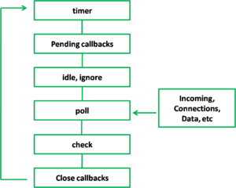
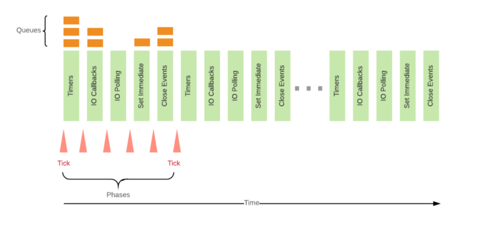

## NodeJS event Loop

### Blocking

**Blocking** is when the execution of additional JavaScript in the Node.js process must wait until a non-JavaScript operation completes. This happens because the event loop is unable to continue running JavaScript while a **blocking** operation is occurring.

In Node.js, JavaScript that exhibits poor performance due to being CPU intensive rather than waiting on a non-JavaScript operation, such as I/O, isn't typically referred to as **blocking**. Synchronous methods in the Node.js standard library that use libuv are the most commonly used **blocking** operations. Native modules may also have **blocking** methods.

All of the I/O methods in the Node.js standard library provide asynchronous versions, which are non-blocking, and accept callback functions. Some methods also have blocking counterparts, which have names that end with Sync.

> **Blocking methods execute synchronously and non-blocking methods execute asynchronously.**

```javascript
const fs = require("fs");

// Blocking operation.
const data = fs.readFileSync("/file.md"); // blocks here until file is read
console.log(data);
moreWork(); // will run after console.log

// Non-blocking/Async operation.
// Runs the callback ince the fle is read.
fs.readFile("/file.md", (err, data) => {
  if (err) throw err;
  console.log(data);
});
moreWork(); // will run before console.log
```

Note that in the synchronous version if an error is thrown it will need to be caught or the process will crash. In the asynchronous version, it is up to the author to decide whether an error should throw as shown.

### Event Loop

The event loop is what allows Node.js to perform non-blocking I/O operations — despite the fact that JavaScript is single-threaded — by offloading operations to the system kernel whenever possible.

Since most modern kernels are multi-threaded, they can handle multiple operations executing in the background. When one of these operations completes, the kernel tells Node.js so that the appropriate callback may be added to the poll queue to eventually be executed.

When Node.js starts, it initializes the event loop, processes the provided input script which may make async API calls, schedule timers, or call process.nextTick(), then begins processing the event loop.

**libuv** - is the C library that implements the Node.js event loop and all of the asynchronous behaviors of the platform.

The following diagram shows a simplified overview of the event loop's order of operations:



Each phase has a FIFO queue of callbacks to execute. While each phase is special in its own way, generally, when the event loop enters a given phase, it will perform any operations specific to that phase, then execute callbacks in that phase's queue until the queue has been exhausted or the maximum number of callbacks has executed. When the queue has been exhausted or the callback limit is reached, the event loop will move to the next phase, and so on.

Event loop works would be as follows:



Since any of these operations may schedule more operations and new events processed in the poll phase are queued by the kernel, poll events can be queued while polling events are being processed. As a result, long running callbacks can allow the poll phase to run much longer than a timer's threshold.

### Event Loop Phases:

- #### Timers

  Everything that was scheduled via `setTimeout()` or `setInterval()` will be processed here.

  A timer specifies the threshold after which a provided callback may be executed rather than the exact time a person wants it to be executed. Timers callbacks will run as early as they can be scheduled after the specified amount of time has passed; however, Operating System scheduling or the running of other callbacks may delay them. The only guarantee is that the timeout will not execute sooner than the declared timeout interval.

  > Technically, the poll phase controls when timers are executed.

  When the callbacks finishes in poll phase, there are no more callbacks in the queue, so the event loop will see that the threshold of the soonest timer has been reached then wrap back to the timers phase to execute the timer's callback.

  > To prevent the poll phase from starving the event loop, _libuv_ also has a hard maximum (system dependent) before it stops polling for more events.

  > `setTimeout()` is similar to `window.setTimeout()` from the browser JavaScript API, however a string of code cannot be passed to be executed.

  `Timeout` objects are returned by `setTimeout` and `setInterval`. The `Timeout` object provides two functions intended to augment `Timeout` behavior with `unref()` and `ref()`. If there is a `Timeout` object scheduled using a `set*` function, `unref()` can be called on that object. to stop the `Timeout` object from remaining active. If latter `ref()` is called on that object, the `Timeout` object gets actived.

- #### Pending IO Callbacks

  In this phase, the event loop executes system-related callbacks if any.

  For example, let's say you are writing a node server and the port on which you want to run the process is being used by some other process, node will throw an error `ECONNREFUSED`, some of the \*nix systems may want the callback to wait for execution due to some other tasks that the operating system is processing. Hence, such callbacks are pushed to the pending callbacks queue for execution.

- #### Idle, Prepare

  Only used internally.

- #### IO Poll

  Retrieve new I/O events; execute I/O related callbacks (almost all with the exception of close callbacks, the ones scheduled by timers, and `setImmediate()`); node will block here when appropriate.

  When the event loop enters the poll phase and there are no timers scheduled, one of two things will happen:

  - If the poll queue is not empty, the event loop will iterate through its queue of callbacks executing them synchronously until either the queue has been exhausted, or the system-dependent hard limit is reached.

  - If the poll queue is empty, one of two more things will happen:

    - If scripts have been scheduled by `setImmediate()`, the event loop will end the poll phase and continue to the check phase to execute those scheduled scripts.
    - If scripts have not been scheduled by `setImmediate()`, the event loop will wait for callbacks to be added to the queue, then execute them immediately.

  Once the poll queue is empty the event loop will check for timers whose time thresholds have been reached. If one or more timers are ready, the event loop will wrap back to the timers phase to execute those timers' callbacks.

- #### Check

  Runs all callbacks registered via `setImmediate()`.

  Generally, as the code is executed, the event loop will eventually hit the poll phase where it will wait for an incoming connection, request, etc. However, if a callback has been scheduled with `setImmediate()` and the _poll_ phase becomes idle, it will end and continue to the check phase rather than waiting for _poll_ events.

  What can be done if a `Timeout` or `Immediate` object needs to be cancelled? `setTimeout()`, `setImmediate()`, and `setInterval() `return a timer object that can be used to reference the set `Timeout` or `Immediate` object. By passing that object into the respective clear function, execution of that object will be halted completely. The respective functions are `clearTimeout()`, `clearImmediate()`, and `clearInterval()`.

- #### Close

  Here all `on(‘close’, ...)` event callbacks are processed.

Between each run of the event loop, Node.js checks if it is waiting for any asynchronous I/O or timers and shuts down cleanly if there are not any.

#### Now, there are two things which happen when any JavaScript code is run by the event loop.

1. #### When a function in our JavaScript code is called, the event loop first goes without actually the execution to register the initial callbacks to the respective queues.
2. #### Once they are registered, the event loop enters its phases and starts iterating and executing the callbacks until all them are processed.

### `setImmediate()` vs `setTimeout()`

The order in which the timers are executed will vary depending on the context in which they are called. If both are called from within the main module, then timing will be bound by the performance of the process (which can be impacted by other applications running on the machine).

For example, if we run the following script which is not within an I/O cycle (i.e. the main module), the order in which the two timers are executed is non-deterministic, as it is bound by the performance of the process:

```javascript
// timeout_vs_immediate.js
setTimeout(() => {
  console.log("timeout");
}, 0);

setImmediate(() => {
  console.log("immediate");
});
```

```shell
$ node timeout_vs_immediate.js
timeout
immediate

$ node timeout_vs_immediate.js
immediate
timeout
```

One more important things to note is `setTimeout` when set to `0` is internally converted to `1`. If the preparation before the first loop took more than `1ms` then the _Timer Phase_ calls the callback associated with it. If it’s is less than `1ms` Event-loop continues to next phase and runs the `setImmediate` callback in check phase of the loop and `setTimeout` in the
next tick of the loop.

However, if you move the two calls within an I/O cycle, the immediate callback is always executed first:

```javascript
// timeout_vs_immediate.js
const fs = require("fs");

fs.readFile(__filename, () => {
  setTimeout(() => {
    console.log("timeout");
  }, 0);
  setImmediate(() => {
    console.log("immediate");
  });
});
```

```shell
$ node timeout_vs_immediate.js
immediate
timeout

$ node timeout_vs_immediate.js
immediate
timeout
```

As we run our script, the event loop first runs without actually executing the callbacks. We encounter the `fs.readFile` with a callback which is registered and the callback is pushed to the **Poll phase queue**. Since all the callbacks for the given function are registered, the event loop is now free to start execution of the callbacks. Hence, it traverses through its phases starting from the timers. It doesn't find anything in the _Timers phase_ and _Pending callbacks_ phase.

When the event loop keeps traversing through its phases and when it sees that the file reading operation is complete, it starts executing the callback. Remember, when the event loop starts executing the callback of `fs.readFile`, it is in the **Poll phase**, after which, it will move to the **Check(`setImmediate`) phase**. Thus, the Check phase comes before the _Timers phase_ for the current run. Hence, when in _Poll phase_, the callback of `setImmediate` will always run before `setTimeout(fn, 0)`.

The main advantage to using `setImmediate()` over `setTimeout()` is `setImmediate()` will always be executed before any timers if scheduled within an I/O cycle, independently of how many timers are present.

### `process.nextTick()`

`process.nextTick()` is not technically part of the event loop. Instead, the `nextTickQueue` will be processed after the current operation is completed, regardless of the current phase of the event loop.

Looking back at our diagram, any time you call `process.nextTick()` in a given phase, all callbacks passed to `process.nextTick()` will be resolved before the event loop continues. This can create some bad situations because it **allows you to "starve" your I/O by making recursive `process.nextTick()` calls**, which prevents the event loop from reaching the **poll phase**.

What we're doing is passing an error back to the user but only after we have allowed the rest of the user's code to execute. By using `process.nextTick()` we guarantee that `apiCall()` always runs its callback after the rest of the user's code and before the event loop is allowed to proceed. To achieve this, the JS call stack is allowed to unwind then immediately execute the provided callback which allows a person to make recursive calls to `process.nextTick()` without reaching a `RangeError: Maximum call stack size exceeded from v8`.

This philosophy can lead to some potentially problematic situations. Take this snippet for example:

```javascript
let bar;

// this has an asynchronous signature, but calls callback synchronously
function someAsyncApiCall(callback) {
  callback();
}

// the callback is called before `someAsyncApiCall` completes.
someAsyncApiCall(() => {
  // since someAsyncApiCall hasn't completed, bar hasn't been assigned any value
  console.log("bar", bar); // undefined
});

bar = 1;
```

The user defines `someAsyncApiCall()` to have an asynchronous signature, but it actually operates synchronously. When it is called, the callback provided to `someAsyncApiCall()` is called in the same phase of the event loop because `someAsyncApiCall()` doesn't actually do anything asynchronously. As a result, the callback tries to reference `bar` even though it may not have that variable in scope yet, because the script has not been able to run to completion.

By placing the callback in a `process.nextTick()`, the script still has the ability to run to completion, allowing all the variables, functions, etc., to be initialized prior to the callback being called. It also has the advantage of not allowing the event loop to continue. It may be useful for the user to be alerted to an error before the event loop is allowed to continue. Here is the previous example using `process.nextTick()`:

```javascript
let bar;

function someAsyncApiCall(callback) {
  process.nextTick(callback);
}

someAsyncApiCall(() => {
  console.log("bar", bar); // 1
});

bar = 1;
```

### Why use `process.nextTick()`?

There are two main reasons:

- Allow users to handle errors, cleanup any then unneeded resources, or perhaps try the request again before the event loop continues.
- At times it's necessary to allow a callback to run after the call stack has unwound but before the event loop continues.

### `process.nextTick()` vs `setImmediate()`

- `process.nextTick()` fires immediately on the same phase.
- `setImmediate()` fires on the following iteration or 'tick' of the event loop.

In essence, the names should be swapped. `process.nextTick()` fires more immediately than `setImmediate()`, but this is an artifact of the past which is unlikely to change.

We recommend developers use `setImmediate()` in all cases because it's easier to reason about.

### Don't Block the Event Loop (or the Worker Pool)

Node.js runs JavaScript code in the Event Loop (initialization and callbacks), and offers a Worker Pool to handle expensive tasks like file I/O. Node.js scales well, sometimes better than more heavyweight approaches like Apache. The secret to the scalability of Node.js is that it uses a small number of threads to handle many clients. If Node.js can make do with fewer threads, then it can spend more of your system's time and memory working on clients rather than on paying space and time overheads for threads (memory, context-switching). But because Node.js has only a few threads, you must structure your application to use them wisely.

Here's a good rule of thumb for keeping your Node.js server speedy: **Node.js is fast when the work associated with each client at any given time is "small"**.

Node.js uses a small number of threads to handle many clients. In Node.js there are two types of threads:

1. **Event Loop** (aka the **main loop**, **main thread**, **event thread**, etc.)
2. A pool of **`k` Workers** in a Worker Pool (aka the **threadpool**).

If a thread is taking a long time to execute a callback (Event Loop) or a task (Worker), we call it "blocked". While a thread is blocked working on behalf of one client, it cannot handle requests from any other clients. This provides two motivations for blocking neither the Event Loop nor the Worker Pool:

1. **Performance**: If you regularly perform heavyweight activity on either type of thread, the **throughput** (requests/second) of your server will suffer.
2. **Security**: If it is possible that for certain input one of your threads might block, a malicious client could submit this "evil input", make your threads block, and keep them from working on other clients. This would be a _Denial of Service attack_.

> Node.js uses the Event-Driven Architecture: it has an Event Loop for orchestration and a Worker Pool for expensive tasks.

When they begin, Node.js applications first complete an initialization phase, require'ing modules and registering callbacks for events. Node.js applications then enter the Event Loop, responding to incoming client requests by executing the appropriate callback. **This callback executes synchronously, and may register asynchronous requests to continue processing after it completes**. The callbacks for these asynchronous requests will also be executed on the Event Loop.

The Event Loop will also fulfill the non-blocking asynchronous requests made by its callbacks, e.g., network I/O.

In summary, the Event Loop executes the JavaScript callbacks registered for events, and is also responsible for fulfilling non-blocking asynchronous requests like network I/O.

The Worker Pool of Node.js is implemented in libuv ([docs](http://docs.libuv.org/en/v1.x/threadpool.html)), which exposes a general task submission API.

Node.js uses the Worker Pool to handle "expensive" tasks. This includes I/O for which an operating system does not provide a non-blocking version, as well as particularly CPU-intensive tasks.

These are the Node.js module APIs that make use of this Worker Pool:

1. I/O-intensive
   - DNS: `dns.lookup()`, `dns.lookupService()`.
   - File System: All file system APIs except `fs.FSWatcher()` and those that are explicitly synchronous use libuv's threadpool.
2. CPU-intensive
   - Crypto: `crypto.pbkdf2()`, `crypto.scrypt()`, `crypto.randomBytes()`, `crypto.randomFill()`, `crypto.generateKeyPair()`.
   - Zlib: All `zlib` APIs except those that are explicitly synchronous use libuv's threadpool.

In many Node.js applications, these APIs are the only sources of tasks for the Worker Pool. Applications and modules that use a [C++ add-on](https://nodejs.org/api/addons.html) can submit other tasks to the Worker Pool.

For the sake of completeness, we note that when you call one of these APIs from a callback on the Event Loop, the Event Loop pays some minor setup costs as it enters the Node.js C++ bindings for that API and submits a task to the Worker Pool. These costs are negligible compared to the overall cost of the task, which is why the Event Loop is offloading it. When submitting one of these tasks to the Worker Pool, Node.js provides a pointer to the corresponding C++ function in the Node.js C++ bindings.

Abstractly, the Event Loop and the Worker Pool maintain queues for pending events and pending tasks, respectively. A Worker pops a task from this queue and works on it, and when finished the Worker raises an _"At least one task is finished"_ event for the Event Loop.

In a one-thread-per-client system like Apache, each pending client is assigned its own thread. If a thread handling one client blocks, the operating system will interrupt it and give another client a turn. The operating system thus ensures that clients that require a small amount of work are not penalized by clients that require more work.

Because Node.js handles many clients with few threads, if a thread blocks handling one client's request, then pending client requests may not get a turn until the thread finishes its callback or task. The fair treatment of clients is thus the responsibility of your application. This means that you shouldn't do too much work for any client in any single callback or task. This is part of why Node.js can scale well, but it also means that you are responsible for ensuring fair scheduling.

The Event Loop notices each new client connection and orchestrates the generation of a response. All incoming requests and outgoing responses pass through the Event Loop. This means that if the Event Loop spends too long at any point, all current and new clients will not get a turn.

You should make sure you never block the Event Loop. In other words, each of your JavaScript callbacks should complete quickly. This of course also applies to your `await`'s, your `Promise.then`'s, and so on.

A good way to ensure this is to reason about the "computational complexity" of your callbacks. If your callback takes a constant number of steps no matter what its arguments are, then you'll always give every pending client a fair turn. If your callback takes a different number of steps depending on its arguments, then you should think about how long the arguments might be.

Node.js uses the Google V8 engine for JavaScript, which is quite fast for many common operations. Exceptions to this rule are **regexps** and **JSON operations**.

#### Regular Expressions

A regular expression (regexp) matches an input string against a pattern. We usually think of a regexp match as requiring a single pass through the input string - `O(n)` time where n is the length of the input string. In many cases, a single pass is indeed all it takes. Unfortunately, in some cases the regexp match might require an exponential number of trips through the input string - `O(2^n)` time.

A vulnerable regular expression is one on which your regular expression engine might take exponential time, exposing you to [REDOS](https://owasp.org/www-community/attacks/Regular_expression_Denial_of_Service_-_ReDoS) on "evil input". Whether or not your regular expression pattern is vulnerable (i.e. the regexp engine might take exponential time on it) is actually a difficult question to answer, and varies depending on whether you're using Perl, Python, Ruby, Java, JavaScript, etc., but here are some rules of thumb that apply across all of these languages:

- Avoid nested quantifiers like `(a+)*`. V8's regexp engine can handle some of these quickly, but others are vulnerable.
- Avoid OR's with overlapping clauses, like `(a|a)*`. Again, these are sometimes-fast.
- Avoid using backreferences, like `(a.*) \1`. No regexp engine can guarantee evaluating these in linear time.
- If you're doing a simple string match, use `indexOf` or the local equivalent. It will be cheaper and will never take more than `O(n)`.

If you aren't sure whether your regular expression is vulnerable, remember that Node.js generally doesn't have trouble reporting a match even for a vulnerable regexp and a long input string. The exponential behavior is triggered when there is a mismatch but Node.js can't be certain until it tries many paths through the input string.

> Check out Web Security Topic within the repostory.

Another approach is to use a different regexp engine. You could use the [node-re2](https://github.com/uhop/node-re2) module, which uses Google's blazing-fast RE2 regexp engine. But be warned, [RE2](https://github.com/google/re2) is not 100% compatible with V8's regexps, so check for regressions if you swap in the `node-re2` module to handle your regexps. And particularly complicated regexps are not supported by `node-re2`.

If you're trying to match something "obvious", like a URL or a file path, find an example in a [regexp library](http://www.regexlib.com/) or use an npm module, e.g. [ip-regex](https://www.npmjs.com/package/ip-regex).

#### JSON DOS

`JSON.parse` and `JSON.stringify` are other potentially expensive operations. While these are `O(n)` in the length of the input, for large n they can take surprisingly long.

If your server manipulates JSON objects, particularly those from a client, you should be cautious about the size of the objects or strings you work with on the Event Loop.

There are npm modules that offer asynchronous JSON APIs. See for example:

- [JSONStream](https://www.npmjs.com/package/JSONStream), which has stream APIs.
- [Big-Friendly JSON](https://www.npmjs.com/package/bfj), which has stream APIs as well as asynchronous versions of the standard JSON APIs using the partitioning-on-the-Event-Loop paradigm outlined below.

#### Node.js core modules

Several Node.js core modules have synchronous expensive APIs, including:

- Encryption
- Compression
- File system
- Child process

These APIs are expensive, because they involve significant computation (encryption, compression), require I/O (file I/O), or potentially both (child process). These APIs are intended for scripting convenience, but are not intended for use in the server context. If you execute them on the Event Loop, they will take far longer to complete than a typical JavaScript instruction, blocking the Event Loop.

In a server, you should not use the following synchronous APIs from these modules:

- Encryption:
  - `crypto.randomBytes` (synchronous version)
  - `crypto.randomFillSync`
  - `crypto.pbkdf2Sync`
  - You should also be careful about providing large input to the encryption and decryption routines.
- Compression:
  - `zlib.inflateSync`
  - `zlib.deflateSync`
- File system:
  - Do not use the synchronous file system APIs. For example, if the file you access is in a [distributed file system](https://en.wikipedia.org/wiki/Clustered_file_system#Distributed_file_systems) like **NFS**, access times can vary widely.
- Child process:
  - `child_process.spawnSync`
  - `child_process.execSync`
  - `child_process.execFileSync`

This list is reasonably complete as of Node.js v9.

#### Complex calculations without blocking the Event Loop

Suppose you want to do complex calculations in JavaScript without blocking the Event Loop. You have two options:

- **Partitioning**

  You could partition your calculations so that each runs on the Event Loop but regularly yields (gives turns to) other pending events. In JavaScript it's easy to save the state of an ongoing task in a closure.

  Un-partitioned average, costs `O(n)`:

  ```javascript
  for (let i = 0; i < n; i++) {
    sum += i;
  }

  let avg = sum / n;

  console.log("avg: " + avg);
  ```

  Partitioned average, each of the n asynchronous steps costs `O(1)`.

  ```javascript
  function asyncAvg(n, avgCB) {
    // Save ongoing sum in JS closure.
    let sum = 0;

    function help(i, cb) {
      sum += i;

      if (i == n) {
        cb(sum);

        return;
      }

      // "Asynchronous recursion".
      // Schedule next operation asynchronously.
      setImmediate(help.bind(null, i + 1, cb));
    }

    // Start the helper, with CB to call avgCB.
    help(1, function (sum) {
      var avg = sum / n;
      avgCB(avg);
    });
  }

  asyncAvg(n, function (avg) {
    console.log("avg of 1-n: " + avg);
  });
  ```

- **Offloading**

  If you need to do something more complex, partitioning is not a good option. This is because partitioning uses only the Event Loop, and you won't benefit from multiple cores almost certainly available on your machine. **Remember, the Event Loop should orchestrate client requests, not fulfill them itself**. For a complicated task, move the work off of the Event Loop onto a Worker Pool.

  You have two options for a destination Worker Pool to which to offload work.

  1. You can use the built-in Node.js Worker Pool by developing a [C++ addon](https://nodejs.org/api/addons.html). On older versions of Node, build your C++ addon using [NAN](https://github.com/nodejs/nan), and on newer versions use [N-API](https://nodejs.org/api/n-api.html). [node-webworker-threads](https://www.npmjs.com/package/webworker-threads) offers a JavaScript-only way to access the Node.js Worker Pool.
  2. You can create and manage your own Worker Pool dedicated to computation rather than the Node.js I/O-themed Worker Pool. The most straightforward ways to do this is using [Child Process](https://nodejs.org/api/child_process.html) or [Cluster](https://nodejs.org/api/cluster.html).

  You should not simply create a Child Process for every client. You can receive client requests more quickly than you can create and manage children, and your server might become a fork bomb.

  The downside of the offloading approach is that it incurs (берет на себя) overhead in the form of communication costs. Only the Event Loop is allowed to see the "namespace" (JavaScript state) of your application. From a Worker, you cannot manipulate a JavaScript object in the Event Loop's namespace. Instead, you have to serialize and deserialize any objects you wish to share. Then the Worker can operate on its own copy of these object(s) and return the modified object (or a "patch") to the Event Loop.

  For serialization concerns, see the section on JSON DOS.

  You may wish to distinguish between **CPU-intensive** and **I/O-intensive** tasks because they have markedly different characteristics.

  A CPU-intensive task only makes progress when its Worker is scheduled, and the Worker must be scheduled onto one of your machine's logical cores. If you have 4 logical cores and 5 Workers, one of these Workers cannot make progress. As a result, you are paying overhead (memory and scheduling costs) for this Worker and getting no return for it.

  I/O-intensive tasks involve querying an external service provider (DNS, file system, etc.) and waiting for its response. While a Worker with an I/O-intensive task is waiting for its response, it has nothing else to do and can be de-scheduled by the operating system, giving another Worker a chance to submit their request. Thus, I/O-intensive tasks will be making progress even while the associated thread is not running. External service providers like databases and file systems have been highly optimized to handle many pending requests concurrently. For example, a file system will examine a large set of pending write and read requests to merge conflicting updates and to retrieve files in an optimal order.

  > If you rely on only one Worker Pool, e.g. the Node.js Worker Pool, then the differing characteristics of CPU-bound and I/O-bound work may harm your application's performance. For this reason, you might wish to maintain a separate Computation Worker Pool.

  > For simple tasks, like iterating over the elements of an arbitrarily long array, partitioning might be a good option. If your computation is more complex, offloading is a better approach: the communication costs, i.e. the overhead of passing serialized objects between the Event Loop and the Worker Pool, are offset by the benefit of using multiple cores.

  However, if your server relies heavily on complex calculations, you should think about whether Node.js is really a good fit. Node.js excels for I/O-bound work, but for expensive computation it might not be the best option.

Node.js has a Worker Pool composed of k Workers. If you are using the Offloading paradigm discussed above, you might have a separate Computational Worker Pool, to which the same principles apply. In either case, let us assume that k is much smaller than the number of clients you might be handling concurrently. This is in keeping with the "one thread for many clients" philosophy of Node.js, the secret to its scalability.

#### Summary

Node.js has two types of threads: one Event Loop and k Workers. The Event Loop is responsible for JavaScript callbacks and non-blocking I/O, and a Worker executes tasks corresponding to C++ code that completes an asynchronous request, including blocking I/O and CPU-intensive work. Both types of threads work on no more than one activity at a time. If any callback or task takes a long time, the thread running it becomes blocked. If your application makes blocking callbacks or tasks, this can lead to degraded throughput (clients/second) at best, and complete denial of service at worst.

To write a high-throughput, more DoS-proof web server, you must ensure that on benign and on malicious input, neither your Event Loop nor your Workers will block.

We say that a 'tick' has happened when the event loop iterates over all of its phases for one time (one iteration of the event loop).

#### High event loop tick frequency and low tick duration(time spent in one iteration) indicates the healthy event loop.

## Best Practices

- ### Avoid sync I/O inside repeatedly invoked code blocks

  Always try to avoid sync I/O functions (`fs.readFileSync`, `fs.renameSync` etc.) inside repeatedly invoked code blocks such as loops and frequently called functions. This can reduce your application’s performance on a considerable scale because each time the synchronous I/O operation is executed, event loop will stay blocked until the completion.

  One of the safest use cases of these sync functions is to read configuration files during the application bootstrapping time.

- ### Functions should be completely async or completely sync

  Your application consists of the small components called functions. In a NodeJS application, there will be two types of functions.

  - **Synchronous Functions** — Most of the time returns the outputs using return keyword (e.g, Math functions, fs.readFileSync etc.) or uses the Continuation-Passing style to return the results/perform an operation(e.g, Array prototype functions such as map, filter, reduce etc.).
  - **Asynchronous Functions** — Returns the results deferred using a callback or a promise (e.g, fs.readFile, dns.resolve etc.)

  The rule of thumb is, the function you write should be,

  - _Completely synchronous_ — Behave synchronously for all the inputs/conditions
  - _Completely asynchronous_ — Behave asynchronously for all the inputs/conditions.

  If your function is a hybrid of the above two and behaves differently for different inputs/conditions, it may result in unpredictable outcomes of your applications.

- ### Too many `nextTick`s

  While `process.nextTick` is very useful in many cases, recursively using `process.nextTick` can result in I/O starvation. This will enforce Node to execute `nextTick` callbacks recursively without moving to the I/O phase.

  Ancient NodeJS versions (≤0.10) offered a way to set a maximum depth for `nextTick` callbacks which can be set using `process.maxTickDepth`. But this was ditched in NodeJS >0.12 with the introduction of `setImmediate`. Due to this, there is no way currently to limit `nextTicks` starving I/O indefinitely.

- ### `dns.lookup()` vs `dns.resolve*()`

  There are two ways to resolve a host name to an IP address using dns module. They are either using `dns.lookup `or using one of the dns resolve functions such as `dns.resolve4`, `dns.resolve6` etc. While these two approaches seem to be the same, there is a clear distinction between them on how they work internally.

  `dns.lookup` function behaves similarly to how `ping` command resolves a hostname. It calls the `getaddrinfo` function in operating system’s network API. Unfortunately, this call is not an asynchronous call. Therefore to mimic the async behavior, this call is run on libuv’s thread pool using the `uv_getaddrinfo` function. This could increase the contention for threads among other tasks which run on the thread pool and could result in a negative impact to the application’s performance. It is also important to revise that libuv thread pool contains only 4 threads by default. Therefore, four parallel `dns.lookup` calls can entirely occupy the thread pool starving other requests (file I/O, certain crypto functions, possibly more dns lookups).

  In contrast, `dns.resolve()` and other `dns.resolve*()` functions are implemented quite differently than `dns.lookup().` They do not use `getaddrinfo(3)` and they always perform a DNS query on the network. This network communication is always done asynchronously, and does not use libuv's thread pool.

  `dns.resolve` does not overload the libuv thread pool. Therefore, it is desirable to use `dns.resolve` instead of `dns.lookup` unless there’s a requirement to adhere to configuration files such as `/etc/nsswitch.conf`, `/etc/hosts` which are considered during `getaddrinfo`.

  Let’s say you are using NodeJS to make an HTTP request to `www.example.com`. First, it will resolve `www.example.com` into an IP address. Then it will use the resolved IP to set up the TCP connection **asynchronously**. So, sending an HTTP request is a **two-step** process.

  Currently, Both Node `http` and `https` modules internally use `dns.lookup` to resolve hostname to IP. During a failure of the DNS provider or a due to a higher network/dns latency, multiple http requests can easily keep the thread pool out-of-service for other requests. This has been a raised concern about `http` and `https`, but is still left as-is at the time of this writing, in order to stick to the native OS behavior. Making things worse, many userland http client modules such as `request` also use `http` and `https` under the hood and are affected by this issue.

  If you notice drastic performance drop in your application in terms of file I/O, crypto or any other threadpool-dependent task, there are few things you can do to improve your application’s performance.

  - You can increase the capacity of the threadpool up-to 128 threads by setting `UV_THREADPOOL_SIZE` environment variable.
  - Resolve hostname to IP address using `dns.resolve*` function and use IP address directly. The following is an example of the same with `request` module.

### Concerns about the Thread Pool

    As we have seen throughout the series, libuv’s threadpool is used for many purposes other than file I/O and can be a bottleneck for certain applications. If you think your application seems to slow down in terms of file I/O or crypto operations than usual, consider increasing the threadpool size by setting `UV_THREADPOOL_SIZE` env variable.

### Monitoring the Event Loop

We see that in fact everything that goes on in a Node applications runs through the event loop. This means that if we could get metrics out of it, they should give us valuable information about the overall health and performance of an application.

There is no API to fetch runtime metrics from the event loop and as such each monitoring tool provides their own metrics. Let’s see what we came up with.

> **Tick Frequency** - The number of ticks per time.

> **Tick Duration** - The time one tick takes.

The easiest way to identify an event loop delay is by checking the additional time a timer takes to execute its callback. In simple terms, let’s say we schedule a timer for 500ms, if it took 550ms to execute the timer’s callback, we can deduce the event loop delay to be roughly 50ms. This additional 50ms should account for the time taken to execute events in other phases of the event loop. You don’t need to write the above from scratch, instead, you can use [loopbench](https://www.npmjs.com/package/loopbench) module which implements the same logic to accomplish the event loop monitoring. Let’s see how you can do this.

Once installed, you can use `loopbench` in your application with few simple lines of code.

```javascript
const LoopBench = require("loopbench");
const loopBench = LoopBench();

console.log(`loop delay: ${loopBench.delay}`);
console.log(`loop delay limit: ${loopBench.limit}`);
console.log(`is loop overloaded: ${loopBench.overlimit}`);
```

An interesting use case of this is, you can expose a health check endpoint exposing the above values so that you can integrate your application with an external alerting/monitoring tool. With this implementation, you can return a 503 Service unavailable response in your health check API if the loop is overloaded to prevent further overloading. This will also help the load balancers to route the requests to other instances of your application if you have High Availability implemented.

### Utilize all CPUs

A Node.js application runs on a single thread. On multicore machines that means that the load isn’t distributed over all cores. Using the [cluster module](https://nodejs.org/api/cluster.html) that comes with Node it’s easy to spawn a child process per CPU. Each child process maintains its own event loop and the master process transparently distributes the load between all childs.

### Tune the Thread Pool

Libuv by default creates a thread pool with four threads to offload asynchronous work to. Today’s operating systems already provide asynchronous interfaces for many I/O tasks (e.g. AIO on Linux).
Whenever possible, libuv will use those asynchronous interfaces, avoiding usage of the thread pool. The same applies to third party subsystems like databases. Here the authors of the driver will rather use the asynchronous interface than utilizing a thread pool.
In short: Only if there is no other way, the thread pool will be used for asynchronous I/O.

The default size of the pool can be overridden by setting the environment variable `UV_THREADPOOL_SIZE`.

### Offload the work to Services

If Node.js spends too much time with CPU heavy operations, offloading work to services maybe even using another language that better suits a specific task might be a viable option.
