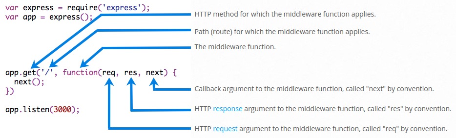

## ExpressJS
__Express__ is a minimal and flexible Node.js web application framework that provides a robust set of features for web and mobile applications. Express is a routing and middleware web framework that has minimal functionality of its own: An Express application is essentially a series of middleware function calls.


### Serving Static Files
To serve static files such as images, CSS files, and JavaScript files, use the express.static built-in middleware function in Express.

The function signature is: `express.static(root, [options])`

```javascript
// Serves assets from root path '/'. The actual files are located in 'files' folder.
app.use(express.static('files'));
// Example: http://localhost:3000/images/kitten.jpg

// Creates a virtual path prefix (where the path does not actually exist in the file system)
// for files that are served from 'public' folder.
app.use('/static', express.static('public'));
// Example: http://localhost:3000/static/js/app.js
```

However, the path that you provide to the express.static function is relative to the directory from where you launch your node process. If you run the express app from another directory, it’s safer to use the absolute path of the directory that you want to serve.

```javascript
app.use('/static', express.static(path.join(__dirname, 'public')));
```


### Routing
__Routing__ refers to determining how an application responds to a client request to a particular endpoint, which is a URI (or path) and a specific HTTP request method (GET, POST, and so on).

Route definition takes the following structure: `app.METHOD(PATH, HANDLER)`, where:
* `app` is an instance of express.
* `METHOD` is an [HTTP request method](https://en.wikipedia.org/wiki/Hypertext_Transfer_Protocol#Request_methods), in lowercase.
* `PATH` is a path on the server.
* `HANDLER` is the function executed when the route is matched.

The application “listens” for requests that match the specified route(s) and method(s), and when it detects a match, it calls the specified callback function.

> #### Route paths can be strings, string patterns, or regular expressions.

The characters `?`, `+`, `*`, and `()` are subsets of their regular expression counterparts. The hyphen (`-`) and the dot (`.`) are interpreted literally by string-based paths. If you need to use the dollar character (`$`) in a path string, enclose it escaped within (`[` and `]`). For example, the path string for requests at `“/data/$book”`, would be `“/data/([\$])book”`.

> Query strings are not part of the route path.

Route parameters are named URL segments that are used to capture the values specified at their position in the URL.

```javascript
app.get('/users/:userId/books/:bookId', function (req, res) {
  res.send(req.params)
});
```

Since the hyphen (`-`) and the dot (`.`) are interpreted literally, they can be used along with route parameters for useful purposes.
```
Route path: /flights/:from-:to
Request URL: http://localhost:3000/flights/LAX-SFO
req.params: { "from": "LAX", "to": "SFO" }
```

```
Route path: /plantae/:genus.:species
Request URL: http://localhost:3000/plantae/Prunus.persica
req.params: { "genus": "Prunus", "species": "persica" }
```

To have more control over the exact string that can be matched by a route parameter, you can append a regular expression in parentheses (`()`):
```
Route path: /user/:userId(\d+)
Request URL: http://localhost:3000/user/42
req.params: {"userId": "42"}
```

You can provide multiple callback functions that behave like middleware to handle a request. With multiple callback functions, it is important to provide `next` as an argument to the callback function and then call `next()` within the body of the function to hand off control to the `next` callback. Route handlers can be in the form of a function, an array of functions, or combinations of both.

```javascript
// Multiple callbacks.
app.get('/example/b', function (req, res, next) {
  console.log('the response will be sent by the next function ...')
  next()
}, function (req, res) {
  res.send('Hello from B!')
});

// Array.
var cb0 = function (req, res, next) {
  console.log('CB0')
  next()
}

var cb1 = function (req, res, next) {
  console.log('CB1')
  next()
}

var cb2 = function (req, res) {
  res.send('Hello from C!')
}

app.get('/example/c', [cb0, cb1, cb2]);

// Array and callbacks.
var cb0 = function (req, res, next) {
  console.log('CB0')
  next()
}

var cb1 = function (req, res, next) {
  console.log('CB1')
  next()
}

app.get('/example/d', [cb0, cb1], function (req, res, next) {
  console.log('the response will be sent by the next function ...')
  next()
}, function (req, res) {
  res.send('Hello from D!')
});
```

You can create chainable route handlers for a route path by using app.route(). Because the path is specified at a single location, creating modular routes is helpful, as is reducing redundancy and typos.
```javascript
app.route('/book')
  .get(function (req, res) {
    res.send('Get a random book')
  })
  .post(function (req, res) {
    res.send('Add a book')
  })
  .put(function (req, res) {
    res.send('Update the book')
  });
```

Use the express.Router class to create modular, mountable route handlers. A Router instance is a complete middleware and routing system; for this reason, it is often referred to as a “mini-app”. The following example creates a router as a module, loads a middleware function in it, defines some routes, and mounts the router module on a path in the main app.
```javascript
// birds.js file.
var express = require('express')
var router = express.Router()

// middleware that is specific to this router
router.use(function timeLog (req, res, next) {
  console.log('Time: ', Date.now())
  next()
})
// define the home page route
router.get('/', function (req, res) {
  res.send('Birds home page')
})
// define the about route
router.get('/about', function (req, res) {
  res.send('About birds')
})

module.exports = router
```

```javascript
// Main router module file.
var birds = require('./birds');

app.use('/birds', birds);
```

The methods on the response object (`res`) in the following table can send a response to the client, and terminate the request-response cycle. If none of these methods are called from a route handler, the client request will be left hanging.
| Method | Description |
| --- | --- |
| `res.download()` | Prompt a file to be downloaded. |
| `res.end()` | End the response process. |
| `res.json()` | Send a JSON response. |
| `res.jsonp()` | Send a JSON response with JSONP support. |
| `res.redirect()` | Redirect a request. |
| `res.render()` | Render a view template. |
| `res.send()` | Send a response of various types. |
| `res.sendFile()` | Send a file as an octet stream. |
| `res.sendStatus()` | Set the response status code and send its string representation as the response body. |


### Middleware
Middleware functions are functions that have access to the [request object](http://expressjs.com/en/4x/api.html#req) (`req`), the [response object](http://expressjs.com/en/4x/api.html#res) (`res`), and the next function in the application’s request-response cycle. The next function is a function in the Express router which, when invoked, executes the middleware succeeding the current middleware.

Middleware functions can perform the following tasks:
* Execute any code.
* Make changes to the request and the response objects.
* End the request-response cycle.
* Call the next middleware in the stack.

If the current middleware function does not end the request-response cycle, it must call `next()` to pass control to the next middleware function. Otherwise, the request will be left hanging.

The following figure shows the elements of a middleware function call:



```javascript
var express = require('express');
var app = express();

// A logging middleware.
var myLogger = function (req, res, next) {
  console.log('LOGGED');
  req.greet = 'Hello World!';
  // Passes on the request to the next middleware function in the stack.
  next();
}

// Load the middleware into the app.
// Every time the app receives a request, it prints the message “LOGGED” to the terminal.
app.use(myLogger);

// If myLogger is loaded after the route to the root path,
// the request never reaches it and the app doesn’t print “LOGGED”,
// because the route handler of the root path terminates the request-response cycle.
app.get('/', function (req, res) {
  // The 'req' object is exactly the same object from 'maLogger', it means
  // you can add custom props to it in middleware and pass it down to route handler.
  res.send(req.greet);
});

// Listen to port 3000 and start the server.
app.listen(3000);
```

> #### The order of middleware loading is important: middleware functions that are loaded first are also executed first.

An Express application can use the following types of middleware:
* ### Application-level middleware

    Bind application-level middleware to an instance of the app object by using the `app.use()` and `app.METHOD()`.

    ```javascript
    var express = require('express');
    var app = express();

    app.use(function (req, res, next) {
        // Gets executed every time the app receives a request.
        console.log('Time:', Date.now());
        next();
    });

    app.use('/user/:id', function (req, res, next) {
        // Gets executed for any type of HTTP request on the "/user/:id" path.
        console.log('Request Type:', req.method);
        next();
    });
    ```

    To skip the rest of the middleware functions from a router middleware stack, call `next('route')` to pass control to the next route. But `next('route')` will work only in middleware functions that were loaded by using the `app.METHOD()` or `router.METHOD()` functions.
    ```javascript
    app.get('/user/:id', function (req, res, next) {
        // if the user ID is 0, skip to the next route
        if (req.params.id === '0') next('route');
        // otherwise pass the control to the next middleware function in this stack
        else next();
    }, function (req, res, next) {
        // send a regular response
        res.send('regular');
    });

    // handler for the /user/:id path, which sends a special response
    app.get('/user/:id', function (req, res, next) {
        res.send('special');
    });
    ```

    Middleware can also be declared in an array for reusability.

* ### Router-level middleware

    Router-level middleware works in the same way as application-level middleware, except it is bound to an instance of `express.Router()`. Load router-level middleware by using the `router.use()` and `router.METHOD()` functions.
    ```javascript
    var express = require('express')
    var app = express()
    var router = express.Router()

    // a middleware function with no mount path. This code is executed for every request to the router
    router.use(function (req, res, next) {
        console.log('Time:', Date.now());
        next();
    });

    // a middleware sub-stack shows request info for any type of HTTP request to the /user/:id path
    router.use('/user/:id', function (req, res, next) {
        console.log('Request URL:', req.originalUrl);
        next();
    }, function (req, res, next) {
        console.log('Request Type:', req.method);
        next();
    });

    // a middleware sub-stack that handles GET requests to the /user/:id path
    router.get('/user/:id', function (req, res, next) {
        // if the user ID is 0, skip to the next router
        if (req.params.id === '0') next('route');
        // otherwise pass control to the next middleware function in this stack
        else next();
    }, function (req, res, next) {
        // render a regular page
        res.render('regular');
    });

    // handler for the /user/:id path, which renders a special page
    router.get('/user/:id', function (req, res, next) {
        console.log(req.params.id);
        res.render('special');
    });

    // mount the router on the app
    app.use('/', router);
    ```

    > To skip the rest of the router’s middleware functions, call `next('router')` to pass control back out of the router instance.

* ### Error-handling middleware

    Error-handling middleware always takes four arguments. You must provide four arguments to identify it as an error-handling middleware function. Even if you don’t need to use the next object, you must specify it to maintain the signature. Otherwise, the next object will be interpreted as regular middleware and will fail to handle errors.
    ```javascript
    app.use(function (err, req, res, next) {
        console.error(err.stack);
        res.status(500).send('Something broke!');
    });
    ```

    > Notice that when __not__ calling `next` in an error-handling function, you are responsible for writing (and ending) the response. Otherwise those requests will “hang” and will not be eligible for garbage collection.

* ### Built-in middleware

    Express has the following built-in middleware functions:
    * [`express.static`](http://expressjs.com/en/4x/api.html#express.static) serves static assets such as HTML files, images, and so on.
    * [`express.json`](http://expressjs.com/en/4x/api.html#express.json) parses incoming requests with JSON payloads.
    * [`express.urlencoded`](http://expressjs.com/en/4x/api.html#express.urlencoded) parses incoming requests with URL-encoded payloads.

    The list of available middlewares is [here](https://github.com/senchalabs/connect#middleware)

* ### 3rd party middleware


## Overriding the Express API
The Express API consists of various methods and properties on the request and response objects. These are inherited by prototype. There are two extension points for the Express API
* The global protoypes at `express.request` and `express.response`.
* App-specific prototypes at `app.request` and `app.response`.

Altering the global prototypes will affect all loaded Express apps in the same process. If desired, alterations can be made app-specific by only altering the app-specific prototypes after creating a new app.

### Methods
```javascript
app.response.sendStatus = function (statusCode, type, message) {
  // code is intentionally kept simple for demonstration purpose
  return this.contentType(type)
    .status(statusCode)
    .send(message);
}

// The overridden method may now be used this way.
res.sendStatus(404, 'application/json', '{"error":"resource not found"}')
```

### Properties
Properties in the Express API are either:
* Assigned properties (ex: `req.baseUrl`, `req.originalUrl`)

    Since this properties dynamically assigned on the request and response objects in the context of the current request-response cycle, their behavior cannot be overriden.

* Defined as getters (ex: `req.secure`, `req.ip`)

    These properties can be overwritten using the Express API extensions API.

```javascript
// Rewrites how the value of "req.ip" is to be derived.
// Now, it simply returns the value of the "Client-IP" request header.
Object.defineProperty(app.request, 'ip', {
  configurable: true,
  enumerable: true,
  get: function () { return this.get('Client-IP') }
})
```


## Error Handling
Error Handling refers to how Express catches and processes errors that occur both synchronously and asynchronously. Express comes with a default error handler so you don’t need to write your own to get started. If you pass an error to `next()` and you do not handle it in a custom error handler, it will be handled by the built-in error handler; the error will be written to the client with the stack trace. The stack trace is not included in the production environment.

Errors that occur in synchronous code inside route handlers and middleware require no extra work. If synchronous code throws an error, then Express will catch and process it.
```javascript
app.get('/', function (req, res) {
  throw new Error('BROKEN'); // Express will catch this on its own.
});
```

For errors returned from asynchronous functions invoked by route handlers and middleware, you must pass them to the `next()` function, where Express will catch and process them.
```javascript
app.get('/', function (req, res, next) {
  fs.readFile('/file-does-not-exist', function (err, data) {
    if (err) {
      next(err); // Pass errors to Express.
    } else {
      res.send(data);
    }
  });
});
```

Route handlers and middleware that return a Promise will call `next(value)` automatically when they reject or throw an error. 
```javascript
app.get('/user/:id', async function (req, res, next) {
  var user = await getUserById(req.params.id);
  res.send(user);
});
```

If `getUserById` throws an error or rejects, `next` will be called with either the thrown error or the rejected value. If no rejected value is provided, `next` will be called with a default Error object provided by the Express router.

Since __promises automatically catch both synchronous errors and rejected promises__, you can simply provide next as the final catch handler and Express will catch errors, because the catch handler is given the error as the first argument.
```javascript
app.get('/', function (req, res, next) {
  Promise.resolve().then(function () {
    throw new Error('BROKEN');
  }).catch(next); // Errors will be passed to Express.
});
```

When an error is written, the following information is added to the response:
* The `res.statusCode` is set from `err.status` (or `err.statusCode`). If this value is outside the _4xx_ or _5xx_ range, it will be set to _500_.
* The `res.statusMessage` is set according to the status code.
* The body will be the HTML of the status code message when in production environment, otherwise will be err.stack.
* Any headers specified in an `err.headers` object.


## Debugging
Express uses the [debug](https://www.npmjs.com/package/debug) module internally to log information about route matches, middleware functions that are in use, application mode, and the flow of the request-response cycle.

To see all the internal logs used in Express, set the `DEBUG` environment variable to `express:*` when launching your app.
```shell
// Linux
$ DEBUG=express:* node index.js

// Windows
> set DEBUG=express:* & node index.js
```


## Database integration
Adding the capability to connect databases to Express apps is just a matter of loading an appropriate Node.js driver for the database in your app.

```javascript
var MongoClient = require('mongodb').MongoClient

// Example 01.
MongoClient.connect('mongodb://localhost:27017/animals', function (err, db) {
  if (err) throw err

  db.collection('mammals').find().toArray(function (err, result) {
    if (err) throw err

    console.log(result)
  })
})

// Example 02.
MongoClient.connect('mongodb://localhost:27017/animals', function (err, client) {
  if (err) throw err

  var db = client.db('animals')

  db.collection('mammals').find().toArray(function (err, result) {
    if (err) throw err

    console.log(result)
  })
})
```


---

#### [ExpressJS Code Examples](http://expressjs.com/en/starter/examples.html)

#### [Express behind proxies](http://expressjs.com/en/guide/behind-proxies.html)

#### [Production Best Practices: Security](http://expressjs.com/en/advanced/best-practice-security.html)

#### [Production best practices: performance and reliability](http://expressjs.com/en/advanced/best-practice-performance.html)

#### [Health Checks and Graceful Shutdown](http://expressjs.com/en/advanced/healthcheck-graceful-shutdown.html)
