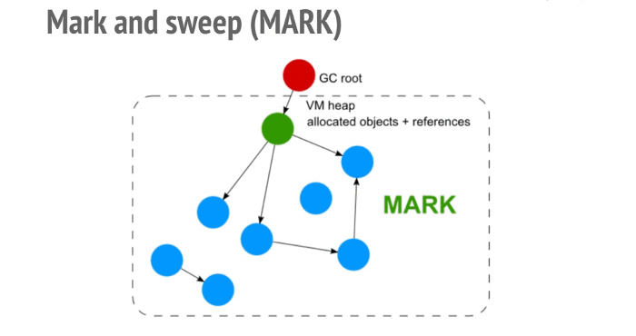

## Memory Leaks
NodeJs applications are long-running processes, the application is initiated once, then it is up and running, handling all incoming requests and consuming resources continuously.

Unlike PHP which creates a child process for every incoming request, initiates the app for it and once the request is done the process is terminated and all resources are released.

This fact gives NodeJS applications advantages as the application is initiated only once not for each incoming request and at the initiation you can add all your configs, DB connections, routes, etc. This makes handling requests faster as it only does the logic for each request with no need for repetitive work, also it saves resources required for this initiation process.

But Nothing comes without a price as for this advantage you have to take care of your application memory usage as it will be consuming your memory continuously during its run-time, and if you aren’t handling your memory usage efficiently, you may run out of memory, Then you’ll have to restart your app to free up the memory.

Memory Management in NodeJs is done via V8: ‘which is the engine that makes it possible to run JavaScript on the server outside the browser’.

V8 is handling two main memory categories:
* __Stack__: In which it stores the primitive data types: `Number`, `String`, `boolean`, `Null`, `Undefined`, `Symbol` and references to non-primitive data types `Object`.
* __Heap__: stores the non-primitive data types: `Object`.

The V8 has a garbage collector runs mainly __Mark and Sweep__ algorithm:
It checks for all objects’ reference paths to the root node ‘which is the global or window object’. If any reference has no path to the root node, it will be marked as garbage and will be swept later.

> Important Note: When the Garbage Collector runs, it pauses your application entirely until it finishes its work. so you need to minimize its work by taking care of your objects’ references.

### Most Common Causes
According to what we explained in Memory management, We can define three of the most common memory leak causes, you need to be careful while using them in your code.
* Global Variables

    As they have a direct path to the root node, they will stay in memory as long as the application is running so you need to be careful when setting global variables and the amount of data you’ll set to them.

* Multiple References

    Setting multiple references to the same object may cause a problem also as you may remove one ref and forget the other which will keep your object still exists in the Heap.

* Closures

    In closures simply you keep references to objects to be used later. this feature has many advantages but if it’s used without caution it may cause big issues as these references will keep objects in heap and these objects might be large ones, not just simple objects.

### How To Detect
There’re many tools and libraries used to detect memory leaks in NodeJS, all following the same concept to detect memory leaks by comparing different heap dumps and check the results, and they try to force run the garbage collector before taking any heap dump to make sure that the leakage is real.
The difference between two heap dumps is an indicator of the amount of memory leak in your application. I would go with two of these tools, the most important ones from my point of view:

* [Node-Memwatch](https://github.com/lloyd/node-memwatch): Very helpful in the production as it emits specific events once there’s abnormal memory usage or potential leak in your app so you can handle these events or expect that there’s a problem coming😄.
* [Node-Inspector](https://nodejs.org/en/docs/guides/debugging-getting-started/): Very useful especially when used with Chrome DevTools in the development phase as it enables you to perform stress tests on your application and monitor the memory usage performance to check if there’s any potential leak in your code and find where exactly that leak might happen.

---

#### [Memory Leaks in NodeJS | Quick Overview](https://medium.com/tech-tajawal/memory-leaks-in-nodejs-quick-overview-988c23b24dba)

#### [Hunting a Ghost - Finding a Memory Leak in Node.js](https://blog.risingstack.com/finding-a-memory-leak-in-node-js/)

#### [Debugging Memory Leaks in Node.js Applications](https://www.toptal.com/nodejs/debugging-memory-leaks-node-js-applications)

#### [4 Types of Memory Leaks in JavaScript and How to Get Rid Of Them](https://auth0.com/blog/four-types-of-leaks-in-your-javascript-code-and-how-to-get-rid-of-them/)

#### [Simple Guide to Finding a JavaScript Memory Leak in Node.js](https://www.alexkras.com/simple-guide-to-finding-a-javascript-memory-leak-in-node-js/)

#### [Memory Analysis 101](https://developer.chrome.com/devtools/docs/memory-analysis-101)
