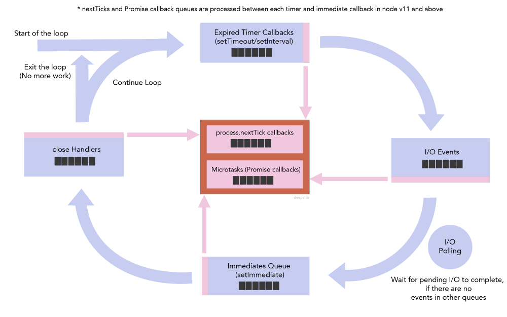
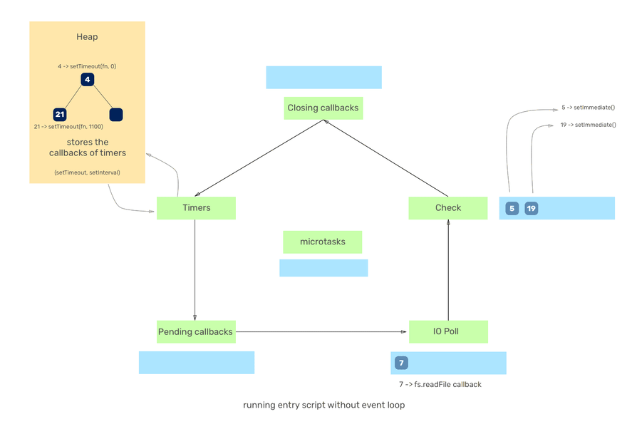

## Microtasks and Macrotasks
There is a thing in Node.js or say v8 to be accurate called 'Microtasks'. Microtasks are not a part of the event loop and they are a part of v8, to be clear. There are some tasks in JavaScript which come under Microtasks namely `process.nextTick`, `Promise.resolve`, etc.

These tasks are prioritised over other tasks/phases meaning that the event loop after its current operation will execute all the callbacks of the microtasks queue until it is drained up after which it resumes its work from the phase it left its work from. Thus, whenever Node.js encounters any microtask defined above, it will push the associated callback to the microtask queue and start the execution right away(microtasks are prioritised) and execute all the callbacks until the queue is drained up thoroughly.

> If you put a lot of callbacks in the microtasks queue, you may end up starving the event loop since it will never go to any other phase.

Tasks such as `setTimeout`, `setInterval`, `setImmediate`, `requestAnimationFrame`, __I/O__, __UI rendering__, or __other I/O callbacks__ come under the __macrotasks__. They have no such thing as prioritisation by the event loop. The callbacks are executed according to the event loop phases.




__The `process.nextTick` comes under microtasks which are prioritised above all other phases and thus the callback associated with it is executed just after the event loop finishes the current operation.__ Which means that, whatever callback we pass to `process.nextTick`, the event loop will complete its current operation and then execute callbacks from the microtasks queue until it is drained up. Once the queue is drained up, it returns back to the phase where it left its work from.

### Examples:
* Example 1:

    ```javascript
    function main() {
    setTimeout(() => console.log('1'), 50);
    process.nextTick(() => console.log('2'));
    setImmediate(() => console.log('3'));
    process.nextTick(() => console.log('4'));
    }

    main(); // Output: 2, 4, 3, 1
    ```

    1. It first checks the microtask queue and executes the callbacks in it(`process.nextTick` callbacks in this case).
    2. It then enters its very first phase (Timers phase) where the `50ms` timer is not yet expired. Hence it moves forward to the other phases.
    3. It then goes to the 'Check (setImmediate)' phase where it sees the timer expired and executes the callback which logs `3`.
    4. In the next iteration of the event loop, it sees the timer of `50ms` expired and hence logs down `1`.

* Example 2:

    ```javascript
    function main() {
    setTimeout(() => console.log('1'), 50);
    process.nextTick(() => console.log('2'));
    setImmediate(() => console.log('3'));
    process.nextTick(() => setTimeout(() => {
        console.log('4');
    }, 1000));
    }

    main(); // Output: 2, 3, 1, 4
    ```

    1. All the callbacks are registered and pushed to their respective queues.
    2. Since the microtasks queue callbacks are executed first as seen in the previous examples, `2` gets logged. Also, at this time, the second `process.nextTick` callback i.e `setTimeout`(which will log `4`) has started its execution and is ultimately pushed to the 'Timers' phase queue.
    3. Now, the event loop enters its normal phases and executes callbacks. The first phase that it enters is 'Timers'. It sees that the timer of `50ms` is not expired and hence moves further to the next phases.
    4. It then enters 'Check (setImmediate)' phase and executes the callback of setImmediate which ultimately logs `3`.
    5. Now, the next iteration of the event loop begins. In it, the event loop returns back to the 'Timers' phase, it encounters both the expired timers i.e `50ms` and `1000ms` as per their registering, and executes the callback associated with it which logs first `1` and then `4`.

* Example 3:

    ```javascript
    const fs = require('fs');

    function main() {
        setTimeout(() => console.log('1'), 0);
        setImmediate(() => console.log('2'));

        fs.readFile('./xyz.txt', (err, buff) => {
            setTimeout(() => {
                console.log('3');
            }, 1000);

            process.nextTick(() => {
                console.log('process.nextTick');
            });

            setImmediate(() => console.log('4'));
        });

        setImmediate(() => console.log('5'));

        setTimeout(() => {
            process.on('exit', (code) => {
                console.log(`close callback`);
            });
        }, 1100);
    }

    main(); // Output: 1, 2, 5, process.nextTick, 4, 3, close callback
    // Or the output can also be: 2, 5, 1, process.nextTick, 4, 3, close callback
    ```

    

    Note: The Idle/Prepare phase is not presented as it is used only internally by NodeJS.

* Example 4:

    ```javascript
    Promise.resolve().then(() => console.log('promise1 resolved'));
    Promise.resolve().then(() => console.log('promise2 resolved'));
    Promise.resolve().then(() => {
        console.log('promise3 resolved');
        process.nextTick(() => console.log('next tick inside promise resolve handler'));
    });
    Promise.resolve().then(() => console.log('promise4 resolved'));
    Promise.resolve().then(() => console.log('promise5 resolved'));
    setImmediate(() => console.log('set immediate1'));
    setImmediate(() => console.log('set immediate2'));

    process.nextTick(() => console.log('next tick1'));
    process.nextTick(() => console.log('next tick2'));
    process.nextTick(() => console.log('next tick3'));

    setTimeout(() => console.log('set timeout'), 0);
    setImmediate(() => console.log('set immediate3'));
    setImmediate(() => console.log('set immediate4'));
    ```

    1. Five handlers will be added to the resolved promises microtask queue. (Note that I add 5 resolve handlers to 5 promises which are already resolved)
    2. Two handlers will be added to the `setImmediate` queue.
    3. Three items will be added to the `process.nextTick` queue.
    4. One timer is created with expiration time as zero, which will be immediately expired and the callback is added to the timers queue
    5. Two items will be added again to the `setImmediate` queue.

    Then the event loop will start checking the `process.nextTick` queue.
    1. Loop will identify that there are three items in the `process.nextTick` queue and Node will start processing the nextTick queue until it is exhausted.
    2. Then the loop will check the promises microtask queue and identify there are five items in the promises microtask queue and will start processing the queue.
    3. During the process of promises microtask queue, one item is again added to the `process.nextTick` queue (‘next tick inside promise resolve handler’).
    4. After promises microtask queue is finished, event loop will again detect that there is one item is in the `process.nextTick` queue which was added during promises microtask processing. Then node will process the remaining 1 item in the nextTick queue.
    5. Enough of promises and nextTicks. There are no more microtasks left. Then the event loop moves to the first phase, which is the timers phase. At this moment it will see there is an expired timer callback in the timers queue and it will process the callback.
    6. Now that there are no more timer callbacks left, loop will wait for I/O. Since we do not have any pending I/O, the loop will then move on to process `setImmediate` queue. It will see that there are four items in the immediates queue and will process them until the immediate queue is exhausted.
    7. At last, loop is done with everything… Then the program gracefully exits.

    Output:
    ```shell
    next tick1
    next tick2
    next tick3
    promise1 resolved
    promise2 resolved
    promise3 resolved
    promise4 resolved
    promise5 resolved
    next tick inside promise resolve handler
    set timeout
    set immediate1
    set immediate2
    set immediate3
    set immediate4
    ```

* Example 5:

    ```javascript
    setTimeout(() => console.log('timeout1'));
    setTimeout(() => {
        console.log('timeout2');
        process.nextTick(() => console.log('next tick'));
        Promise.resolve().then(() => console.log('promise resolve'));
    });
    setTimeout(() => console.log('timeout3'));
    setTimeout(() => console.log('timeout4'));
    ```

    With the new changes in Node v11, `nextTick` callbacks and microtasks will run between each individual `setTimeout` and `setImmediate` callbacks, even if the timers queue or the immediates queue is not empty. In terms of `setTimeout` and `Promise` callbacks, the new changes in Node v11 matches the browser behaviour which improves the reusability of browser JavaScript in Node.js.

    Output from both NodeJS 11+ and Browser:
    ```shell
    timeout1
    timeout2
    next tick
    promise resolve
    timeout3
    timeout4
    ```
