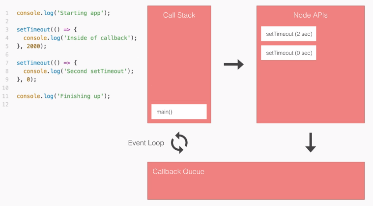

# NodeJS
Node.js is a JavaScript runtime environment built on Chrome’s V8 JavaScript engine. The Node.js run-time environment includes everything you need to execute a program written in JavaScript.

### NodeJS is a singe treaded language
JavaScript execution in Node.js is single threaded, so concurrency refers to the event loop's capacity to execute JavaScript callback functions after completing other work. Any code that is expected to run in a concurrent manner must allow the event loop to continue running as non-JavaScript operations, like I/O, are occurring.

Node.js is a single threaded language which in background uses multiple threads to execute asynchronous code.

Node.js is non-blocking which means that all functions (callbacks) are delegated to the event loop and they are (or can be) executed by different threads. That is handled by Node.js run-time.
* Node.js does support forking multiple processes (which are executed on different cores).
* It is important to know that state is not shared between master and forked process.
* We can pass messages to forked process (which is different script) and to master process from forked process with function send.

> The event loop is different than models in many other languages where additional threads may be created to handle concurrent work.

### NudeJS uses non-blocking I/O model
I/O refers to input/output. It can be anything ranging from reading/writing local files to making an HTTP request to an API. I/O takes time and hence blocks other functions.

Consider a scenario where we request a backend database for the details of user1 and user2 and then print them on the screen/console. The response to this request takes time, but both of the user data requests can be carried out independently and at the same time.

This non-blocking I/O eliminates the need for multi-threading since the server can handle multiple requests at the same time.

### NodeJs has an async event-driven architecture
__Events__ are something that has happened in our app that we can respond to. There are two types of events in Node:
1. System Events: C++ core from a library called `libuv`. (For example, finished reading a file).
2. Custom Events: JavaScript core.

Node.js uses events heavily and it is also one of the reasons why Node.js is pretty fast compared to other similar technologies. As soon as Node starts its server, it simply initiates its variables, declares functions and then simply waits for the event to occur.

In an event-driven application, there is generally a main loop that listens for events, and then triggers a callback function when one of those events is detected.

1. Push `main()` onto the call stack.
2. Push `console.log()` onto the call stack. This then runs right away and gets popped.
3. Push `setTimeout(2000)` onto the stack. `setTimeout(2000)` is a Node API. When we call it, we register the event-callback pair. The event will wait 2000 milliseconds, then callback is the function.
4. After registering it in the APIs, `setTimeout(2000)` gets popped from the call stack.
5. Now the second `setTimeout(0)` gets registered in the same way. We now have two Node APIs waiting to execute.
6. After waiting for `0` seconds, `setTimeout(0)` gets moved to the callback queue, and the same thing happens with `setTimeout(2000)`.
7. In the callback queue, the functions wait for the call stack to be empty, because only one statement can execute a time. This is taken care of by the event loop.
8. The last `console.log()` runs, and the `main()` gets popped from the call stack.
9. The event loop sees that the call stack is empty and the callback queue is not empty. So it moves the callbacks (in a first-in-first-out order) to the call stack for execution.

[YouTube video about JS Event Loop](https://youtu.be/8aGhZQkoFbQ)

### NodeJS uses V8 engine
Both your browser JavaScript and Node.js run on the V8 JavaScript runtime engine. This engine takes your JavaScript code and converts it into a faster machine code. Machine code is low-level code which the computer can run without needing to first interpret it.

V8 is an open source runtime engine written in C++.

> JavaScript -> V8(C++) -> Machine Code

V8 can run standalone or can be embedded into any C++ application. It has hooks that allow you to write your own C++ code that you can make available to JavaScript.

This essentially lets you add features to JavaScript by embedding V8 into your C++ code so that your C++ code understands more than what the ECMAScript standard otherwise specifies.

### Full user-level system access.
This is one of the most exciting things about node.js. Unlike the browser where Javascript is sandboxed for your safety, node.js has full access to the system like any other native application. This means you can read and write directly to/from the file system, have unrestricted access to the network, can execute software and more. This means writing full desktop software is possible with node.js even including a UI through modules like electron. This means that javascript ran through node.js needs to be treated with the same level of caution as running C++, java, or any other language directly on your system.

### `global` instead of `window`
A lot of the APIs of the browser are missing like anything related to DOM and CSS, Performance, Document, APIs related to `window`. So for logic’s sake, the global object was renamed to `global`, since it does not refer to a `window` and has no window like properties

### CommonJS
Node.js has a module system that predates the modern import statement. While node.js has recently started supporting `import`, almost all code in the wild still uses `common.js`. In `common.js` you will use `require()` to load a javascript module.

`require()` does three things:
* It loads modules that come bundled with Node.js like file system and HTTP from the Node.js API .
* It loads third-party libraries like Express and Mongoose that you install from npm.
* It lets you require your own files and modularize the project.

Require is a function, and it accepts a parameter “path” and returns module.exports.

### `libuv`
`libuv` is a multi-platform support library with a focus on asynchronous I/O. It was primarily developed for use by Node.js.

### How to run
Two ways of running NodeJS code:
* Use `node <filename.js>` to run a NodeJS script.
* Use `node` command to enter interactive mode. Usually used to run just a single line of code.

### Useful links
• Node.js official [website](https://kb.epam.com/display/EUXDCC/NodeJS+Mentoring) (visit download and documentation pages)
• [List of JavaScript engines](https://en.wikipedia.org/wiki/List_of_ECMAScript_engines)
• [V8 source code](https://github.com/v8/v8) and [V8 Wiki](https://github.com/v8/v8/wiki)
• [Node.js source code](https://github.com/nodejs/node)
• [Node green](http://node.green/) (for monitoring ECMAScript features support) and [Kangax compat-able](http://kangax.github.io/compat-table/esnext/) (for ES Next)
• [Libuv website](http://libuv.org/) and [GitHub](https://github.com/libuv/libuv)

---

#### [Tutorial](https://www.guru99.com/node-js-tutorial.html)
