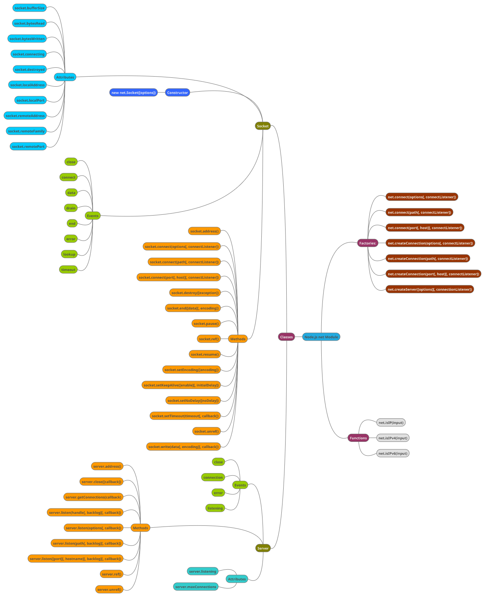

## Net Module
The [net module](https://nodejs.org/api/net.html) provides an asynchronous network API for creating stream-based TCP or IPC servers (`net.createServer()`) and clients (`net.createConnection()`).

This module is mostly used to create a custom protocol on top of TCP and for process inter process communication (IPC).

[node-ipc](https://github.com/RIAEvangelist/node-ipc) is a nodejs module for local and remote Inter Process Communication with full support for Linux, Mac and Windows. It also supports all forms of socket communication from low level unix and windows sockets to UDP and secure TLS and TCP sockets.

## Dgram Module
The [dgram module](https://nodejs.org/api/dgram.html) provides an implementation of UDP datagram sockets.

---

#### [Implementing a WebSocket server with Node.js](https://medium.com/hackernoon/implementing-a-websocket-server-with-node-js-d9b78ec5ffa8)

#### [Socket.IO](https://socket.io/)
