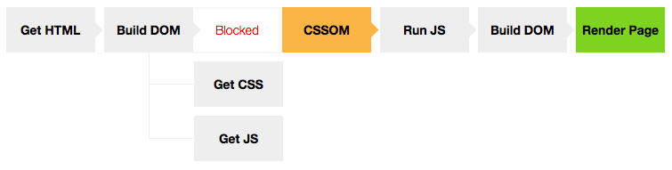

# Critical Rendering Path
The __Critical Path__ refers to the resources that must be loaded before your initial render.

Optimizing for performance is all about understanding what happens in these intermediate steps between receiving the HTML, CSS, and JavaScript bytes and the required processing to turn them into rendered pixels - that's the __critical rendering path__.


By optimizing the critical rendering path we can significantly improve the time to first render of our pages.

### How does the browser rendering engine work?
In order to render content the browser has to go through a series of steps:
1. Document Object Model(DOM)
2. CSS object model(CSSOM)
3. Render Tree
4. Layout
5. Paint.

__Optimizing the critical rendering path__ is the process of minimizing the total amount of time spent performing steps 1 through 5.

## 1. Document Object Model (`DOM`)
To process a html file and get to the document object model event (DOM) the browser has to go through 4 steps:
* __Conversion__: The browser reads the raw bytes of HTML off the disk or network, and translates them to individual characters based on specified encoding of the file (for example, UTF-8).
* __Tokenizing__: The browser converts strings of characters into distinct tokens—as specified by the W3C HTML5 standard; for example, `<html>`, `<body>`—and other strings within angle brackets. Each token has a special meaning and its own set of rules.
* __Lexing__: The emitted tokens are converted into "objects," which define their properties and rules.
* __DOM construction__: Finally, because the HTML markup defines relationships between different tags (some tags are contained within other tags) the created objects are linked in a tree data structure that also captures the parent-child relationships defined in the original markup: the HTML object is a parent of the body object, the body is a parent of the paragraph object, and so on.


The final output of this entire process is the _Document Object Model_ (_DOM_) of our simple page, which the browser uses for all further processing of the page.

> __Every time the browser processes HTML markup, it goes through all of the steps above.__

The DOM tree captures the properties and relationships of the document markup, but it doesn't tell us how the element will look when rendered. That’s the responsibility of the CSSOM.

## 2. CSS Object Model (`CSSOM`)
> CSS Object model is how the browser takes a CSS file and converts it to "rules" it knows how to understand and create the styles you have in your CSS file.

Just as with HTML, the CSS rules need to be converted into something that the browser understands, so these rules go through the same steps as the document object model.
1. Convert bytes to characters
2. Identify tokens
3. Convert tokens to nodes
4. Build CSSOM


In this stage the CSS parser goes through each node and gets the styles attributed to it.

Why does the CSSOM have a tree structure? When computing the final set of styles for any object on the page, the browser starts with the most general rule applicable to that node (for example, if it is a child of a body element, then all body styles apply) and then recursively refines the computed styles by applying more specific rules; that is, the rules "cascade down."

## 3. The Render Tree
__This stage is where the browser combines the DOM and CSSOM__, this process outputs a final render tree, which contains both the content and the style information of all the visible content on the screen.

To construct the render tree, the browser roughly does the following:
1. Starting at the root of the DOM tree, traverse each visible node.
    * Some nodes are not visible (for example, script tags, meta tags, and so on), and are omitted since they are not reflected in the rendered output.
    * Some nodes are hidden via CSS and are also omitted from the render tree; for example, the span node---in the example above---is missing from the render tree because we have an explicit rule that sets the `display: none` property on it.
2. For each visible node, find the appropriate matching CSSOM rules and apply them.
3. Emit visible nodes with content and their computed styles.


> Note that `visibility: hidden` is different from `display: none`. The former makes the element invisible, but the element still occupies space in the layout (that is, it's rendered as an empty box), whereas the latter (`display: none`) removes the element entirely from the render tree such that the element is invisible and is not part of the layout.

## 4. Layout
__This stage is where the browser calculates the size and position of each visible element on the page__.

The output of the layout process is a "box model", which precisely captures the exact position and size of each element within the viewport: all of the relative measurements are converted to absolute pixels on the screen.

[The list of actions which cause the reflow](https://gist.github.com/paulirish/5d52fb081b3570c81e3a)

## 5. Paint
__When we get to the paint stage, the browser has to pick up the layout result, and paint the pixels to the screen__. Beware in this stage that not all styles have the same paint times.

The more complicated the styles, the more time taken for painting also (for example, a solid color is "cheap" to paint, while a drop shadow is "expensive" to compute and render).

[CSS statements paint times](http://www.html5rocks.com/en/tutorials/speed/css-paint-times/)

> __If either the DOM or CSSOM were modified, you would have to repeat the process in order to figure out which pixels would need to be re-rendered on the screen.__

### CSS
By default, CSS is treated as a __render blocking resource__, which means that the browser won't render any processed content until the CSSOM is constructed.

Media types and media queries allow us to mark some CSS resources as non-render blocking.

> __Both HTML and CSS are render blocking resources.__

```html
<!-- render-block -->
<link href="style.css" rel="stylesheet">

<!-- non render-block -->
<link href="print.css" rel="stylesheet" media="print">
<link href="other.css" rel="stylesheet" media="(min-width: 40em)">
```

> __By default all JavaScript is parser blocking. Because the browser does not know what the script is planning to do on the page, it assumes the worst case scenario and blocks the parser.__

Whether we use a `<script>` tag or an inline JavaScript snippet, the browser pauses and executes the script before it can process the remainder of the document. If the browser hasn't finished downloading and building the CSSOM when we want to run our script. The browser delays script execution and DOM construction until it has finished downloading and constructing the CSSOM.

Adding the `async` keyword to the script tag tells the browser not to block DOM construction while it waits for the script to become available, which can significantly improve performance.

## JavaScript
Javascript is a powerful tool that can manipulate both the DOM and CSSOM, so to execute Javascript, the browser has to wait for the DOM, then it has to download and parse all the CSS files, get to the CSSOM event and only then finally execute Javascript.

When the parser finds a script tag it blocks DOM construction, then waits for the browser to get the file and for the javascript engine to parse the script, this is why __Javascript is parser blocking__.



__Here we can understand the importance of the CSSOM event in the critical rendering path, this single event is blocking rendering and Javascript execution.__

There are only two cases when Javascript does not block on CSSOM:
1. Inlined scripts above the css files `<link>` in the `<head>`;
2. Async scripts.

__Async scripts don’t block DOM construction and don’t have the need to wait for the CSSOM event__, this way your critical rendering path stays free from Javascript interference. This is a crucial part of optimising for the critical rendering path.

# Optimizing the critical rendering path
## Optimize JavaScript
### Prefer asynchronous JavaScript resources
Asynchronous resources unblock the document parser and allow the browser to avoid blocking on CSSOM prior to executing the script. Often, if the script can use the async attribute, it also means it is not essential for the first render.

### Avoid synchronous server calls
Use the `navigator.sendBeacon()` and the `fetch()` methods.

The Beacon interface schedules an asynchronous and non-blocking request to a web server.
* Beacon requests use HTTP `POST` and do not require a response.
* Beacon requests are guaranteed to be initiated before the page unloads.

[Read more about `navigator.sendBeacon()`](https://developer.mozilla.org/en-US/docs/Web/API/Beacon_API/Using_the_Beacon_API)

### Defer parsing JavaScript
To minimize the amount of work the browser has to perform to render the page, defer any non-essential scripts that are not critical to constructing the visible content for the initial render.

### Avoid long running JavaScript
Long running JavaScript blocks the browser from constructing the DOM, CSSOM, and rendering the page, so defer until later any initialization logic and functionality that is non-essential for the first render. If a long initialization sequence needs to run, consider splitting it into several stages to allow the browser to process other events in between.

## 1. Minification & Obfuscation
Make our critical assets as small as possible by minifying and compressing both the html and css. We can further optimize this resources by making use of html and css obfuscation.

Tools:
> https://medium.freecodecamp.org/reducing-css-bundle-size-70-by-cutting-the-class-names-and-using-scope-isolation-625440de600b
https://github.com/webpack-contrib/css-loader
https://code.google.com/p/closure-stylesheets/#Renaming

## 2. Optimising CSS
CSS is required to construct the render tree and JavaScript often blocks on CSS during initial construction of the page. Ensure that any non-essential CSS is marked as non-critical (for example, print and other media queries), and that the amount of critical CSS and the time to deliver it is as small as possible.

### Put CSS in the document head
Specify all CSS resources as early as possible within the HTML document so that the browser can discover the `<link>` tags and dispatch the request for the CSS as soon as possible.

### Avoid CSS imports
The CSS import (`@import`) directive enables one stylesheet to import rules from another stylesheet file. However, avoid these directives because they introduce additional roundtrips into the critical path: the imported CSS resources are discovered only after the CSS stylesheet with the `@import` rule itself is received and parsed.

### Inline render-blocking CSS
For best performance, you may want to consider inlining the critical CSS directly into the HTML document. This eliminates additional roundtrips in the critical path and if done correctly can deliver a "one roundtrip" critical path length where only the HTML is a blocking resource.

Tools:
> https://github.com/filamentgroup/loadCSS

If you’re going down this path and you’re using web fonts, __it’s an absolute must to have your webfonts async__. You don’t want to render the styles immediately and have your users waiting on the fonts to see the text, which is probably the most important part of your content.

More:
> http://www.sitepoint.com/improving-font-performance-subsetting-local-storage/

## 3. Achieving the 1s render
In order to make our page render in 1s we need to make our critical html and css fit in approximately 14kb. If we follow the logic mentioned above, this would be the header and the main module of the page.

After achieving the 14kb goal, we need to render the content, but the process of parsing the HTML, CSS, and executing Javascript takes time and resources, in a 3g connection we have ~600ms of 3g networking overhead (4g networks can reduce this overhead), then we need to wait for the server response, which can be ~200ms and then we are left with 200ms to parse the html and css, so it really helps to keep things simple(this is one of the advantages of design principles such as flat design and mobile first).

If you’ve managed to get through the whole process and made all the optimisations mentioned above, congratulations you should now have devivered an instant experience.

More:
> https://developers.google.com/speed/docs/insights/mobile

## 4. Server-Side Rendering

[More about CRP](https://bitsofco.de/understanding-the-critical-rendering-path/)
