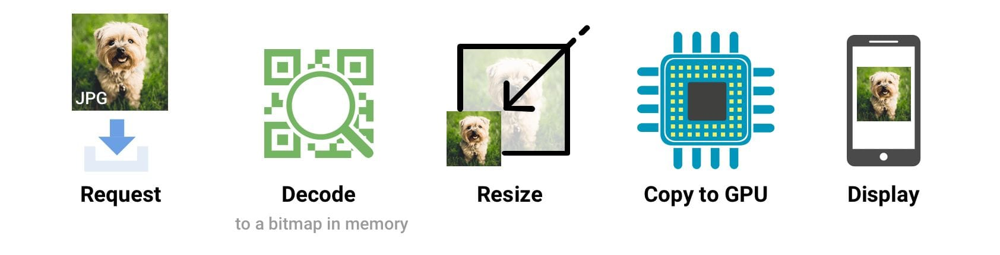

## Images

### How to optimize
* __Choose right format__
* __Image placeholder__
* __Remove Image Metadata__
* __Resize Image__

    All your images should be appropriately sized for their intended use and should not rely on the browser to resize them for rendering.

* __Crop images__ to show only what's important

* __Reduce image quality__

    In most cases, you can reduce the image quality, and thus the file size, without suffering any visible quality difference.

* __Compress Images__

    `PNG` and `JPG` images can be squashed down even more using a compression tool, which reduces file size without affecting either image dimensions or visual quality.

### Image decode and resize costs
When a browser fetches an image, it has to decode the image from the original source format (e.g JPEG) to a bitmap in memory. Often the image needs to be resized (e.g width has been set to a percentage of its container). Decoding and resizing images are expensive and can delay how long it takes for an image to be displayed.



> Omitting the `width` or `height` attributes on an image can also negatively impact performance. Without them, a browser assigns a smaller placeholder region for the image until sufficient bytes have arrived for it to know the correct dimensions. At that point, the document layout must be updated in what can be a costly step called reflow.

### Replace Animated GIFs with Video
Delivering the same file as an MP4 video can often shave _80%_ or more off your file-size. Not only do GIFs often waste significant bandwidth, but they take longer to load, include fewer colors and generally offer sub-part user experiences.

GIFs (and other animated image formats) are suboptimal because an image decode is incurred for every frame in the image, which can contribute to jank. This makes sense, because each frame in a GIF is simply another image.

[The Book of GIF](https://rigor.com/wp-content/uploads/2017/03/TheBookofGIFPDF.pdf)

Tools: [ffmpeg](https://www.ffmpeg.org/), [Gifify](https://github.com/vvo/gifify), [GIFV](https://blog.imgur.com//2014/10/09/introducing-gifv/)

[Article about how to convert GIF to Video](https://rigor.com/blog/2015/12/optimizing-animated-gifs-with-html5-video)

[Step-by-step Instructions](https://developers.google.com/web/fundamentals/performance/optimizing-content-efficiency/replace-animated-gifs-with-video/)

[Converting MP4 to WEBM](https://gist.github.com/Vestride/278e13915894821e1d6f)

### Image optimization:
* __Use alternative technologies if possible__

  * CSS effects
  * Web Fonts

* __Use `<picture>`__ for responsive images.

* __Vector vs. Raster images__

  * Vector images are ideal for images that consist of geometric shapes.

  * Vector images are zoom and resolution-independent.

  * Raster images should be used for complex scenes with lots of irregular shapes and details as raster images encode image data on a per-pixel basis.

* __Optimizing vector images__

  * SVG is an XML-based image format
  * SVG files should be minified to reduce their size
  * SVG files should be compressed with `GZIP`
  * Optimization tool: [SVGOMG](https://jakearchibald.github.io/svgomg/)

* __Optimizing raster images__

  * A raster image is a grid of pixels
  * Each pixel encodes color and transparency information
  * Reduce color palette and [delta encoding](https://en.wikipedia.org/wiki/Delta_encoding)

* __Selecting the right image format__

    _JPEG_ are for photographs and realistic images. _PNG_ are for line art, text-heavy images, and images with few colors.

    | Format | Transparency | Animation | Browser |
    | - | - | - | - |
    | [GIF](http://en.wikipedia.org/wiki/Graphics_Interchange_Format) |	Yes |	Yes |	All |
    | [PNG](http://en.wikipedia.org/wiki/Portable_Network_Graphics) |	Yes |	No | All |
    | [JPEG](http://en.wikipedia.org/wiki/JPEG) | No | No | All |
    | [JPEG XR](http://en.wikipedia.org/wiki/JPEG_XR) | Yes | Yes | IE |
    | [WebP](http://en.wikipedia.org/wiki/WebP) | Yes | Yes | Chrome, Opera, Android |

    

    > If you are using a `Webview` to render content in your native application, then you have full control of the client and can use `WebP` exclusively! [Watch on YouTube](https://www.youtube.com/watch?v=pS8udLMOOaE)

* __Tools__

    | Tool | Description |
    | - | - |
    | [gifsicle](http://www.lcdf.org/gifsicle/) | create and optimize GIF images |
    | [jpegtran](http://jpegclub.org/jpegtran/) | optimize JPEG images |
    | [optipng](http://optipng.sourceforge.net/) | lossless PNG optimization |
    | [pngquant](http://pngquant.org/) | lossy PNG optimization |

* __Delivering scaled image assets__

  * Resize images on the server and ensure that the "display" size is as close as possible to the "natural" size of the image. Pay close attention to large images in particular, as they account for largest overhead when resized!

* __Remove unnecessary image metadata__

    Many images contain unnecessary metadata about the asset: geo information, camera information, and so on. Use appropriate tools to strip this data

### Decode image async
Loading large images in JavaScript and dropping them into the DOM can tie up the main thread, causing the user interface to be unresponsive for a short period of time while decoding occurs. Asynchronously decoding images using the `decode()` method prior to inserting them into the DOM can cut down on this sort of jank, but beware: It's not available everywhere yet, and it adds complexity to lazy loading logic.

```javascript
const img = new Image();

img.src = "bigImage.jpg";
img.decode()
    .then(() => {
        document.body.appendChild(img);
    }).catch(() => {
        throw new Error('Could not load/decode big image.');
    });
```

[Read More](https://medium.com/dailyjs/image-loading-with-image-decode-b03652e7d2d2)

### Automating Image Optimization

* The browser itself is capable of choosing which image format to display through the use of the `<picture>` tag. The `<picture> `tag utilizes multiple `<source>` elements, with one `` tag, which is the actual DOM element which contains the image. The browser cycles through the sources and retrieves the first match. If the `<picture>` tag isn't supported in the user's browser, a `<div>` is rendered and the `` tag is used.
    ```html
    <picture>
        <source srcset='paul_irish.jxr' type='image/vnd.ms-photo'>
        <source srcset='paul_irish.jp2' type='image/jp2'>
        <source srcset='paul_irish.webp' type='image/webp'>
        
    </picture>
    ```

  * `srcset`

    Allows a browser to select the best available image per device, e.g selecting a 2x image for a 2x mobile display. Browsers without `srcset` support can fallback to the default `src` specified in the `` tag.

    ```html
    
    ```

    [Client Hints](https://www.smashingmagazine.com/2016/01/leaner-responsive-images-client-hints/) can also provide an alternative to specifying each possible pixel density and format in your responsive image markup. Instead, they append this information to the HTTP request so web servers can pick the best fit for the current device's screen density.

### Image lazy-loading
* [_IntersectionObserver_](https://developers.google.com/web/fundamentals/performance/lazy-loading-guidance/images-and-video/)

* [_Native lazy-loading_](https://addyosmani.com/blog/lazy-loading/)

    The `loading` attribute allows a browser to defer loading offscreen images and iframes until users scroll near them. `loading` supports three values:

    * lazy: is a good candidate for lazy loading.
    * eager: is not a good candidate for lazy loading. Load right away.
    * auto: browser will determine whether or not to lazily load.

    ```html
    <!-- Lazy-load an offscreen image when the user scrolls near it -->
    

    <!-- Load an image right away instead of lazy-loading -->
    

    <!-- Browser decides whether or not to lazy-load the image -->
    

    <!-- Lazy-load images in <picture>.  is the one driving image 
    loading so <picture> and srcset fall off of that -->
    <picture>
    <source media="(min-width: 40em)" srcset="big.jpg 1x, big-hd.jpg 2x">
    <source srcset="small.jpg 1x, small-hd.jpg 2x">
    
    </picture>

    <!-- Lazy-load an image that has srcset specified -->
    

    <!-- Lazy-load an offscreen iframe when the user scrolls near it -->
    <iframe src="video-player.html" loading="lazy"></iframe>
    ```

### Responsive images
#### Resolution switching: Different sizes
Resolution switching: The problem whereby you want to serve smaller image files to narrow screen devices, as they don't need huge images like desktop displays do — and also optionally that you want to serve different resolution images to high density/low density screens. You can also use SVG.

```html

```

`srcset` defines the set of images we will allow the browser to choose between, and what size each image is. Before each comma, we write:
* An image filename (`elva-fairy-480w.jpg`)
* A space
* The image's inherent _width in pixels_ (`480w`) — note that this uses the w unit, not px as you might expect. This is the image's real size, which can be found by inspecting the image file on your computer (for example, on a Mac you can select the image in Finder and press `Cmd + I` to bring up the info screen).

`sizes` defines a set of media conditions (e.g. screen widths) and indicates what image size would be best to choose, when certain media conditions are true — these are the hints we talked about earlier. In this case, before each comma we write:
* A media condition (`(max-width:480px)`) — describes a possible state that the screen can be in. In this case, we are saying "when the viewport width is 480 pixels or less".
* A space
* The width of the slot the image will fill when the media condition is true (`440px`)

> For the slot width, you may provide an absolute length (`px`, `em`) or a length relative to the viewport (`vw`), but not percentages.

So, with these attributes in place, the browser will:
* Look at its device width
* Work out which media condition in the sizes list is the first one to be true
* Look at the slot size given to that media query
* Load the image referenced in the srcset list that most closely matches the chosen slot size

If a supporting browser with a viewport width of `480px` loads the page, the (`max-width: 480px`) media condition will be true, and so the browser chooses the `440px` slot. The `elva-fairy-480w.jpg` will be loaded, as its inherent width (`480w`) is the closest to `440px`.

> Older browsers that don't support these features will just ignore them. Instead, those browsers will go ahead and load the image referenced in the `src` attribute as normal.

#### Resolution switching: Same size, different resolutions
```html

```

In this case, `sizes` is not needed — the browser simply works out what resolution the display is that it is being shown on, and serves the most appropriate image referenced in the `srcset`.

So if the device accessing the page has a standard/low resolution display, with one device pixel representing each CSS pixel, the `elva-fairy-320w.jpg` image will be loaded (the `1x` is implied, so you don't need to include it.) If the device has a high resolution of two device pixels per CSS pixel or more, the `elva-fairy-640w.jpg` image will be loaded.

To calculate the pixel density of a screen, browsers make use of the pixel-device-ratio. A pixel-device-ratio of _1_ means that one device pixel corresponds to one CSS pixel. A pixel-device-ratio of _2_ means that two device pixels corresponds to one CSS pixel.

For example, an iPad Air 2 has a screen resolution of _2048_ by _1536_ pixels. The pixel-device-ratio of this iPad is _2_. Which means that for the browser, the screen is _1024_ by _768_ pixels.

[Read More](https://medium.com/@woutervanderzee/responsive-images-with-srcset-and-sizes-fc434845e948)

#### Art direction
Art direction: The problem whereby you want to serve cropped images for different layouts — for example a landscape image showing a full scene for a desktop layout, and a portrait image showing the main subject zoomed in for a mobile layout.

```html
<picture>
  <source media="(max-width: 799px)" srcset="elva-480w-close-portrait.jpg">
  <source media="(min-width: 800px)" srcset="elva-800w.jpg">
  
</picture>
```

* The `<source>` elements include a media attribute that contains a media condition. The first one that returns true will be displayed. In this case, if the viewport width is `799px` wide or less, the first `<source>` element's image will be displayed. If the viewport width is `800px` or more, it'll be the second one.
* The `srcset` attributes contain the path to the image to display. Just as we saw with `` above, `<source>` can take a `srcset` attribute with multiple images referenced, as well as a `sizes` attribute. So, you could offer multiple images via a `<picture>` element, but then also offer multiple resolutions of each one. Realistically, you probably won't want to do this kind of thing very often.
* In all cases, you must provide an `` element, with `src` and `alt`, right before `</picture>`, otherwise no images will appear. This provides a default case that will apply when none of the media conditions return true.

[Read More](https://css-tricks.com/responsive-images-css/)

#### Why not using CSS or JavaScript?
When the browser starts to load a page, it starts to download (preload) any images before the main parser has started to load and interpret the page's CSS and JavaScript.

### Pick right Image format
#### Lossy Compression
The first form of compression is lossy. Lossy compression involves eliminating some of the data in your image. Because of this, it means you might see degradation (reduction in quality or what some refer to as pixelated). So you have to be careful by how much you’re reducing your image. Not only due to quality, but also because you can’t reverse the process. Of course, one of the great benefits of lossy compression and why it’s one of the most popular compression methods is that you can reduce the file size by a very large amount.

> JPEGs is lossy image formats.

#### Lossless Compression
Lossless compression, unlike lossy, doesn’t reduce the quality of the image. How is this possible? It’s usually done by removing unnecessary metadata (automatically generated data produced by the device capturing the image). However, the biggest drawback to this method is that you won’t see a significant reduction in file size.

> GIF, and PNG are lossless image formats.

#### JPG/JPEG (Joint Photographic Experts Group)
JPGs can support millions of colors, so this file type is ideal for real-life images, like photographs.

The JPG is “lossy” - which means that when the data is compressed, unnecessary information is deleted from the file permanently. That means that some quality will be lost or compromised when any file is converted to a JPG.

Think of JPG as the default file format for uploading pictures to the web, unless they need transparency, have text in them, are animated, or would benefit from color changes (like logos or icons).

#### PNG (Portable Network Graphics)
Represents a bit-mapped graphics format. The PNG images could be palette based or in formats such as grayscale or RGB. PNG supports 24 bits per pixel, so that a single image could reference over 16 million colors, as compared to the palette of 256 distinct colors supported by the GIF format.

PNG (Portable Network Graphics) is a file format used for lossless image compression. PNG has almost entirely replaced the Graphics Interchange Format (GIF) that was widely used in the past.

Like a GIF, a PNG file is compressed in lossless fashion, meaning all image information is restored when the file is decompressed during viewing. A PNG file is not intended to replace the JPEG format, which is "lossy" but lets the creator make a trade-off between file size and image quality when the image is compressed. Typically, an image in a PNG file can be 10 percent to 30 percent more compressed than in a GIF format.

One of the standout features of PNG is its support of transparency.

#### GIF (Graphics Interchange Format)
GIFs are “lossless” - meaning that a GIF retains all the data contained in the file, but they are smaller than JPGs, specifically because they only accommodate up to 256 indexed colors.

GIF was intended for small, simple graphic icons, but with one important caveat - they can be animated! There is no audio associated with a GIF, but they are still a powerful way to bring motion to your online channels.

#### SVG (Scalable Vector Graphics)
Unlike raster formats seen in JPG, GIF, and PNG, an SVG image remains crisp and clear at any resolution or size.

That’s because an SVG is drawn from mathematically declared shapes and curves, not pixels. SVG’s can be animated, support transparency, and any combinations of colors or gradients.

SVG is a lossless file format like GIF and PNG, and they tend to be fairly large files when compared with other formats for the web.

#### WebP
WebP is an image format that utilizes both lossy and lossless compression formats. Being able to create images that use mixed compression formats lets you create richer images that are smaller in file size than other formats.

WebP essentially combines the features of all other image formats (JPEG, PNG, and GIF) together in a surprisingly seamless way. WebP offers file sizes that are around 30% smaller than JPEG without a quality gap. It also provides transparency (alpha channel) like PNG, and the ability to animate images like the GIF format.

So, usually lossy compression images are much smaller in size than lossless compression images, but they suffer a quality loss. Lossy compression also has the disadvantage of generation loss. Every time you compress the same image using lossy compression it becomes less and less recognizable.

Even though WebP was announced in 2010, it isn’t universally compatible as of yet. It’s 100% compatible for anyone that’s using Chrome or Opera (which accounts for around 63% of users.) Currently, neither Firefox nor Safari natively support WebP without plugins.

##### WebP vs. PNG
Essentially WebP offers the following benefits over PNG.

WebP offers 26% smaller file sizes than PNG, while still providing transparency and the same quality.

WebP loads faster (due to file size) than PNG images.

##### WebP vs. JPEG
WebP offers 25 – 35% smaller file sizes at the exact same SSIM quality index, which means that WebP images have smaller file sizes with the same quality.

##### WebP vs. GIF
Sure, WebP is better than GIF. It offers the same quality at a smaller file size.

WebP is an absolutely amazing image format for website designers, and it would be a mistake not to utilize WebP’s impressive quality-to-size ration on your website. It will make your site load faster and look better.

##### GIF vs. Video
GIFs were actually designed to hold multiple images in a single file, kind of like a ZIP file for images. And that’s how they were used until Netscape 2.0 came along in 1995 and introduced the looping extension that set GIF animations free, bringing them to life.

Besides being fun to use, GIFs have several benefits:
* Universally supported by browsers
* Universally understood. Everyone knows what GIF is
* Easy-to-use and widely available tools for creating them
* No patent or licensing concerns that apply to common video codecs
* Easy to insert in sites using img
* Easy to share on social platforms

> Unlike actual, video formats, GIFs don’t use any kind of video encoding or compression techniques. So a GIF that’s only a few seconds long can quickly blow out to several megabytes in size, depending on the frame rate and quality.

On top of that GIFs lack the quality of video and have color limitations and slower frame rates.

But the biggest problem of all with GIFs is their file size. While JPEG and PNG files can be easily compressed, GIF animations are a nightmare to optimize because the more you compress them, the worse they look, making them less than ideal for use on modern websites.

While video can take more time to encode, HTML5 does offer a number of advantages compared to GIF:

* Easy to insert videos in sites using `<video>`
* Small file size
* Better performance
* More colors and detail

### Fonts
Web Fonts are _scalable_, _zoomable_, and _high-DPI friendly_, meaning they can be easily shown across desktops, tablet, and mobile phones no matter what the resolution. Other advantages of using web fonts are _performance_, _design_, _readability_, and _accessibility_.

The biggest disadvantage of using web fonts is that it instantly affects the overall rendering speed of your pages. If you are using a 3rd party such as Google or Typekit, then you also have no control if their services go down.

#### Fallback Fonts
You always want to have a fallback font in case the third party web font host is down or the visitor is using an older browser. These are referred to as web safe fonts, which are pre-installed by many operating systems and don’t use the CSS3 @font-face declaration.

```css
@font-face {
    font-family: 'Open Sans';
    src: local('Open Sans'), local('OpenSans'),
        url('./fonts/open-sans.woff2') format('woff2'),
        url('./fonts/open-sans.woff') format('woff');
}

body {
    font: 18px 'Open Sans', Arial, sans-serif;
}
```

CSS is by default treated as a render blocking resource. And since you are calling your web fonts with a CSS3 `@font` declaration this automatically means that web fonts can also be render blocking, keeping your page from loading as quickly as it could.

> To optimize your critical rendering path and prevent render blocking you can include the CSS required for the initial rendering, typically styles for the above-the-fold content, directly in the HEAD section in the `<style></style>` elements. Then move the rest of your CSS to the bottom before the `</body>` element.

You could also load your Google fonts asynchronously by using [Google’s Web Font Loader](https://developers.google.com/fonts/docs/webfont_loader).

#### FOIT
FOIT, or __“Flash of Invisible Text”__ can be another big disadvantage when using web fonts. This is when a browser hides all text that should be styled with a custom font until that font has finished loading. This is definitely something you want to avoid when optimizing your font’s performance because users will see a blank screen. This could increase your bounce rate and it hurts your branding.

#### Others
Store the Web Fonts in LocalStorage with Base64 Encoding.

[Read More](https://www.keycdn.com/blog/web-font-performance)

### Conclusion
If you’re uploading vacation pictures to Facebook, JPG is the winner. You want to make a short, hilarious animation from your favourite movie scene? GIF. If you’re going to be using high quality images, detailed icons or need to preserve transparency, PNG is the winner. SVG is ideal for high quality images and can be scaled to ANY size.
