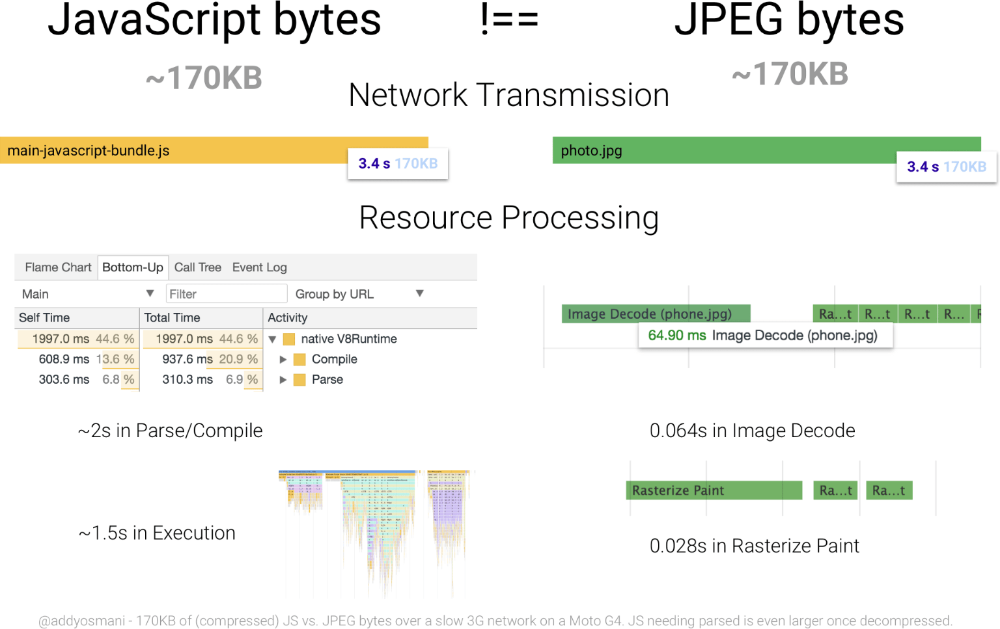

## Loading Performance
### Text Content:
* Text minification.
* Remote resource compression with `Gzip`.

### Graphical Content
* As a rule of thumb, use `PNG` for clip art, line drawings, or wherever you need transparency, `JPG` for photographs (as it might weight less than `PNG`), and `GIF` when you need animation.
* __Remove Image Metadata__
* __Resize Image__

    All your images should be appropriately sized for their intended use and should not rely on the browser to resize them for rendering.

* __Crop images__ to show only what's important

* __Reduce image quality__

    In most cases, you can reduce the image quality, and thus the file size, without suffering any visible quality difference.

* __Compress Images__

    `PNG` and `JPG` images can be squashed down even more using a compression tool, which reduces file size without affecting either image dimensions or visual quality.

### HTTP
* __Use module bundler__
* __Combine Graphical Resources__ to get the `sprite`.
    > Note: Physically combining files as discussed above might not achieve the desired result on `HTTP/2`.
* __Script Location__

    Common convention is to put script blocks in the page head. The problem with this positioning is that, typically, little to none of the script is really meant to execute until the page is displayed but, while it is loading, it unnecessarily blocks page rendering. Identifying render-blocking script is one of the reporting rules of PageSpeed Insights.

    A simple and effective solution is to reposition the deferred script block at the end of the page. That is, put the script reference last, just before the closing body tag. This allows the browser to load and render the page content, and then lets it download the script while the user perceives the initial content.

    > An exception to this technique is any script that manipulates the initial content or `DOM`, or provides required page functionality prior to or during rendering.

* __Code Location__

    Of course, the technique described above splits your JavaScript into two files on the server and thus requires two HTTP requests instead of one, exactly the situation we're trying to avoid. A better solution for relocating critical, pre-render scripts might be to place them directly inside the page itself, referred to as an _inline push_.

* __Enable Cache__

    Two main types of cache headers, `Cache-control` and `expires`, define the caching characteristics for your resources.

    > Tip: Don't use an expiry greater than one year; that's effectively forever on the internet and, as noted above, is the maximum value for `max-age` under `Cache-control`.

* __Reduce Latency with a Content Delivery Network (CDN)__

    Besides speeding up the delivery of your assets around the globe a CDN also can dramatically decrease your latency.

    A content delivery network (__CDN__) is a network of edge servers strategically placed across the globe with the purpose of delivering digital content to users as fast as possible.

    [Read More about CDN](https://www.keycdn.com/what-is-a-cdn)

* __Avoid 301 Redirects__

    Redirects are performance killers. Avoid them whenever possible. A redirect will generate additional round trip times (RTT) and therefore quickly doubles the time that is required to load the initial HTML document before the browser even starts to load other assets.

* __Hotlink Protection__

    Hotlink protection refers to restricting HTTP referrers in order to prevent others from embedding your assets on other websites. Hotlink protection will save you bandwidth by prohibiting other sites from displaying your images.

* __Infrastructure__

    Having a fast web host is equally as important as any website performance optimization you could make, as it is the backbone of your site. Stay away from cheap shared hosting.

### Optimizing performance
* __Optimizing `FP`/`FCP`__:
  * [`HTTP/2` Server Push](https://developers.google.com/web/fundamentals/performance/http2/#server_push)
  * [App Shell Pattern](https://developers.google.com/web/updates/2015/11/app-shell)

* __Optimizing `FMP`/`TTI`__:
  * Once you've identified the most critical UI elements on your page (the _hero elements_), you should ensure that your initial script load contains just the code needed to get those elements rendered and make them interactive.
  * Try as hard as possible to minimize the time between `FMP` and `TTI`.
  * One of the most frustrating experiences for a user is tapping on an element and then having nothing happen.

* __Preventing long tasks__:

  * Split up your code and prioritizing the order in which it's loaded.
  * [`requestIdleCallback`](https://developers.google.com/web/updates/2015/08/using-requestidlecallback) will schedule work when there is free time at the end of a frame, or when the user is inactive. This means that there’s an opportunity to do your work without getting in the user’s way. You can postpone analytics task.

    Scheduling non-essential work yourself is very difficult to do. It’s impossible to figure out exactly how much frame time remains

> Test with low bandwidth and high latency

### Optimizing Content Efficiency
* Eliminate unnecessary data
* Minification

    It refers to the removal of whitespace and other nonessential characters like comments so that the code is still valid but as compact as possible. Minified code is still valid code in all respects and can be run immediately.

* Data Compression

    Compressed code would have to be uncompressed first before execution.

* Text compression with `GZIP`

    `GZIP` is a generic compressor that can be applied to any stream of bytes. However, in practice, it performs best on text-based content.

### Image optimization:
* __Use alternative technologies if possible__

  * CSS effects
  * Web Fonts

* __Use `<picture>`__ for responsive images.

* __Vector vs. Raster images__

  * Vector images are ideal for images that consist of geometric shapes.

  * Vector images are zoom and resolution-independent.

  * Raster images should be used for complex scenes with lots of irregular shapes and details as raster images encode image data on a per-pixel basis.

* __Optimizing vector images__

  * SVG is an XML-based image format
  * SVG files should be minified to reduce their size
  * SVG files should be compressed with `GZIP`
  * Optimization tool: [SVGOMG](https://jakearchibald.github.io/svgomg/)

* __Optimizing raster images__

  * A raster image is a grid of pixels
  * Each pixel encodes color and transparency information
  * Reduce color palette and [delta encoding](https://en.wikipedia.org/wiki/Delta_encoding)

* __Selecting the right image format__

    _JPEG_ are for photographs and realistic images. _PNG_ are for line art, text-heavy images, and images with few colors.

    | Format | Transparency | Animation | Browser |
    | - | - | - | - |
    | [GIF](http://en.wikipedia.org/wiki/Graphics_Interchange_Format) |	Yes |	Yes |	All |
    | [PNG](http://en.wikipedia.org/wiki/Portable_Network_Graphics) |	Yes |	No | All |
    | [JPEG](http://en.wikipedia.org/wiki/JPEG) | No | No | All |
    | [JPEG XR](http://en.wikipedia.org/wiki/JPEG_XR) | Yes | Yes | IE |
    | [WebP](http://en.wikipedia.org/wiki/WebP) | Yes | Yes | Chrome, Opera, Android |

    

    > If you are using a `Webview` to render content in your native application, then you have full control of the client and can use `WebP` exclusively! [Watch on YouTube](https://www.youtube.com/watch?v=pS8udLMOOaE)

* __Tools__

    | Tool | Description |
    | - | - |
    | [gifsicle](http://www.lcdf.org/gifsicle/) | create and optimize GIF images |
    | [jpegtran](http://jpegclub.org/jpegtran/) | optimize JPEG images |
    | [optipng](http://optipng.sourceforge.net/) | lossless PNG optimization |
    | [pngquant](http://pngquant.org/) | lossy PNG optimization |

* __Delivering scaled image assets__

  * Resize images on the server and ensure that the "display" size is as close as possible to the "natural" size of the image. Pay close attention to large images in particular, as they account for largest overhead when resized!

* __Remove unnecessary image metadata__

    Many images contain unnecessary metadata about the asset: geo information, camera information, and so on. Use appropriate tools to strip this data

### Automating Image Optimization

* The browser itself is capable of choosing which image format to display through the use of the `<picture>` tag. The `<picture> `tag utilizes multiple `<source>` elements, with one `` tag, which is the actual DOM element which contains the image. The browser cycles through the sources and retrieves the first match. If the `<picture>` tag isn't supported in the user's browser, a `<div>` is rendered and the `` tag is used.
    ```html
    <picture>
        <source srcset='paul_irish.jxr' type='image/vnd.ms-photo'>
        <source srcset='paul_irish.jp2' type='image/jp2'>
        <source srcset='paul_irish.webp' type='image/webp'>
        
    </picture>
    ```

  * `srcset`

    Allows a browser to select the best available image per device, e.g selecting a 2x image for a 2x mobile display. Browsers without `srcset` support can fallback to the default `src` specified in the `` tag.

    ```html
    
    ```

    [Client Hints](https://www.smashingmagazine.com/2016/01/leaner-responsive-images-client-hints/) can also provide an alternative to specifying each possible pixel density and format in your responsive image markup. Instead, they append this information to the HTTP request so web servers can pick the best fit for the current device's screen density.

* __Lazy-load non-critical images__

    Use [`Intersection Observer`](https://developers.google.com/web/updates/2016/04/intersectionobserver)

    [__Read More__](https://developers.google.com/web/fundamentals/performance/lazy-loading-guidance/images-and-video/)

* __Avoiding the `display: none` trap__

    Does `display: none` avoid triggering a request for an image `src`?
    ```html
    <div style="display:none"></div>
    ```
    No. The image will be requested although it is hidden.

    Does `display: none` avoid triggering a request for a background: `url()`?
    ```html
    <div style="display:none">
        <div style="background: url(img.jpg)"></div>
    </div>
    ```
    Yes. CSS backgrounds aren’t fetched as soon as an element is parsed.

* __Caching image assets__

    Most of the images you deliver to users are static assets that will not change in the future. The best caching strategy for such assets is aggressive caching. For this, set
    ```
    Cache-Control:public; max-age=31536000
    ```

* __Preloading critical image assets__

    `<link rel=preload>` is a declarative fetch, allowing you to force the browser to make a request for a resource without blocking the document’s onload event. It enables increasing the priority of requests for resources that might otherwise not be discovered until later in the document parsing process.

    ```html
    <link rel="preload" as="image" href="logo.jpg"/>
    ```

    Image resources for ``, `<picture>`, srcset and SVGs can all take advantage of this optimization.

* __Prefetch__

    `prefetch` informs the browser of a resource that is expected to be needed as part of a future navigation or user interaction, for example, something that might be needed later, if the user takes the action we’re expecting. These resources are fetched at the Lowest priority in Chrome, when the current page is done loading and there’s bandwidth available.
    ```html
    <link rel="prefetch" href="page-2.html">
    ```

[Read More](https://developers.google.com/web/fundamentals/performance/optimizing-content-efficiency/automating-image-optimization/)

### Image decode and resize costs
When a browser fetches an image, it has to decode the image from the original source format (e.g JPEG) to a bitmap in memory. Often the image needs to be resized (e.g width has been set to a percentage of its container). Decoding and resizing images are expensive and can delay how long it takes for an image to be displayed.


> Omitting the `width` or `height` attributes on an image can also negatively impact performance. Without them, a browser assigns a smaller placeholder region for the image until sufficient bytes have arrived for it to know the correct dimensions. At that point, the document layout must be updated in what can be a costly step called reflow.

### Replace Animated GIFs with Video
Delivering the same file as an MP4 video can often shave _80%_ or more off your file-size. Not only do GIFs often waste significant bandwidth, but they take longer to load, include fewer colors and generally offer sub-part user experiences.

GIFs (and other animated image formats) are suboptimal because an image decode is incurred for every frame in the image, which can contribute to jank. This makes sense, because each frame in a GIF is simply another image.

[The Book of GIF](https://rigor.com/wp-content/uploads/2017/03/TheBookofGIFPDF.pdf)

Tools: [ffmpeg](https://www.ffmpeg.org/), [Gifify](https://github.com/vvo/gifify), [GIFV](https://blog.imgur.com//2014/10/09/introducing-gifv/)

[Article about how to convert GIF to Video](https://rigor.com/blog/2015/12/optimizing-animated-gifs-with-html5-video)

[Step-by-step Instructions](https://developers.google.com/web/fundamentals/performance/optimizing-content-efficiency/replace-animated-gifs-with-video/)

[Converting MP4 to WEBM](https://gist.github.com/Vestride/278e13915894821e1d6f)

### PRPL
`PRPL` is a pattern that optimizes for interactivity through aggressive code-splitting and caching.

`PRPL` stands for:
* __Push__ critical resources for the initial URL route using <link preload> and http/2.
* __Render__ initial route.
* __Pre-cache__ remaining routes.
* __Lazy-load__ and create remaining routes on demand.

`PRPL` strives to optimize for:
* Minimum time-to-interactive.
  * Especially on first use (regardless of entry point).
  * Especially on real-world mobile devices.
* Maximum caching efficiency, especially over time as updates are released.
* Simplicity of development and deployment.

__App entrypoint__

The entrypoint must import and instantiate the shell, as well as conditionally load any required polyfills.

The main considerations for the entrypoint are:
* Has minimal static dependencies, in other words, not much beyond the app-shell itself.
* Conditionally loads required polyfills.
* Uses absolute paths for all dependencies.

__App shell__

The shell is responsible for routing and usually includes the main navigation UI for the app.

The app should lazy-load fragments as they're required. For example, when the user changes to a new route, it imports the fragment(s) associated with that route. This may initiate a new request to the server, or simply load the resource from the cache.

The shell (including its static dependencies) should contain everything needed for first paint.

__Bundled build__
The build process could produce a set of different bundles: one bundle for the shell, and one bundle for each fragment.


[Read More about PRPL](https://developers.google.com/web/fundamentals/performance/prpl-pattern/)

### Progressive Bootstrapping
Progressive rendering and bootstraping means you send a functionally viable (though minimal) view in the HTML, including JS and CSS. As more recources arrive, the app progressively "unlocks" features.

### Resource Hints
* `preconnect` informs the browser that your page intends to establish a connection to another origin, and that you’d like the process to start as soon as possible.

    Establishing connections often involves significant time in slow networks, particularly when it comes to secure connections, as it may involve DNS lookups, redirects, and several round trips to the final server that handles the user’s request. Taking care of all this ahead of time can make your application feel much snappier to the user without negatively affecting the use of bandwidth.
    ```html
    <link rel="preconnect" href="https://cdn.example.com">
    ```

* `dns-prefetch` handles the DNS lookup only, so it’s a small subset of `preconnect`, but it’s got wider browser support, so it may serve as a nice fallback. You use it the exact same way:
    ```html
    <link rel="dns-prefetch" href="http://example.com">
    ```

### Fonts
Fonts are a great example of late-discovered resources that must be fetched, often sitting at the bottom of one of several CSS files loaded by a page.

* Preload fonts:
    ```html
    <link rel="preload" as="font" crossorigin="crossorigin" type="font/woff2" href="myfont.woff2">
    ```

    > Note that the use of crossorigin here is important; without this attribute, the preloaded font is ignored by the browser, and a new fetch takes place. This is because fonts are expected to be fetched anonymously by the browser, and the preload request is only made anonymous by using the crossorigin attribute.

* `font-display` property.

    The `font-display` descriptor determines how a font face is displayed based on whether and when it is downloaded and ready to use.
    ```css
    font-display: auto;
    font-display: block;
    font-display: swap;
    font-display: fallback;
    font-display: optional;
    ```
    * `auto` - The font display strategy is defined by the user agent.
    * `block` - Gives the font face a short block period and an infinite swap period.
    * `swap` - Gives the font face an extremely small block period and an infinite swap period.
    * `fallback` - Gives the font face an extremely small block period and a short swap period.
    * `optional` - Gives the font face an extremely small block period and no swap period.

### Client Hint
Client hints are a set of opt-in _HTTP request headers_ that give us insight into these aspects of the user’s device and the network they’re connected to. This is an another method of content negotiation, which means changing content responses based on browser request headers.

___

## Optimizing JavaScript
Unlike images which only incur relatively trivial decode time once downloaded, JavaScript must be parsed, compiled, and then finally executed. Byte for byte, this makes JavaScript more expensive than other types of resources.



### Tree shaking
Tree shaking is a form of dead code elimination.

When tree shaking, use the following Babel options:
```javascript
{
    "presets": [
        ["env", {
        "modules": false
        }]
    ]
}
```

To not let the Babel to transpile the ES6 Modules into CommonJS Modules, which are harder to tree shake.

If you run into a stubborn library that won't respond to tree shaking, look to see if it exports its methods using the ES6 syntax. If it's exporting stuff in CommonJS format (e.g., `module.exports`), that code won't be tree shakeable by webpack.

`Lodash` is a bit of a strange case in that tree shaking as it's described in this guide doesn't work. Because of how `Lodash` is architected, you have to a) install the `lodash-es` package in lieu of (вместо) regular old `lodash` and b) use a slightly different syntax (referred to as "cherry-picking") to shake off the other dependencies:
```javascript
// This still pulls in all of lodash even if everything is configured right.
import { sortBy } from "lodash";

// This will only pull in the sortBy routine.
import sortBy from "lodash-es/sortBy";
```

### Code Splitting
Modern sites often combine all of their JavaScript into a single, large bundle. When JavaScript is served this way, loading performance suffers. Large amounts of JavaScript can also tie up the main thread, delaying interactivity. This is especially true of devices with less memory and processing power.

An alternative to large bundles is code-splitting, which is where JavaScript is split into smaller chunks. This enables sending the minimal code required to provide value upfront, improving page-load times. The rest can be loaded on demand.

Code-splitting can be done in the following ways:
* __Vendor splitting__ separates vendor code (e.g., React, lodash, etc.) away from your app's code. This allows you to keep application and vendor code separate. This isolates the negative performance impacts of cache invalidation for returning users when either your vendor or app code changes. This should be done in every app.
* __Entry point splitting__ separates code by entry point(s) in your app, which are the scripts where tools like webpack and Parcel start when they build a dependency tree of your app.

    Conveniently, when there are multiple entry points, webpack treats them all as separate dependency trees, meaning that code is automatically split into named chunks like so.

    Though we've created nicely split chunks for each page, there's still a problem: There's a lot of duplicate code in each chunk. This is because webpack treats each entry point as its own dependency tree without assessing what code is shared between them.

    Here, the duplicate code comes from vendor scripts. To remedy this, we'll tell webpack to create a separate chunk for those scripts. To do this, we'll use the `optimization.splitChunks` configuration object.

    If you really want to go for the gold, though, you can eliminate most or all shared code between bundles and employ a type of splitting called "commons splitting". In the example app, this can be achieved by creating another entry under `cacheGroups`

    [Read More](https://developers.google.com/web/fundamentals/performance/optimizing-javascript/code-splitting/)

* __Dynamic splitting__ separates code where `dynamic import()` statements are used. This type of splitting is often best for single page applications.

    Another method is to lazy load scripts with the [`dynamic import()`](https://developers.google.com/web/updates/2017/11/dynamic-import) statement:

    ```javascript
    import("./myFancyModule.js").then(module => {
        module.default(); // Call a module's default export
    });
    ```

    Since `import()` returns a Promise, you can also use async/await:

    ```javascript
    let module = await import("./myFancyModule.js");
    module.default(); // Access a module's default export
    ```

    When this approach makes sense: You're developing a single page application with many discrete pieces of functionality that not all users may, well, use. Lazy loading this functionality can reduce JS parse/compile activity as well as bytes sent over the network.

    The most intuitive tool to use for dynamic code splitting is [Parcel](https://parceljs.org/). Without any configuration, Parcel builds a dependency tree accounting for both static and dynamic modules, and outputs scripts with names that nicely align with your inputs.

    Like Parcel, webpack can split dynamic imports to separate files. It does so with little guidance, in fact.

Use [Workbox](https://developers.google.com/web/tools/workbox/) to add service workers for your app.

### What can go wrong when lazy loading images and videos
* Layout shifting and placeholders

    Lazy loading media can cause shifting in the layout if placeholders aren't used. These changes can be disorienting for users and trigger expensive DOM layout operations that consume system resources and contribute to jank. At a minimum, consider using a solid color placeholder occupying the same dimensions as the target image, or techniques such as [LQIP](http://www.guypo.com/introducing-lqip-low-quality-image-placeholders) (Low Quality Image Placeholders) or [SQIP](https://github.com/technopagan/sqip) (SVG-Based Image Placeholder) that hint at the content of a media item before it loads.

    For `` tags, src should initially point to a placeholder until that attribute is updated with the final image URL. Use the `poster` attribute in a `<video>` element to point to a placeholder image. Additionally, use `width` and `height` attributes on both `` and `<video>` tags. This ensures that transitioning from placeholders to final images won't change the rendered size of the element as media loads.

    LQIP’s logic is simple. In a sense, this is like loading progressive JPEGs, except it’s page wide. There are more implementation details below, but it boils down to two main steps:
    * Initially load the page with low quality images

        ```html
        <!-- An image that eventually gets lazy loaded by JavaScript -->
        
        ```

    * Once the page loaded (e.g. in the onload event), replace them with the full quality images

* Image decoding delays

    Loading large images in JavaScript and dropping them into the DOM can tie up the main thread, causing the user interface to be unresponsive for a short period of time while decoding occurs. [Asynchronously decoding images using the `decode` method](https://medium.com/dailyjs/image-loading-with-image-decode-b03652e7d2d2) prior to inserting them into the DOM can cut down on this sort of jank, but beware: It's not available everywhere yet, and it adds complexity to lazy loading logic.

    ```javascript
    var newImage = new Image();
    newImage.src = "my-awesome-image.jpg";

    if ("decode" in newImage) {
        // Fancy decoding logic
        newImage.decode().then(function() {
            imageContainer.appendChild(newImage);
        });
    } else {
        // Regular image load
        imageContainer.appendChild(newImage);
    }
    ```
