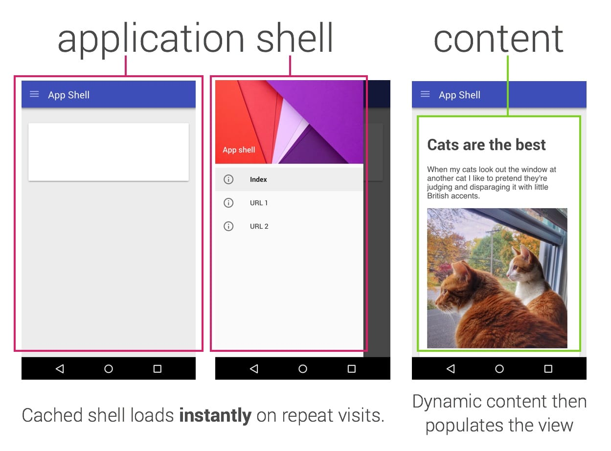

## Instant Loading Web Apps with an Application Shell Architecture
An __application shell__ is the minimal `HTML`, `CSS`, and `JavaScript` powering a user interface. The application shell should:
* load fast
* be cached
* dynamically display content

Service workers are powerful for offline caching but they also offer significant performance wins in the form of instant loading for repeat visits to your site or web app.

Use [Service Worker Toolbox](https://github.com/GoogleChromeLabs/sw-toolbox) when working with with SW.
