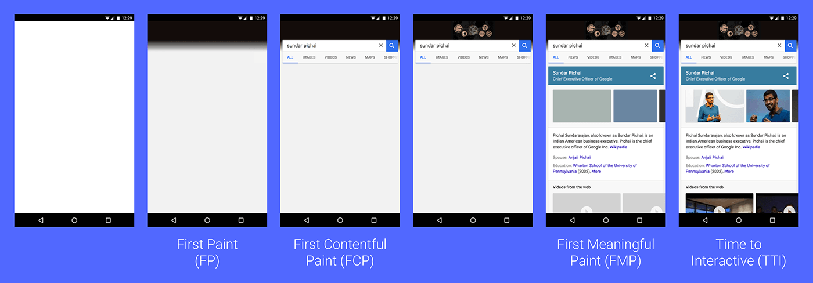

## APIs used to measure the performance:
* [`PerformanceObserver`](https://developer.mozilla.org/en-US/docs/Web/API/PerformanceObserver) - interface is used to observe performance measurement events and be notified of new `PerformanceEntry`s as they are recorded in the browser's performance timeline.

    > This feature is available in Web Workers.

* [`DOMHighResTimeStamp`](https://developer.mozilla.org/en-US/docs/Web/API/DOMHighResTimeStamp) - type is a `double` and is used to store a time value. The value could be a discrete point in time or the difference in time between two discrete points in time.

> You must ensure your `PerformanceObserver` is registered in the `<head>` of your document before any stylesheets, so it runs before _First Paint_ happens.

Once you have the data for a particular performance event, you can send it to whatever analytics service (_Google Analytics_) you use to capture the metric for the current user.

The [RAIL performance model](https://developers.google.com/web/fundamentals/performance/rail) teaches us that in order for a user interface to feel smooth, it should respond within `100ms` of user input.

| The Experience | The Metric |
| - | - |
| Is it happening? | First Paint (`FP`) / First Contentful Paint (`FCP`) |
| Is it useful?	| First Meaningful Paint (`FMP`) / Hero Element Timing |
| Is it usable? |	Time to Interactive (`TTI`) |
| Is it delightful? |	Long Tasks (technically the absence of long tasks) |

__Real User Monitoring__ (`RUM`) relies on JavaScript APIs in the browser to gather statistics on how sites perform for real users. Two specific APIs measure how fast documents and resources load for users by capturing high-resolution timings which measure various phases of resource loading. These are the Network and Resource Timing APIs, and this guide will help you make sense of the data they provide.
* _Navigation Timing_ collects performance metrics for HTML documents.
* _Resource Timing_ collects performance metrics for document-dependent resources. Stuff like style sheets, scripts, images, et cetera.

[Performance Measuring Tools](https://developers.google.com/web/fundamentals/performance/speed-tools/)