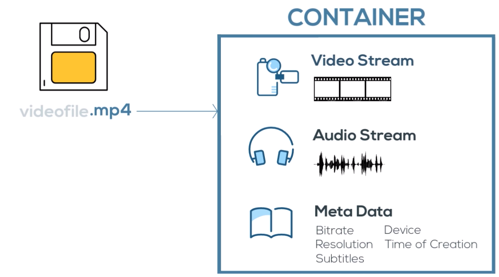

## Video

### What is video
__Co__ der + __Dec__ ode = __Codec__

Codec is the algorithm which used for packaging and unpackaging for further streaming and playing.

Encoding is another term for compression. Which makes the size of file, making it easier to transmit over distance. Decoding reverses the process.

Video format is a standarized set of rules for storing containers, codec, meta data and folder structure.

Bitrate - rate at which data is encoded per second. The higher it is the higher the quality as more data is transmitted.

The higher the frame rate, more data need to be encoded.

### Containers/Frmats
MP4 was not designed with today, and tomorrow’s, internet in mind.

#### Why `WebM`?
`WebM` format provides excellent quality for video files. In addition to that, the playback of this video format is effortless, so the videos in this format can be easily played even on machines with low technical characteristics. This format is perfect for online streaming, and it’s free!

#### WebM vs. MP4
The major difference between these two formats are the video codecs used. WebM uses `VP8` or `VP9` while MP4 is based upon `H.264`. Quality-wise, `VP8` is better than `H.264`.

As for the size of the file, both formats provide relatively similar compression, so the difference in the sizes of the same files of MP4 and WebM formats is not that significant. However, WebM files tend to be a bit smaller than MP4 files.

Another big question is the difference between the total number of devices and programs that support WebM and MP4. There is no doubt that MP4 format is more popular today and it is supported by plenty of smartphones whereas WebM is only supported by Android. The same can be said about software for the playback and editing of the files.

### How to optimize
* Use Image Compression Tools
* Convert to MP4 and webm
* Remove Audio From
* Stream Directly From Your Server
* Specify the Video Size

### ffmpeg
`-b:v`: specifies the target (average) bit rate for the encoder to use.
