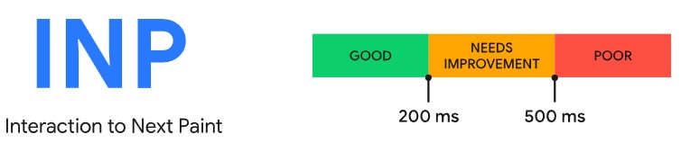

# Web Vitals
Web Vitals is an initiative by Google to provide unified guidance for quality signals that are essential to delivering a great user experience on the web.

## Core Web vitals
Core Web Vitals are the subset of Web Vitals that apply to all web pages, should be measured by all site owners, and will be surfaced across all Google tools. The metrics that make up Core Web Vitals will evolve over time.

The current set for 2020 focuses on three aspects of the user experience: __loading__, __interactivity__, and __visual stability__ and includes the following metrics (and their respective thresholds):

### Largest Contentful Paint
__Largest Contentful Paint__ - measures the time from when a user starts loading the page until the time when the largest image or text block in the viewport finishes rendering.

Older metrics like `load` or `DOMContentLoaded` are not good because they don't necessarily correspond to what the user sees on their screen.

In the past we've recommended performance metrics like First Meaningful Paint (FMP) and Speed Index (SI) (both available in Lighthouse) to help capture more of the loading experience after the initial paint, but these metrics are complex, hard to explain, and often wrong—meaning they still do not identify when the main content of the page has loaded.

A more accurate way to measure when the main content of a page is loaded is to look at when the largest element was rendered.

#### Optimization
1. Preload assets using `<link rel="preload" ...>`
2. Set loading priority using ``
3. Reduce or inline render-blocking stylesheets
4. Defer or inline render-blocking JavaScript
5. Minify JS
6. Use treeshaking for JS
7. Use server-side rendering
8. Serve the optimal image size
9. Use modern image formats
10. Compress images
11. Reduce web font size
12. Use CDN

#### [Read more](https://web.dev/optimize-lcp)

### First Input Delay
__First Input Delay__ - measures the time from when a user first interacts with a page (that is, when they click a link, tap on a button, or use a custom, JavaScript-powered control) to the time when the browser is actually able to begin processing event handlers in response to that interaction. In short: _FID is a metric that measures a page's responsiveness during load_.

In general, input delay (a.k.a. input latency) happens because the browser's main thread is busy doing something else, so it can't (yet) respond to the user. One common reason this might happen is the browser is busy parsing and executing a large JavaScript file loaded by your app. While it's doing that, it can't run any event listeners because the JavaScript it's loading might tell it to do something else.

> FID only measures the "delay" in event processing. It does not measure the event processing time itself nor the time it takes the browser to update the UI after running event handlers. While this time does affect the user experience, including it as part of FID would incentivize developers to respond to events asynchronously—which would improve the metric but likely make the experience worse.

FID measures the delta between when an input event is received and when the main thread is next idle. This means FID is measured even in cases where an event listener has not been registered. The reason is because many user interactions do not require an event listener but do require the main thread to be idle in order to run.

For example, all of the following HTML elements need to wait for in-progress tasks on the main thread to complete prior to responding to user interactions: `<input>`, `<textarea>`, `<select>`, `<a>`.

While a delay from any input can lead to a bad user experience, we primarily recommend measuring the first input delay for a few reasons:
* The first input delay will be the user's first impression of your site's responsiveness, and first impressions are critical in shaping our overall impression of a site's quality and reliability.
* The biggest interactivity issues we see on the web today occur during page load. Therefore, we believe initially focusing on improving site's first user interaction will have the greatest impact on improving the overall interactivity of the web.
* The recommended solutions for how sites should fix high first input delays (code splitting, loading less JavaScript upfront, etc.) are not necessarily the same solutions for fixing slow input delays after page load. By separating out these metrics we'll be able to provide more specific performance guidelines to web developers.

FID focuses on the R (responsiveness) in the RAIL performance model, whereas scrolling and zooming are more related to A (animation), and their performance qualities should be evaluated separately.

#### Optimization
* Break down long-running code into smaller, asynchronous tasks.
* Minimize a reliance on cascading data fetches.
* Minimize how much data needs to be post-processed on the client-side.
* Use a web worker to move heavy tasks to background thread. Use these libs: [Comlink](https://github.com/GoogleChromeLabs/comlink), [Workway](https://github.com/WebReflection/workway), [Workerize](https://github.com/developit/workerize)
* Defer unused JavaScript by using `async` or `defer`.
* Minimize unused polyfills
* Lazy load modules using React, Angular, Webpack ...

#### [Read more](https://web.dev/optimize-fid)

### Cumulative Layout Shift
__Cumulative Layout Shift__ - a measure of the largest burst of layout shift scores for every unexpected layout shift that occurs during the entire lifespan of a page.

Unexpected movement of page content usually happens because resources are loaded asynchronously or DOM elements get dynamically added to the page above existing content. The culprit might be an image or video with unknown dimensions, a font that renders larger or smaller than its fallback, or a third-party ad or widget that dynamically resizes itself.

To calculate the layout shift score, the browser looks at the viewport size and the movement of unstable elements in the viewport between two rendered frames. The layout shift score is a product of two measures of that movement: the impact fraction and the distance fraction.

`layout shift score = impact fraction * distance fraction`

The __impact fraction__ measures how unstable elements impact the viewport area between two frames.

The union of the visible areas of all unstable elements for the previous frame and the current frame—as a fraction of the total area of the viewport—is the impact fraction for the current frame.

The other part of the layout shift score equation measures the distance that unstable elements have moved, relative to the viewport. The __distance fraction__ is the greatest distance any unstable element has moved in the frame (either horizontally or vertically) divided by the viewport's largest dimension (width or height, whichever is greater).

Animations and transitions, when done well, are a great way to update content on the page without surprising the user. Content that shifts abruptly and unexpectedly on the page almost always creates a bad user experience.

CSS `transform` property allows you to animate elements without triggering layout shifts:
* Instead of changing the `height` and `width` properties, use transform: `scale()`.
* To move elements around, avoid changing the `top`, `right`, `bottom`, or `left` properties and use `transform: translate()` instead.

#### Optimization
The most common causes of a poor CLS are:
* Images without dimensions
* Ads, embeds, and `iframes` without dimensions
* Dynamically injected content such as ads, embeds, and `iframes` without dimensions
* The fallback font is swapped with the web font (FOUT—flash of unstyled text)
* "Invisible" text is displayed using the fallback font until a web font is available and the text is made visible (FOIT—flash of invisible text)

Solution:
* Always set image/vide size
* Use `` with responsive images
* Use `<picture>` for providing different images based on container size
* Statically reserve space (placeholder) for late-loading content
* Avoid placing late-loading content near the top of the viewport
* Ensure the fallback font is similar to final font, to avoid additional re-layout
* Minimize the size differences between the fallback font and the web font using the new `size-adjust`, `ascent-override`, `descent-override`, and `line-gap-override` APIs
* Load critical web fonts as early as possible using `<link rel=preload>`.
* `font-display: optional`

#### [Read more](https://web.dev/optimize-cls)

### [Interaction to Next Paint (INP)](https://web.dev/inp)
Interaction to Next Paint (INP) is a Core Web Vital metric that assesses a page's overall responsiveness to user interactions by observing the latency of all qualifying interactions that occur throughout the lifespan of a user's visit to a page. The final INP value is the longest interaction observed (sometimes ignoring outliers).

As far as INP goes, only the following interaction types are observed:
* Clicking with a mouse.
* Tapping on a device with a touchscreen.
* Pressing a key on either a physical or onscreen keyboard.

__Layout thrashing__—sometimes called forced synchronous layout—is a rendering performance problem where layout occurs synchronously. It occurs when you update styles in JavaScript, and then read them in the same task—and [there are many properties in JavaScript that can cause layout thrashing](https://gist.github.com/paulirish/5d52fb081b3570c81e3a).

Layout thrashing is a performance bottleneck because by updating styles and then immediately requesting the values of those styles in JavaScript, the browser is forced to do synchronous layout work it otherwise could have waited to perform asynchronously later on after event callbacks have finished running.

#### Optimization
* Do UI updates sync and the rest of computation using `setTimeout()` or `requestAnimationFrame()`.
* Avoid layout thrashing
* Minimize DOM size, since small doms updates faster
* Use `content-visibility` to lazily render off-screen elements

The `content-visibility` property, launching in Chromium 85, might be one of the most impactful new CSS properties for improving page load performance. content-visibility enables the user agent to skip an element's rendering work, including layout and painting, until it is needed. Because rendering is skipped, if a large portion of your content is off-screen, leveraging the content-visibility property makes the initial user load much faster. It also allows for faster interactions with the on-screen content.

#### [Read more](https://web.dev/optimize-inp)

## Others vitals
* [Time to First Byte (TTFB)](https://web.dev/ttfb)
* [First Contentful Paint (FCP)](https://web.dev/fcp)
