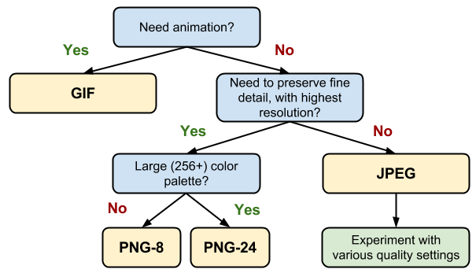

## Loading Performance
### Text Content:
* Text minification.
* Remote resource compression with `Gzip`.

### Graphical Content
* As a rule of thumb, use `PNG` for clip art, line drawings, or wherever you need transparency, `JPG` for photographs (as it might weight less than `PNG`), and `GIF` when you need animation.
* __Remove Image Metadata__
* __Resize Image__

    All your images should be appropriately sized for their intended use and should not rely on the browser to resize them for rendering.

* __Crop images__ to show only what's important

* __Reduce image quality__

    In most cases, you can reduce the image quality, and thus the file size, without suffering any visible quality difference.

* __Compress Images__

    `PNG` and `JPG` images can be squashed down even more using a compression tool, which reduces file size without affecting either image dimensions or visual quality.

### HTTP
* __Use module bundler__
* __Combine Graphical Resources__ to get the `sprite`.
    > Note: Physically combining files as discussed above might not achieve the desired result on `HTTP/2`.
* __Script Location__

    Common convention is to put script blocks in the page head. The problem with this positioning is that, typically, little to none of the script is really meant to execute until the page is displayed but, while it is loading, it unnecessarily blocks page rendering. Identifying render-blocking script is one of the reporting rules of PageSpeed Insights.

    A simple and effective solution is to reposition the deferred script block at the end of the page. That is, put the script reference last, just before the closing body tag. This allows the browser to load and render the page content, and then lets it download the script while the user perceives the initial content.

    > An exception to this technique is any script that manipulates the initial content or `DOM`, or provides required page functionality prior to or during rendering.

* __Code Location__

    Of course, the technique described above splits your JavaScript into two files on the server and thus requires two HTTP requests instead of one, exactly the situation we're trying to avoid. A better solution for relocating critical, pre-render scripts might be to place them directly inside the page itself, referred to as an _inline push_.

* __Enable Cache__

    Two main types of cache headers, `cache-control` and `expires`, define the caching characteristics for your resources.

    > Tip: Don't use an expiry greater than one year; that's effectively forever on the internet and, as noted above, is the maximum value for `max-age` under `cache-control`.

__Real User Monitoring__ (`RUM`) relies on JavaScript APIs in the browser to gather statistics on how sites perform for real users. Two specific APIs measure how fast documents and resources load for users by capturing high-resolution timings which measure various phases of resource loading. These are the Network and Resource Timing APIs, and this guide will help you make sense of the data they provide.
* _Navigation Timing_ collects performance metrics for HTML documents.
* _Resource Timing_ collects performance metrics for document-dependent resources. Stuff like style sheets, scripts, images, et cetera.


[Performance Measuring Tools](https://developers.google.com/web/fundamentals/performance/speed-tools/)

### APIs used to measure the performance:
* [`PerformanceObserver`](https://developer.mozilla.org/en-US/docs/Web/API/PerformanceObserver) - interface is used to observe performance measurement events and be notified of new `PerformanceEntry`s as they are recorded in the browser's performance timeline.

  > This feature is available in Web Workers.

* [`DOMHighResTimeStamp`](https://developer.mozilla.org/en-US/docs/Web/API/DOMHighResTimeStamp) - type is a `double` and is used to store a time value. The value could be a discrete point in time or the difference in time between two discrete points in time.

> You must ensure your `PerformanceObserver` is registered in the `<head>` of your document before any stylesheets, so it runs before _First Paint_ happens.

Once you have the data for a particular performance event, you can send it to whatever analytics service (_Google Analytics_) you use to capture the metric for the current user.

The [RAIL performance model](https://developers.google.com/web/fundamentals/performance/rail) teaches us that in order for a user interface to feel smooth, it should respond within `100ms` of user input.

| The Experience | The Metric |
| - | - |
| Is it happening? | First Paint (`FP`) / First Contentful Paint (`FCP`) |
| Is it useful?	| First Meaningful Paint (`FMP`) / Hero Element Timing |
| Is it usable? |	Time to Interactive (`TTI`) |
| Is it delightful? |	Long Tasks (technically the absence of long tasks) |


### Optimizing performance
* __Optimizing `FP`/`FCP`__:
  * [`HTTP/2` Server Push](https://developers.google.com/web/fundamentals/performance/http2/#server_push)
  * [App Shell Pattern](https://developers.google.com/web/updates/2015/11/app-shell)

* __Optimizing `FMP`/`TTI`__:
  * Once you've identified the most critical UI elements on your page (the _hero elements_), you should ensure that your initial script load contains just the code needed to get those elements rendered and make them interactive.
  * Try as hard as possible to minimize the time between `FMP` and `TTI`.
  * One of the most frustrating experiences for a user is tapping on an element and then having nothing happen.

* __Preventing long tasks__:

  * Split up your code and prioritizing the order in which it's loaded.
  * [`requestIdleCallback`](https://developers.google.com/web/updates/2015/08/using-requestidlecallback) will schedule work when there is free time at the end of a frame, or when the user is inactive. This means that there’s an opportunity to do your work without getting in the user’s way. You can postpone analytics task.

    Scheduling non-essential work yourself is very difficult to do. It’s impossible to figure out exactly how much frame time remains

> Test with low bandwidth and high latency

### Optimizing Content Efficiency
* Eliminate unnecessary data
* Minification

  It refers to the removal of whitespace and other nonessential characters like comments so that the code is still valid but as compact as possible. Minified code is still valid code in all respects and can be run immediately.

* Data Compression

  Compressed code would have to be uncompressed first before execution.

* Text compression with `GZIP`

  `GZIP` is a generic compressor that can be applied to any stream of bytes. However, in practice, it performs best on text-based content.

### Image optimization:
* __Use alternative technologies if possible__

  * CSS effects
  * Web Fonts

* __Vector vs. Raster images__

  * Vector images are ideal for images that consist of geometric shapes.

  * Vector images are zoom and resolution-independent.

  * Raster images should be used for complex scenes with lots of irregular shapes and details as raster images encode image data on a per-pixel basis.

* __Optimizing vector images__

  * SVG is an XML-based image format
  * SVG files should be minified to reduce their size
  * SVG files should be compressed with `GZIP`
  * Optimization tool: [SVGOMG](https://jakearchibald.github.io/svgomg/)

* __Optimizing raster images__

  * A raster image is a grid of pixels
  * Each pixel encodes color and transparency information
  * Reduce color palette and [delta encoding](https://en.wikipedia.org/wiki/Delta_encoding)

* __Selecting the right image format__

  _JPEG_ are for photographs and realistic images. _PNG_ are for line art, text-heavy images, and images with few colors.

  | Format | Transparency | Animation | Browser |
  | - | - | - | - |
  | [GIF](http://en.wikipedia.org/wiki/Graphics_Interchange_Format) |	Yes |	Yes |	All |
  | [PNG](http://en.wikipedia.org/wiki/Portable_Network_Graphics) |	Yes |	No | All |
  | [JPEG](http://en.wikipedia.org/wiki/JPEG) | No | No | All |
  | [JPEG XR](http://en.wikipedia.org/wiki/JPEG_XR) | Yes | Yes | IE |
  | [WebP](http://en.wikipedia.org/wiki/WebP) | Yes | Yes | Chrome, Opera, Android |

  

  > If you are using a `Webview` to render content in your native application, then you have full control of the client and can use `WebP` exclusively! [Watch on YouTube](https://www.youtube.com/watch?v=pS8udLMOOaE)

* __Tools__

  | Tool | Description |
  | - | - |
  | [gifsicle](http://www.lcdf.org/gifsicle/) | create and optimize GIF images |
  | [jpegtran](http://jpegclub.org/jpegtran/) | optimize JPEG images |
  | [optipng](http://optipng.sourceforge.net/) | lossless PNG optimization |
  | [pngquant](http://pngquant.org/) | lossy PNG optimization |

* __Delivering scaled image assets__

  * Resize images on the server and ensure that the "display" size is as close as possible to the "natural" size of the image. Pay close attention to large images in particular, as they account for largest overhead when resized!

* __Remove unnecessary image metadata__

  Many images contain unnecessary metadata about the asset: geo information, camera information, and so on. Use appropriate tools to strip this data

### Automating Image Optimization

* The browser itself is capable of choosing which image format to display through the use of the `<picture>` tag. The `<picture> `tag utilizes multiple `<source>` elements, with one `` tag, which is the actual DOM element which contains the image. The browser cycles through the sources and retrieves the first match. If the `<picture>` tag isn't supported in the user's browser, a `<div>` is rendered and the `` tag is used.
  ```html
  <picture>
      <source srcset='paul_irish.jxr' type='image/vnd.ms-photo'>
      <source srcset='paul_irish.jp2' type='image/jp2'>
      <source srcset='paul_irish.webp' type='image/webp'>
      
  </picture>
  ```

  * `srcset`

    Allows a browser to select the best available image per device, e.g selecting a 2x image for a 2x mobile display. Browsers without `srcset` support can fallback to the default `src` specified in the `` tag.

    ```html
    
    ```

    [Client Hints](https://www.smashingmagazine.com/2016/01/leaner-responsive-images-client-hints/) can also provide an alternative to specifying each possible pixel density and format in your responsive image markup. Instead, they append this information to the HTTP request so web servers can pick the best fit for the current device's screen density.

* __Lazy-load non-critical images__

  Use [`Intersection Observer`](https://developers.google.com/web/updates/2016/04/intersectionobserver)

  Libraries: [lazysizes](https://github.com/aFarkas/lazysizes), [Lazy Load XT](http://ressio.github.io/lazy-load-xt/), [BLazy.js](https://github.com/dinbror/blazy), [Unveil](http://luis-almeida.github.io/unveil/), [yall.js](https://github.com/malchata/yall.js)

* __Avoiding the `display: none` trap__

  Does `display: none` avoid triggering a request for an image `src`?
  ```html
  <div style="display:none"></div>
  ```
  No. The image will be requested although it is hidden.

  Does `display: none` avoid triggering a request for a background: `url()`?
  ```html
  <div style="display:none">
    <div style="background: url(img.jpg)"></div>
  </div>
  ```
  Yes. CSS backgrounds aren’t fetched as soon as an element is parsed.

* __Caching image assets__

  Most of the images you deliver to users are static assets that will not change in the future. The best caching strategy for such assets is aggressive caching. For this, set
  ```
  Cache-Control:public; max-age=31536000
  ```
* __Preloading critical image assets__

  `<link rel=preload>` is a declarative fetch, allowing you to force the browser to make a request for a resource without blocking the document’s onload event. It enables increasing the priority of requests for resources that might otherwise not be discovered until later in the document parsing process.

  ```html
  <link rel="preload" as="image" href="logo.jpg"/>
  ```

  Image resources for ``, `<picture>`, srcset and SVGs can all take advantage of this optimization.

[Read More](https://developers.google.com/web/fundamentals/performance/optimizing-content-efficiency/automating-image-optimization/)

### Image decode and resize costs

  When a browser fetches an image, it has to decode the image from the original source format (e.g JPEG) to a bitmap in memory. Often the image needs to be resized (e.g width has been set to a percentage of its container). Decoding and resizing images are expensive and can delay how long it takes for an image to be displayed.

  

  > Omitting the `width` or `height` attributes on an image can also negatively impact performance. Without them, a browser assigns a smaller placeholder region for the image until sufficient bytes have arrived for it to know the correct dimensions. At that point, the document layout must be updated in what can be a costly step called reflow.

### Replace Animated GIFs with Video
Delivering the same file as an MP4 video can often shave _80%_ or more off your file-size. Not only do GIFs often waste significant bandwidth, but they take longer to load, include fewer colors and generally offer sub-part user experiences.

GIFs (and other animated image formats) are suboptimal because an image decode is incurred for every frame in the image, which can contribute to jank. This makes sense, because each frame in a GIF is simply another image.

[The Book of GIF](https://rigor.com/wp-content/uploads/2017/03/TheBookofGIFPDF.pdf)

Tools: [ffmpeg](https://www.ffmpeg.org/), [Gifify](https://github.com/vvo/gifify), [GIFV](https://blog.imgur.com//2014/10/09/introducing-gifv/)

[Article about how to convert GIF to Video](https://rigor.com/blog/2015/12/optimizing-animated-gifs-with-html5-video)

[Step-by-step Instructions](https://developers.google.com/web/fundamentals/performance/optimizing-content-efficiency/replace-animated-gifs-with-video/)

### PRPL
`PRPL` is a pattern that optimizes for interactivity through aggressive code-splitting and caching.

`PRPL` stands for:
* __Push__ critical resources for the initial URL route using <link preload> and http/2.
* __Render__ initial route.
* __Pre-cache__ remaining routes.
* __Lazy-load__ and create remaining routes on demand.

### Progressive Bootstrapping
Progressive rendering and bootstraping means you send a functionally viable (though minimal) view in the HTML, including JS and CSS. As more recources arrive, the app progressively "unlocks" features.

### Resource Hints
You can use Resource Hints like to perform a DNS lookup for domains hosting third-party scripts. When the request for them is finally made, time can be saved as the DNS lookup has already been carried out.
```html
<link rel="dns-prefetch" href="http://example.com">
```
If the third-party domain you are referencing uses HTTPS, you may also consider as this will both perform the DNS lookup and resolve TCP round-trips and handle TLS negotiations. These other steps can be very slow as they involve looking at SSL certificates for verification, so consider Resource Hints seriously if you find third-party setup time to be an issue.
```html
<link rel="preconnect" href="https://cdn.example.com">
```

### Fonts
Preload fonts:
```html
<link rel="preload" href="/fonts/awesome-font.woff2" as="font">
```

Use `font-display` property.
