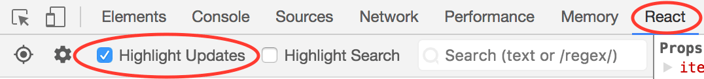

## Optimizing Performance
Internally, React uses several clever techniques to minimize the number of costly DOM operations required to update the UI. For many applications, using React will lead to a fast user interface without doing much work to specifically optimize for performance.

### Use the Production Build
By default, React includes many helpful warnings. These warnings are very useful in development. However, they make React larger and slower so you should make sure to use the production version when you deploy the app.

If you aren’t sure whether your build process is set up correctly, you can check it by installing React Developer Tools for Chrome.

### Profiling Components with the Chrome Performance Tab
In the development mode, you can visualize how components mount, update, and unmount, using the performance tools in supported browsers.

### Virtualize Long Lists
If your application renders long lists of data (hundreds or thousands of rows), we recommended using a technique known as __windowing__. This technique only renders a small subset of your rows at any given time, and can dramatically reduce the time it takes to re-render the components as well as the number of DOM nodes created.

[React Virtualized](https://bvaughn.github.io/react-virtualized/) is one popular windowing library. It provides several reusable components for displaying lists, grids, and tabular data. You can also create your own windowing component, like [Twitter did](https://medium.com/@paularmstrong/twitter-lite-and-high-performance-react-progressive-web-apps-at-scale-d28a00e780a3), if you want something more tailored to your application’s specific use case.

### Avoid Reconciliation
When a component’s `props` or `state` change, React decides whether an actual DOM update is necessary by comparing the newly returned element with the previously rendered one. When they are not equal, React will update the DOM.

You can now visualize these re-renders of the virtual DOM with React DevTools.



Interact with your page and you should see colored borders momentarily appear around any components that have re-rendered. This lets you spot re-renders that were not necessary.


### shouldComponentUpdate
You can speed all of this up by overriding the lifecycle function `shouldComponentUpdate`, which is triggered before the re-rendering process starts. The default implementation of this function returns true, leaving React to perform the update:
```javascript
shouldComponentUpdate(nextProps, nextState) {
  return true;
}
```

If you know that in some situations your component doesn’t need to update, you can return `false` from `shouldComponentUpdate` instead, to skip the whole rendering process, including calling `render()` on this component and below.

If the only way your component ever changes is when the `props.color` or the `state.count` variable changes, you could have `shouldComponentUpdate` check that:
```javascript
class CounterButton extends React.Component {
  constructor(props) {
    super(props);
    this.state = {count: 1};
  }

  shouldComponentUpdate(nextProps, nextState) {
    if (this.props.color !== nextProps.color) {
      return true;
    }
    if (this.state.count !== nextState.count) {
      return true;
    }
    return false;
  }

  render() {
    return (
      <button
        color={this.props.color}
        onClick={() => this.setState(state => ({count: state.count + 1}))}>
        Count: {this.state.count}
      </button>
    );
  }
}
```

Most of the time, you can use `React.PureComponent` instead of writing your own `shouldComponentUpdate`. It only does a shallow comparison, so you can’t use it if the `props` or `state` may have been mutated in a way that a __shallow comparison__ would miss.

### The Power Of Not Mutating Data
The simplest way to avoid this problem is to avoid mutating values that you are using as `props` or `state`.

You can also rewrite code that mutates objects to avoid mutation, in a similar way. For example, let’s say we have an object named `colormap` and we want to write a function that changes `colormap.right` to be `'blue'`. We could write:
```javascript
function updateColorMap(colormap) {
  colormap.right = 'blue';
}
```
To write this without mutating the original object, we can use `Object.assign` method:
```javascript
function updateColorMap(colormap) {
  return Object.assign({}, colormap, {right: 'blue'});
}
// or
function updateColorMap(colormap) {
  return {...colormap, right: 'blue'};
}
```
`updateColorMap` now returns a new object, rather than mutating the old one.

### Using Immutable Data Structures
[Immutable.js](https://github.com/facebook/immutable-js) is another way to solve this problem. It provides immutable, persistent collections that work via structural sharing.

Immutability makes tracking changes cheap. A change will always result in a new object so we only need to check if the reference to the object has changed.

Immutable data structures provide you with a cheap way to track changes on objects, which is all we need to implement `shouldComponentUpdate`. This can often provide you with a nice performance boost.

[More about Optimizing Performance](https://reactjs.org/docs/optimizing-performance.html)