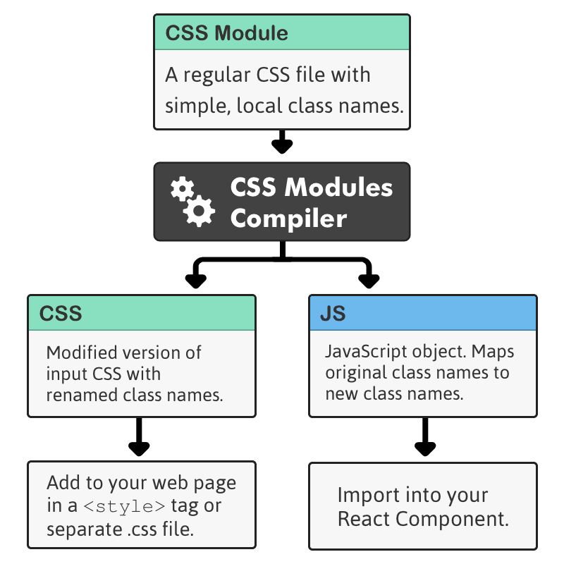
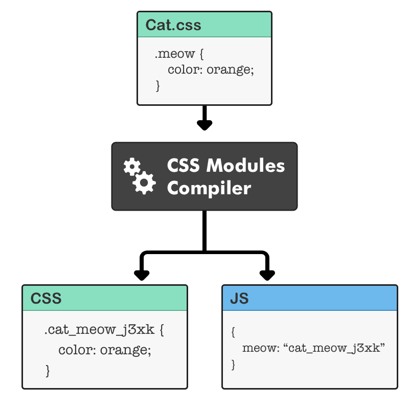

## CSS in JavaScript
`CSS-in-JS` abstracts the `CSS` model to the _component level_, rather than the document level (modularity).

[`JSS`](http://cssinjs.org/?v=v9.8.7) is a more powerful abstraction over CSS. It uses JavaScript as a language to describe styles in a declarative and maintainable way. It is a high performance JS to `CSS` compiler which works at runtime and server-side.

The Idea of `JSS` is exactly the opposite. It is about using just one language for the logic and styling and get benefits from both worlds.

`CSS` was never actually made for component based approaches. `CSS-in-JS` solves exactly this problem.

Benefits of `CSS-in-JS`:
* __Thinking in components__ — No longer do you have to maintain bunch of style-sheets.
* `CSS-in-JS` leverages the full power of the JavaScript ecosystem to enhance `CSS`.
* __“True rules isolation”__ — Scoped selectors are not enough. `CSS` has properties which are inherited automatically from the parent element, if not explicitly defined. Thanks to [jss-isolate](http://cssinjs.org/jss-isolate) plugin, `JSS` rules will not inherit properties.
* __Scoped selectors__ — `CSS` has just one global namespace. It is impossible to avoid selector collisions in non-trivial applications. Naming conventions like `BEM` might help within one project, but will not when integrating third-party code. `JSS` generates unique class names by default when it compiles JSON representation to `CSS`.
* __Vendor Prefixing__ — The `CSS` rules are automatically vendor prefixed, so you don’t have to think about it.
* __Code sharing__ — Easily share constants and functions between JS and `CSS`.
* Only the styles which are currently in use on your screen are also in the DOM ([react-jss](https://github.com/cssinjs/react-jss)).
* Dead code elimination
* Unit tests for `CSS`!

Drawbacks of `CSS-in-JS`:
* Learning curve
* New dependencies
* Harder for newer teammates to adapt to the code-base

__[More Detailed about CSS-in-JS](https://hackernoon.com/all-you-need-to-know-about-css-in-js-984a72d48ebc)__

## CSS Modules
Alternative to `CSS-in-JS` is __[CSS Modules](https://medium.com/front-end-developers/css-modules-solving-the-challenges-of-css-at-scale-85789980b04f)__

A `CSS Module` is a CSS file in which all class names and animation names are _scoped locally_ by default.

> 

Where do you get a _CSS Modules compiler_? If you are using `Webpack`, you already have one. Just add the `"?modules"` option to `css-loader`.

Example:

> 

__[More Detailed about CSS Modules](https://medium.com/front-end-developers/css-modules-solving-the-challenges-of-css-at-scale-85789980b04f)__