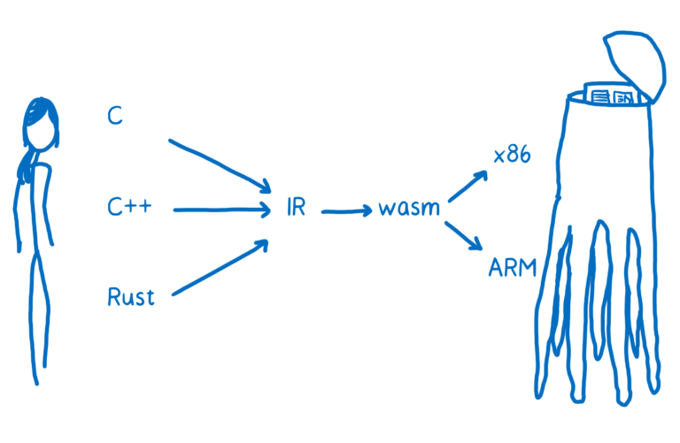

## `WebAssembly` or `wasm`
Technically speaking, it is a new, low-level, assembly-like language that runs efficiently on the existing web platform and is backward-compatible with its precursor, [asm.js](http://asmjs.org/).

### Compiling to `.wasm`
Most people, however, will use the `wasm` format as a compiler target, translating their applications (in `C/C++`, `Rust`, `TypeScript` ) into web-ready modules that can run in modern web browsers at near-native speeds.

So you can take `C/C++` code, translate it into wasm using a compiler tool like [Emscripten](https://developer.mozilla.org/en-US/docs/Mozilla/Projects/Emscripten), and load the generated wasm module into a JavaScript app, where it will be safely and efficiently executed by the browser.

You can compile _`TypeScript`_ to wasm with __[`wasm-util`](https://github.com/rsms/wasm-util)__.

`WebAssembly` modules define functions that can be used from JavaScript. So just like you download a module like lodash from npm today and call functions that are part of its API, you will be able to download `WebAssembly` modules in the future.

> 

### Loading a `.wasm` module in JavaScript
The `.wasm` file is the `WebAssembly` module, and it can be loaded in JavaScript.

### Why does it matter?
The wasm format makes it possible to support graphics-heavy games in a browser without plug-ins. It can be used to port scientific simulation and other compute-intensive applications to the web platform.

### [More](https://hacks.mozilla.org/2017/02/creating-and-working-with-webassembly-modules/)

### What makes `WebAssembly` fast?
`WebAssembly` is faster than JavaScript in many cases because:
* fetching `WebAssembly` takes less time because it is more compact than JavaScript, even when compressed.
* decoding `WebAssembly` takes less time than parsing JavaScript.
* compiling and optimizing takes less time because WebAssembly is closer to machine code than JavaScript and already has gone through optimization on the server side.
* reoptimizing doesn’t need to happen because `WebAssembly` has types and other information built in, so the JS engine doesn’t need to speculate when it optimizes the way it does with JavaScript.
* executing often takes less time because there are fewer compiler tricks and gotchas that the developer needs to know to write consistently performant code, plus `WebAssembly`’s set of instructions are more ideal for machines.
* garbage collection is not required since the memory is managed manually.

This is why, in many cases, `WebAssembly` will outperform JavaScript when doing the same task.

### [More](https://hacks.mozilla.org/2017/02/what-makes-webassembly-fast/)

### WebAssembly imperfections
Currently, calling a WebAssembly function in JS code is slower than it needs to be. That’s because it has to do something called “trampolining”. The JIT doesn’t know how to deal directly with WebAssembly, so it has to route the WebAssembly to something that does. This is a slow piece of code in the engine itself, which does setup to run the optimized WebAssembly code.

Currently, there’s no way to interact with the DOM. This means you can’t do something like `element.innerHTML` to update a node from `WebAssembly`. Instead, you have to go through JS to set the value.

Many code bases in languages like C++ use exceptions. However, exceptions aren’t yet specified as part of `WebAssembly`.

### [More](https://hacks.mozilla.org/2017/02/where-is-webassembly-now-and-whats-next/)