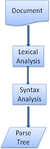

# Web Browser
The main function of a browser is to present the web resource you choose, by requesting it from the server and displaying it in the browser window. The resource is usually an HTML document, but may also be a `PDF`, image, or some other type of content. The location of the resource is specified by the user using a `URI` (Uniform Resource Identifier).

Say you have entered _'google.com'_  and hit _Enter_ key. Actions which takes browser:
1. ### Parse the URL

    When no protocol or valid domain name is given the browser proceeds to feed the text given in the address box to the browser's default web search engine.

    1. The browser checks its `preloaded HSTS` (HTTP Strict Transport Security) list. This is a list of websites that have requested to be contacted via HTTPS only.
    2. If the website is in the list, the browser sends its request via HTTPS instead of HTTP. Otherwise, the initial request is sent via HTTP.

2. ### DNS lookup

    The browser tries to figure out the IP address for the entered domain. The DNS lookup proceeds as follows:
    1. Browser cache: The browser caches DNS records for some time. Interestingly, the OS does not tell the browser the time-to-live for each DNS record, and so the browser caches them for a fixed duration (varies between browsers, 2 – 30 minutes).
    2. OS cache: If the browser cache does not contain the desired record, the browser makes a system call (gethostbyname in Windows). The OS has its own cache.
    3. Router cache: The request continues on to your router, which typically has its own DNS cache.
    4. ISP DNS cache: The next place checked is the cache ISP’s DNS server. With a cache, naturally.
    5. Recursive search: Your ISP’s DNS server begins a recursive search, from the root nameserver, through the `.com` top-level nameserver, to Google’s nameserver. Normally, the DNS server will have names of the `.com` nameservers in cache, and so a hit to the root nameserver will not be necessary.

        

        For `maps.google.com`, first, the DNS recursor will contact the root `.` name server. The root name server will redirect it to `.com` domain name server. `.com` name server will redirect it to `google.com` name server. `google.com` name server will find the matching IP address for `maps.google.com` in its’ DNS records and return it to your DNS recursor which will send it back to your browser.

3. ### Browser initiates a TCP connection with the server

    Once the browser receives the correct IP address it will build a connection with the server that matches IP address to transfer information. Browsers use internet protocols to build such connections. There are a number of different internet protocols which can be used but TCP is the most common protocol used for any type of HTTP request.

    In order to transfer data packets between your computer(client) and the server, it is important to have a TCP connection established. This connection is established using a process called the TCP/IP three-way handshake. This is a three step process where the client and the server exchange `SYN`(synchronize) and `ACK`(acknowledge) messages to establish a connection.

    1. Client machine sends a `SYN` packet to the server over the internet asking if it is open for new connections.
    2. If the server has open ports that can accept and initiate new connections, it’ll respond with an ACKnowledgment of the `SYN` packet using a `SYN`/`ACK` packet.
    3. The client will receive the `SYN`/`ACK` packet from the server and will acknowledge it by sending an `ACK` packet.

4. ### The browser sends an HTTP request to the web server

5. ### The server handles the request and sends back an HTTP response

6. ### The browser displays the HTML content

## The browser's main components are:
* __The `User Interface`:__ this includes the address bar, back/forward button, bookmarking menu, etc. Every part of the browser display except the window where you see the requested page.
* __The `Browser Engine`:__ marshals (выстраивать) actions between the UI and the rendering engine.
* __The `Rendering Engine`:__ responsible for displaying requested content. For example if the requested content is HTML, the rendering engine parses HTML and CSS, and displays the parsed content on the screen.
* __`Networking`:__ for network calls such as HTTP requests, using different implementations for different platform behind a platform-independent interface.
* __`UI Backend`:__ used for drawing basic widgets like combo boxes and windows. This backend exposes a generic interface that is not platform specific. Underneath it uses operating system user interface methods.
* __`JavaScript Interpreter`__: used to parse and execute JavaScript code.
* __`Data Storage`:__ is a persistence layer. The browser may need to save all sorts of data locally, such as cookies. Browsers also support storage mechanisms such as localStorage, IndexedDB, WebSQL and FileSystem.


> __Chrome__ run multiple instances of the rendering engine: one for each tab. Each tab runs in a separate process.

## Rendering Engine
Different browsers use different rendering engines:

| Browser | Engine |
|:-:|:-:|
| `Chrome` | `Blink` (a fork of `WebKit`) |
| `Firefox` | `Gecko` |
| `Safari` | `Webkit` |
| `Opera` | `Blink` (`Presto` if < v15) |
| `Internet Explorer` | `Trident` |
| `Edge` | `EdgeHTML` |

### Flow:
1. The rendering engine will start getting the contents of the requested document from the networking layer. This will usually be done in `8kB` chunks.
2. The rendering engine will start parsing the HTML document and convert elements to DOM nodes in a tree called the __`content tree`__.

3. The engine will parse the style data, both in external CSS files and in style elements. Styling information together with visual instructions in the HTML will be used to create another tree: the __`render tree`__.

    > The __`render tree`__ contains rectangles with visual attributes like color and dimensions. The rectangles are in the right order to be displayed on the screen.

4. After the construction of the render tree it goes through a __`layout`__ process. This means giving each node the exact coordinates where it should appear on the screen.

5. The next stage is __`painting`__ – the render tree will be traversed and each node will be painted using the UI backend layer.

    

> It's important to understand that this is a _gradual process_. For better user experience, the rendering engine will try to display contents on the screen as soon as possible. It will not wait until all HTML is parsed before starting to build and layout the render tree. Parts of the content will be parsed and displayed, while the process continues with the rest of the contents that keeps coming from the network.

WebKit main flow Example:


### Parsing
Parsing a document means translating it to a structure the code can use. The result of parsing is usually a tree of nodes that represent the structure of the document.

Parsing can be separated into two sub processes:
* __`Lexical Analysis`__ is the process of breaking the input into tokens. Tokens are the language vocabulary: the collection of valid building blocks. In human language it will consist of all the words that appear in the dictionary for that language.
* __`Syntax Analysis`__ is the applying of the language syntax rules.

|   |   |
|:-:|:--|
| >>>>>>>>>  >>>>>>>>> | Parsers usually divide the work between two components: the __`lexer`__ (sometimes called tokenizer) that is responsible for breaking the input into valid tokens, and the __`parser`__ that is responsible for constructing the parse tree by analyzing the document structure according to the language syntax rules. The lexer knows how to strip irrelevant characters like white spaces and line breaks. |

The parsing process is _iterative_. The parser will usually ask the lexer for a new token and try to match the token with one of the syntax rules. If a rule is matched, a node corresponding to the token will be added to the parse tree and the parser will ask for another token.

If no rule matches, the parser will store the token internally, and keep asking for tokens until a rule matching all the internally stored tokens is found. If no rule is found then the parser will raise an exception. This means the document was not valid and contained syntax errors.

### Translation
|   |   |
|:-:|:--|
| >>>>>>>>>  >>>>>>>>> | In many cases the parse tree is not the final product. Parsing is often used in translation: transforming the input document to another format. An example is compilation. The compiler that compiles source code into machine code first parses it into a parse tree and then translates the tree into a machine code document. |

### Generating parsers automatically
There are tools that can generate a parser. You feed them the grammar of your language – its vocabulary and syntax rules and they generate a working parser. Creating a parser requires a deep understanding of parsing and it's not easy to create an optimized parser by hand, so parser generators can be very useful.

`WebKit` uses two well known parser generators: [Flex](http://en.wikipedia.org/wiki/Flex_lexical_analyser) for creating a `lexer` and [Bison](http://www.gnu.org/software/bison/) for creating a `parser` (you might run into them with the names `Lex` and `Yacc`). `Flex` input is a file containing regular expression definitions of the tokens. `Bison`'s input is the language syntax rules in BNF format.

## `HTML` Parser
The job of the `HTML` parser is to parse the `HTML` markup into a __`DOM`__. The root of the tree is the `document` object.

Example:
```html
<html>
    <body>
        <p>Hello World</p>
        <div>
            
        </div>
    </body>
</html>
```
This markup would be translated to the following DOM tree:


### The parsing algorithm
The [parsing algorithm is described in detail by the HTML5 specification](http://www.whatwg.org/specs/web-apps/current-work/multipage/parsing.html). The algorithm consists of two stages:
* __`Tokenization`__ - is the lexical analysis, parsing the input into tokens. Among HTML tokens are start tags, end tags, attribute names and attribute values.

    The tokenizer recognizes the token, gives it to the tree constructor, and consumes the next character for recognizing the next token, and so on until the end of the input.

    

* __`Tree Construction`__ - Each node emitted by the tokenizer will be processed by the tree constructor. For each token the specification defines which `DOM` element is relevant to it and will be created for this token. The element is added to the `DOM` tree, and also the stack of open elements. This stack is used to correct nesting mismatches and unclosed tags.

### Actions when the parsing is finished
At this stage the browser will mark the document as interactive and start parsing scripts that are in __`deferred`__ mode: those that should be executed after the document is parsed. The document state will be then set to `complete` and a __`load`__ event will be fired.

### Browsers' error tolerance
You never get an _"Invalid Syntax"_ error on an `HTML` page. Browsers fix any invalid content and go on.

Error handling is quite consistent in browsers, but amazingly enough it hasn't been part of `HTML` specifications.

## `CSS` Parsing
WebKit uses `Flex` and `Bison` parser generators to create parsers automatically from the `CSS` grammar files. As you recall from the parser introduction, `Bison` creates a bottom up shift-reduce parser. `Firefox` uses a top down parser written manually.

In both cases each `CSS` file is parsed into a StyleSheet object. Each object contains `CSS` rules. The `CSS` rule objects contain selector and declaration objects and other objects corresponding to `CSS` grammar.


## The order of processing scripts and style sheets
### Scripts
The model of the web is synchronous. Authors expect scripts to be parsed and executed immediately when the parser reaches a `<script>` tag. The parsing of the document halts until the script has been executed. If the script is external then the resource must first be fetched from the network–this is also done synchronously, and parsing halts until the resource is fetched.

This was the model for many years and is also specified in `HTML4` and `5` specifications. Authors can add the `"defer"` attribute to a script, in which case it will not halt document parsing and will execute after the document is parsed. `HTML5` adds an option to mark the script as asynchronous so it will be parsed and executed by a different thread.

### Speculative parsing
Both `WebKit` and `Firefox` do this optimization. While executing scripts, another thread parses the rest of the document and finds out what other resources need to be loaded from the network and loads them. In this way, resources can be loaded on parallel connections and overall speed is improved.

> Note: the speculative parser only parses references to external resources like external scripts, style sheets and images: it doesn't modify the DOM tree–that is left to the main parser.

### Style sheets
Style sheets on the other hand have a different model. Conceptually it seems that since style sheets don't change the DOM tree, there is no reason to wait for them and stop the document parsing.

There is an issue, though, of scripts asking for style information during the document parsing stage. If the style is not loaded and parsed yet, the script will get wrong answers and apparently this caused lots of problems. It seems to be an edge case but is quite common. `Firefox` blocks all scripts when there is a style sheet that is still being loaded and parsed. `WebKit` blocks scripts only when they try to access certain style properties that may be affected by unloaded style sheets.

## `Render Tree` construction
While the DOM tree is being constructed, the browser constructs another tree, the `render tree`. This tree is of visual elements in the order in which they will be displayed. It is the visual representation of the document. The purpose of this tree is to enable painting the contents in their correct order.

`Firefox` calls the elements in the render tree `"frames"`. `WebKit` uses the term `renderer` or `render object`.

A renderer knows how to lay out and paint itself and its children.

`WebKit`'s `RenderObject` class, the base class of the renderers, has the following definition:
```cpp
class RenderObject{
  virtual void layout();
  virtual void paint(PaintInfo);
  virtual void rect repaintRect();
  Node* node;                   //the DOM node
  RenderStyle* style;           // the computed style
  RenderLayer* containgLayer;   //the containing z-index layer
}
```

Each renderer represents a rectangular area usually corresponding to a node's `CSS` box, as described by the `CSS2` spec. It includes geometric information like `width`, `height` and `position`.

### The render tree relation to the `DOM` tree
The renderers correspond to `DOM` elements, but the relation is not one to one. Non-visual `DOM` elements will not be inserted in the render tree. An example is the `<head></head>` element. Also elements whose `display` value was assigned to `'none'` will not appear in the tree (whereas elements with `'hidden'` `visibility` will appear in the tree).

There are `DOM` elements which correspond to several visual objects. These are usually elements with complex structure that cannot be described by a single rectangle. For example, the `<select></select>` element has three renderers: one for the display area, one for the drop down list box and one for the button. Also when text is broken into multiple lines because the width is not sufficient for one line, the new lines will be added as extra renderers. 

Some render objects correspond to a `DOM` node but not in the same place in the tree. Floats and absolutely positioned elements are out of flow, placed in a different part of the tree, and mapped to the real frame. A placeholder frame is where they should have been.


### Style Computation
Building the render tree requires calculating the visual properties of each render object. This is done by calculating the style properties of each element.

The style includes style sheets of various origins, inline style elements and visual properties in the `HTML` (like the "bgcolor" property).The later is translated to matching `CSS` style properties.

The origins of style sheets are the browser's default style sheets, the style sheets provided by the page author and user style sheets–these are style sheets provided by the browser user.

Style computation brings up a few difficulties:
1. Style data is a very large construct, holding the numerous style properties, this can cause memory problems.
2. Finding the matching rules for each element can cause performance issues if it's not optimized. Traversing the entire rule list for each element to find matches is a heavy task. Selectors can have complex structure that can cause the matching process to start on a seemingly promising path that is proven to be futile and another path has to be tried.
3. Applying the rules involves quite complex cascade rules that define the hierarchy of the rules.

### Manipulating the rules for an easy match
There are several sources for style rules:
1. `CSS` rules, either in external style sheets or in style elements

    ```css
    p {color: blue}
    ```

2. Inline style attributes like

    ```html
    <p style="color: blue" />
    ```

3. `HTML` visual attributes (which are mapped to relevant style rules)

    ```html
    <p bgcolor="blue" />
    ```

The last two are easily matched to the element since he owns the style attributes and `HTML` attributes can be mapped using the element as the key. But the `CSS` rule matching can be trickier.

### Applying the rules in the correct cascade order
The style object has properties corresponding to every visual attribute (all `CSS` attributes but more generic). If the property is not defined by any of the matched rules, then some properties can be inherited by the parent element style object. Other properties have default values.

The problem begins when there is more than one definition–here comes the cascade order to solve the issue.

A declaration for a style property can appear in several style sheets, and several times inside a style sheet. This means the order of applying the rules is very important. This is called the _"cascade"_ order. According to `CSS2` spec, the __`cascade order`__ is (from low to high):

1. Browser declarations
2. User normal declarations
3. Author normal declarations
4. Author important declarations
5. User important declarations

Declarations with the same order will be sorted by __`specificity`__ and then the order they are specified.

> The `HTML` visual attributes are translated to matching `CSS` declarations. They are treated as _author rules_ with _low priority_.

After the rules are matched, they are sorted according to the cascade rules. `WebKit` uses _bubble sort_ for small lists and _merge sort_ for big ones. `WebKit` implements sorting by overriding the `">"` operator for the rules.

`WebKit` uses a flag that marks if all top level style sheets (including `@imports`) have been loaded. If the style is not fully loaded when attaching, place holders are used and it is marked in the document, and they will be recalculated once the style sheets were loaded.

## Layout
When the `renderer` is created and added to the tree, it does not have a position and size. Calculating these values is called __`layout`__ or __`reflow`__.

HTML uses a __flow based layout model__, meaning that most of the time it is possible to compute the geometry in a single pass. Elements later "in the flow" typically do not affect the geometry of elements that are earlier "in the flow", so layout can proceed left-to-right, top-to-bottom through the document. There are exceptions: for example, `HTML` tables may require more than one pass.

> The coordinate system is relative to the root frame. Top and left coordinates are used.

Layout is a recursive process. It begins at the root renderer, which corresponds to the `<html>` element of the `HTML` document. Layout continues recursively through some or all of the frame hierarchy, computing geometric information for each renderer that requires it.

> The position of the root renderer is 0,0 and its dimensions are the viewport–the visible part of the browser window.

All renderers have a `layout()` or `reflow()` method, each renderer invokes the `layout()` method of its children that need layout.

### Dirty bit system
In order not to do a full layout for every small change, browsers use a __`dirty bit`__ system. A renderer that is changed or added marks itself and its children as `"dirty"`: needing layout.

There are two flags: `"dirty"`, and `"children are dirty"` which means that although the renderer itself may be OK, it has at least one child that needs a layout.

### Global and incremental layout
Layout can be triggered on the entire render tree–this is __`global layout`__. This can happen as a result of:
* A global style change that affects all renderers, like a font size change.
* As a result of a screen being resized

Incremental layout is triggered (_asynchronously_) when renderers are dirty. For example when new renderers are appended to the render tree after extra content came from the network and was added to the DOM tree.

### Asynchronous and Synchronous layout
Incremental layout is done asynchronously. `Firefox` queues "reflow commands" for incremental layouts and a scheduler triggers batch execution of these commands. `WebKit` also has a timer that executes an incremental layout–the tree is traversed and "dirty" renderers are layout out.

Scripts asking for style information, like `offsetHeight` can trigger incremental layout synchronously.

> Global layout will usually be triggered synchronously.

Sometimes layout is triggered as a callback after an initial layout because some attributes, like the scrolling position changed.

When a layout is triggered by a `resize` or a change in the renderer position(and not size), the renders sizes are taken from a cache and not recalculated. In some cases only a sub tree is modified and layout does not start from the root. This can happen in cases where the change is local and does not affect its surroundings–like text inserted into text fields (otherwise every keystroke would trigger a layout starting from the root).

## Painting
In the painting stage, the render tree is traversed and the renderer's `paint()` method is called to display content on the screen. Painting uses the UI infrastructure component.

Like layout, painting can also be:
* __global__ - the entire tree is painted
* __incremental__ - some of the renderers change in a way that does not affect the entire tree.

The changed renderer invalidates its rectangle on the screen. This causes the OS to see it as a `dirty region` and generate a `paint()` event. The OS does it cleverly and coalesces (объединять) several regions into one. In Chrome it is more complicated because the renderer is in a different process then the main process. Chrome simulates the OS behavior to some extent. The presentation listens to these events and delegates the message to the render root. The tree is traversed until the relevant renderer is reached. It will repaint itself (and usually its children).

### The painting order
[`CSS2` defines the order of the painting process](http://www.w3.org/TR/CSS21/zindex.html). This is actually the order in which the elements are stacked in the `stacking contexts`. This order affects painting since the stacks are painted from back to front.

The stacking order of a block renderer is:
1. background color
2. background image
3. border
4. children
5. outline

Before repainting, `WebKit` saves the old rectangle as a bitmap. It then paints only the delta between the new and old rectangles. 

The browsers try to do the minimal possible actions in response to a change. So changes to an element's color will cause only repaint of the element. Changes to the element position will cause layout and repaint of the element, its children and possibly siblings. Adding a DOM node will cause layout and repaint of the node. Major changes, like increasing font size of the `<html></html>` element, will cause invalidation of caches, relayout and repaint of the entire tree.

### The rendering engine's threads
__The rendering engine is single threaded__. Almost everything, except network operations, happens in a single thread. In Firefox and Safari this is the main thread of the browser. In Chrome it's the tab process main thread. Network operations can be performed by several parallel threads. The number of parallel connections is limited (usually 2–6 connections).

The browser main thread is an event loop. It's an infinite loop that keeps the process alive. It waits for events (like layout and paint events) and processes them.

### Example:


## Additional recources:
* [Video](https://vimeo.com/44182484)
* [Keynote](http://arvindr21.github.io/howBrowserWorks/#/)