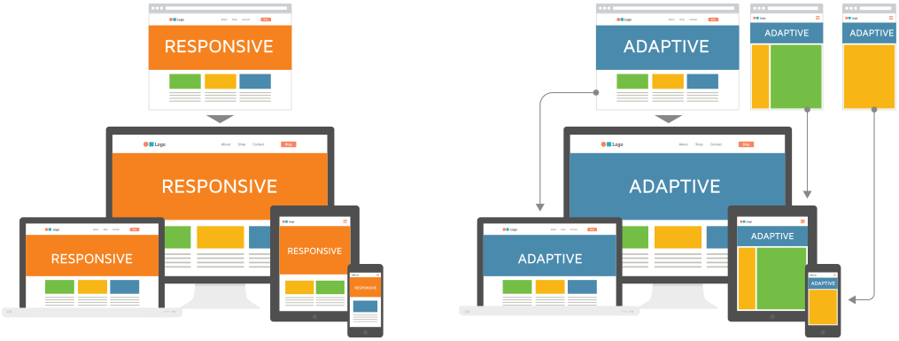

## Adaptive Vs. Responsive Design

Responsive websites respond to the size of the browser at any given point. No matter what the browser width may be, the site adjusts its layout (and perhaps functionality) in a way that is optimized to the screen.

Adaptive websites adapt to the width of the browser at a specific points. In other words, the website is only concerned about the browser being a specific width, at which point it adapts the layout.

