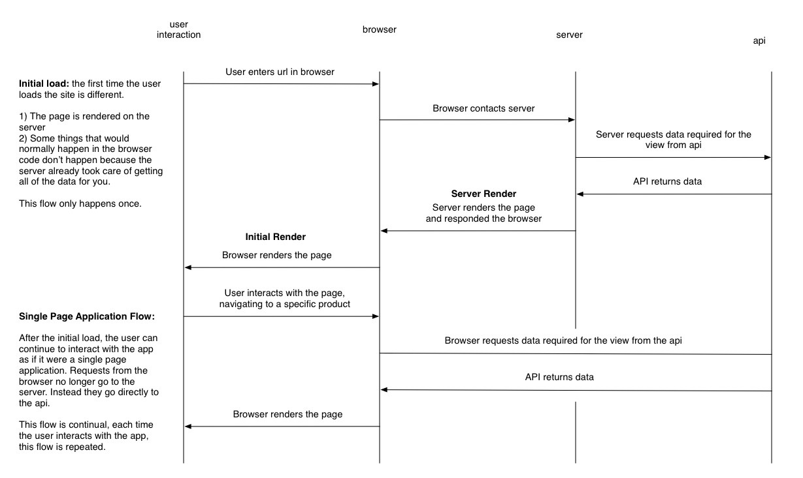
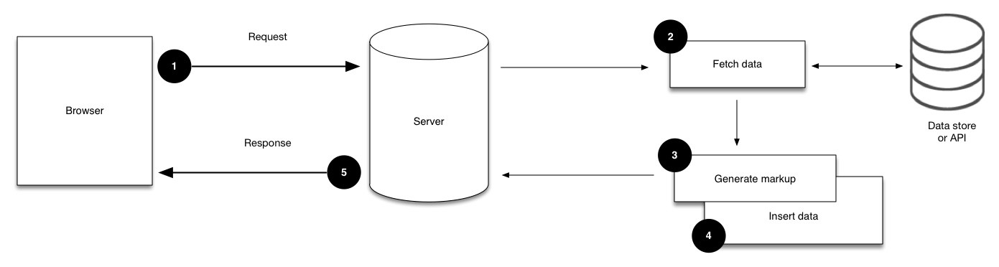
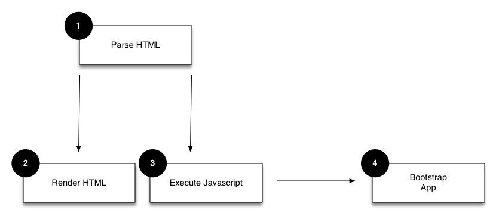

# Isomorphic Application
An isomorphic app is a web app that blends a server-rendered web app with a single-page application.

## What the Server does?

1. The server receives a request.
2. The server fetches the required data for that request. This can be from either a persistent data store like a MySQL or NoSQL database, or from an external API.
3. Once the data are received, the server can build the HTML. It generates the markup with React’s virtual DOM via the renderToString method.
4. The server injects the data from step 2 into our HTML, allowing the browser to access it later.
5. The server responds to the request with our fully built HTML.

## What Browser does?

1. The browser parses the DOM that it has received from the server;
2. This results in rendering an HTML element; or
3. Executing JavaScript;
4. When the browser reaches our entry point for the application, the app bootstraps itself.

## Pros
* Old devices can browse our site because the application returns HTML, which differs from common Single Page Applications (SPA), where the tag contains JavaScript. (It is a problem in SPA frameworks/libraries)
* There is less code, as it is shared by both the client and the server.
* Better performance: Pages are served as rendered and faster initial page loading (less javascript files and file sizes)
* Full SEO support: Fully formed pages are served. Pages are easier to crawl with search engine crawlers. Also, faster page loading assures better page rankings.
* Flexibility of client-side: With the balance of server-side and client-side, it is possible to have better web apps. Despite server-side rendering, flexibility of client-side is still useable.
* Maintenance: As the same code is shared by both the client and the server, we don’t have to write logics twice. There is less code and it is easier to maintain the code.
* Poor connections: Coursera says that “In extreme cases, we saw some users in these environments wait minutes for all the Javascript to load before they could see even the page. ... With isomorphic rendering, we were able to meet this threshold even in many of these extreme cases.”. Using isomorphism can lead poor connections to use web applications easier and faster.
* Better user experience: By balancing rendering of pages will create a better user experience. Important parts of a page will be rendered in server and will be shown to user initially. Other parts can be rendered in client-side after these important parts of page are loaded.

## Cons
* Learning curve
* Lots of logic should be handled in server-side. Handling Http requests, routing, rendering, styling and module loading can be difficult and external libraries would be needed in server-side rendering. They should be handled in the same way both in server-side and client-side.
* Server-side and client-side are different environments with different dynamics. Using same code may be problematic in different cases.
